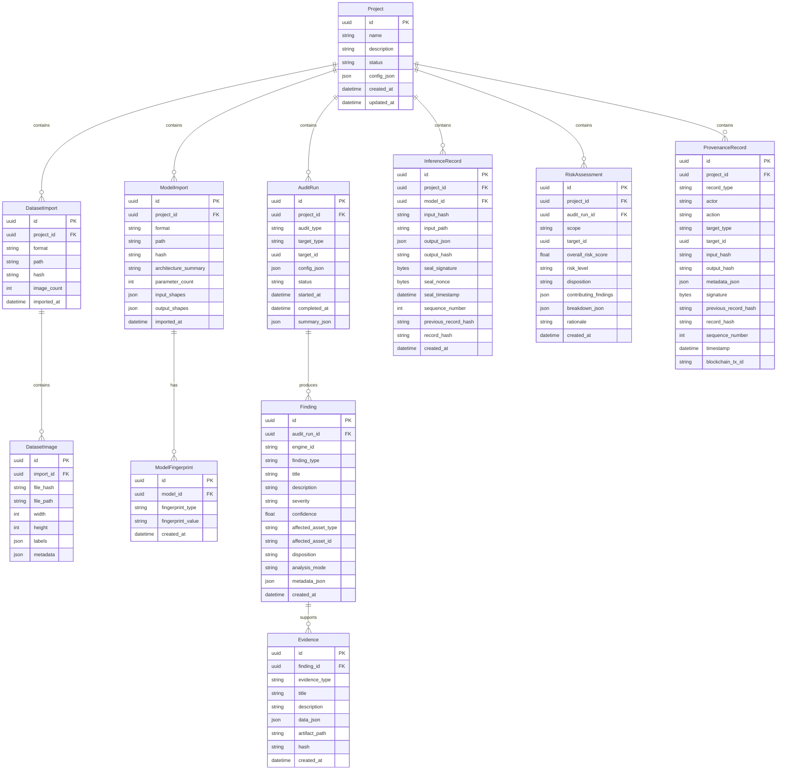

# AIVARA — Architecture Specification

**AI Verification & Assurance**
*"Don't Trust the AI Pipeline. Verify It."*

**Version:** 0.1.0-draft
**Date:** 2026-08-31
**Status:** ARCHITECTURE DISCOVERY — Not yet approved for implementation

---

## Table of Contents

1. [System Overview](#1-system-overview)
2. [Architectural Principles](#2-architectural-principles)
3. [Architectural Risks and Ambiguities](#3-architectural-risks-and-ambiguities)
4. [Repository Structure](#4-repository-structure)
5. [Module Boundaries](#5-module-boundaries)
6. [Database Entities and Relationships](#6-database-entities-and-relationships)
7. [API Boundaries](#7-api-boundaries)
8. [Core Interfaces](#8-core-interfaces)
9. [Configuration Strategy](#9-configuration-strategy)
10. [Testing Architecture](#10-testing-architecture)
11. [Security Boundaries](#11-security-boundaries)
12. [Offline Dependency Strategy](#12-offline-dependency-strategy)
13. [Optional Blockchain Layer](#13-optional-blockchain-layer)
14. [Recommended Changes Before Implementation](#14-recommended-changes-before-implementation)
15. [Coverage and Limitations](#15-coverage-and-limitations)
16. [Architecture Review](#16-architecture-review)

---

## 1. System Overview

### 1.1 What AIVARA Is

AIVARA is an offline, desktop-first security and assurance platform for Computer Vision AI pipelines. It evaluates the integrity of:

- Training datasets
- AI models (ONNX, PyTorch/TorchScript)
- Inference outputs
- Distribution shifts
- Multi-contributor provenance

It produces **evidence-backed assurance decisions**: `ACCEPT`, `REVIEW`, or `QUARANTINE`.

### 1.2 What AIVARA Is Not

- AIVARA is **not** a general-purpose MLOps platform.
- AIVARA **does not** retrain or fine-tune supplied models.
- AIVARA **does not** claim to detect every possible attack. It explicitly reports its coverage and limitations.
- AIVARA **does not** require cloud connectivity, external APIs, or paid services at runtime.

### 1.3 High-Level Architecture

```
┌─────────────────────────────────────────────────────────────────────┐
│                        ANALYST DASHBOARD                            │
│                   (React / TypeScript / Vite)                       │
└──────────────────────────────┬──────────────────────────────────────┘
                               │ HTTP REST + SSE
                               │ (localhost only)
┌──────────────────────────────▼──────────────────────────────────────┐
│                         API GATEWAY                                 │
│                    (FastAPI / Uvicorn)                               │
├─────────────────────────────────────────────────────────────────────┤
│                       ORCHESTRATION LAYER                           │
│              (Pipeline Coordinator / Task Runner)                   │
├──────┬──────┬──────┬──────┬──────┬──────┬──────┬──────┬────────────┤
│  DI  │  CR  │  MI  │  BA  │  BT  │  IP  │  DS  │  AS  │  Report   │
│  E   │  E   │  E   │  E   │  A   │  E   │  E   │  L   │  Gen      │
├──────┴──────┴──────┴──────┴──────┴──────┴──────┴──────┴────────────┤
│                        EVIDENCE ENGINE                              │
├─────────────────────────────────────────────────────────────────────┤
│                          RISK ENGINE                                │
├─────────────────────────────────────────────────────────────────────┤
│                      PROVENANCE LEDGER                              │
├─────────────────────────────┬───────────────────────────────────────┤
│       SQLite (core)         │   Blockchain Adapter (optional)       │
└─────────────────────────────┴───────────────────────────────────────┘

Legend:
  DIE = Dataset Integrity Engine       CRE = Contributor Risk Engine
  MIE = Model Integrity Engine         BAE = Behavioural Analysis Engine
  BTA = Backdoor/Trigger Analysis      IPE = Inference Provenance Engine
  DSE = Distribution Shift Engine      ASL = Attack Simulation Lab
```

### 1.4 Fundamental Evidence Flow

```
Evidence → Finding → Confidence → Risk → Decision
```

Every assurance decision is derived from measurable evidence and documented logic. There is no opaque "AI trust score."

### 1.5 Two-Layer Architecture

| Layer | Purpose | Methods |
|-------|---------|---------|
| **Layer 1: Detection** | Identify anomalies, deviations, and suspicious patterns | ML, CV, statistics, embeddings, behavioural testing |
| **Layer 2: Proof** | Establish cryptographic identity, integrity, and provenance | Hashes, signatures, timestamps, nonces, audit records, ledger |

> **Critical distinction:** A cryptographic hash proves artifact identity/integrity relative to a reference. It does NOT prove that the artifact itself is benign. Detection and Proof are complementary, not substitutes.

---

## 2. Architectural Principles

| ID | Principle | Rationale |
|----|-----------|-----------|
| AP-01 | **Offline-first** | The system must operate in air-gapped environments. No runtime dependency on cloud, external APIs, or paid services. |
| AP-02 | **Evidence-backed decisions** | Every finding must contain: evidence, confidence, severity, affected asset, and recommended disposition. |
| AP-03 | **Model-agnostic** | Support ONNX and PyTorch/TorchScript. No assumption about architecture. |
| AP-04 | **Graceful degradation** | White-box analysis falls back to black-box when model internals are inaccessible. |
| AP-05 | **Modular engines** | Each detection engine is independently replaceable without rewriting the platform. |
| AP-06 | **Separation of concerns** | Frontend, API, engines, and storage are decoupled through well-defined interfaces. |
| AP-07 | **Tamper-evident audit** | All operations produce signed, hash-linked audit records. |
| AP-08 | **Explicit limitations** | The system explicitly states what attacks it covers and what it does not. |
| AP-09 | **No retraining** | Baseline assessment must not require retraining the supplied model. |
| AP-10 | **Deterministic reproducibility** | Given the same inputs and configuration, analysis results should be reproducible. |

---

## 3. Architectural Risks and Ambiguities

### 3.1 Identified Risks

| ID | Risk | Severity | Mitigation |
|----|------|----------|------------|
| R-01 | **FAISS + DINOv2/CLIP models are large** (~300MB–1.5GB). Air-gapped deployment requires pre-bundling. | HIGH | Define a "model cache" directory. Ship models via Docker image or offline bundle. Document exact versions. |
| R-02 | **Hyperledger Fabric/Besu are complex distributed systems** designed for multi-node networks. Running a single-node instance is non-trivial and may introduce fragility. | HIGH | Make blockchain entirely optional behind an adapter interface. The local SQLite-backed provenance ledger must be fully functional without it. |
| R-03 | **Cleanlab's internal behavior may change across versions**, affecting reproducibility of dataset audits. | MEDIUM | Pin exact version. Wrap Cleanlab behind an adapter interface. Document version-specific behavior. |
| R-04 | **White-box to black-box fallback** requires clear criteria for when fallback occurs and how findings are labeled differently. | MEDIUM | Define explicit fallback conditions. Tag findings with `analysis_mode: white_box | black_box`. Adjust confidence accordingly. |
| R-05 | **PDF generation** in an air-gapped environment requires bundled fonts and rendering engines. | LOW | Use WeasyPrint or ReportLab with bundled fonts. No external font downloads. |
| R-06 | **WebSocket for real-time progress** adds complexity. | LOW | Use simple SSE (Server-Sent Events) for progress; fall back to polling. WebSocket only if bidirectional communication is needed. |
| R-07 | **ONNX Runtime GPU support** varies by platform and may not be available in all air-gapped environments. | MEDIUM | Default to CPU. GPU is optional and auto-detected. |
| R-08 | **Attack Simulation Lab** generating adversarial examples could be computationally expensive. | MEDIUM | Make simulation configurable with complexity limits. Run asynchronously with progress reporting. |
| R-09 | **SQLite write concurrency** is limited (single writer). | MEDIUM | Use WAL mode. Serialize writes through the API layer. For heavy workloads, consider a write queue. |
| R-10 | **Tauri packaging** introduces Rust build dependencies and platform-specific challenges. | LOW | Treat Tauri as a Phase 2 concern. Docker is the primary deployment mechanism. |

### 3.2 Identified Ambiguities

| ID | Ambiguity | Resolution |
|----|-----------|------------|
| A-01 | **Multi-user vs. single-user?** The "Contributor Risk Engine" implies multiple contributors, but the desktop-first design implies single-user. | **Resolution:** Single analyst operating the tool. "Contributors" refers to contributors to the *dataset/model pipeline being audited*, not to AIVARA itself. The analyst examines provenance metadata about external contributors. |
| A-02 | **What constitutes a "project"?** Is it one model + one dataset, or can a project contain multiple models/datasets? | **Resolution:** A project is a container for one assurance engagement. It may contain multiple datasets and multiple models. Each audit run is scoped to a specific (dataset, model) pair or a single artifact. |
| A-03 | **How are reference baselines established** if no retraining is allowed? | **Resolution:** Baselines are established through: (a) statistical profiling of the dataset, (b) model fingerprinting via weight statistics and activation patterns, (c) behavioral profiling via inference on held-out or synthetic probes. No retraining occurs. |
| A-04 | **What is the expected scale?** Dataset sizes (100 images? 100K images? 1M images?) dramatically affect architecture. | **Resolution:** Target initial support for datasets up to 100K images. Larger datasets are supported but with configurable sampling strategies. Document performance expectations. |
| A-05 | **Replay detection scope**: Does "replay" mean identical inference requests, or does it include near-duplicate detection? | **Resolution:** Both. Exact replay via hash comparison, near-duplicate replay via embedding similarity. |
| A-06 | **Blockchain consensus model** for a single-node deployment. | **Resolution:** Single-node deployment uses no blockchain. The blockchain adapter is for organizations that want multi-node provenance verification. Core system uses hash-linked SQLite records. |

---

## 4. Repository Structure

```
AiVara/
├── docs/
│   ├── ARCHITECTURE.md              # This document
│   ├── DECISIONS.md                  # Architectural decision records
│   ├── API.md                        # API specification (OpenAPI)
│   ├── THREAT_MODEL.md               # Supported attack classes & limitations
│   ├── DEPLOYMENT.md                 # Deployment guide
│   └── diagrams/                     # Architecture diagrams
│
├── backend/
│   ├── pyproject.toml                # Python project config (PEP 621)
│   ├── alembic/                      # Database migrations
│   │   ├── alembic.ini
│   │   ├── env.py
│   │   └── versions/
│   │
│   ├── aivara/                       # Main Python package
│   │   ├── __init__.py
│   │   ├── main.py                   # FastAPI application entry point
│   │   ├── config.py                 # Configuration loading
│   │   ├── dependencies.py           # FastAPI dependency injection
│   │   │
│   │   ├── api/                      # API layer (routers only, no logic)
│   │   │   ├── __init__.py
│   │   │   ├── projects.py
│   │   │   ├── datasets.py
│   │   │   ├── models.py
│   │   │   ├── audits.py
│   │   │   ├── inference.py
│   │   │   ├── reports.py
│   │   │   ├── provenance.py
│   │   │   ├── risk.py
│   │   │   ├── simulation.py
│   │   │   └── system.py
│   │   │
│   │   ├── core/                     # Core domain objects and interfaces
│   │   │   ├── __init__.py
│   │   │   ├── interfaces.py         # Abstract base classes / Protocols
│   │   │   ├── types.py              # Shared enums and type definitions
│   │   │   ├── schemas.py            # Pydantic models (API contracts)
│   │   │   ├── exceptions.py         # Domain exceptions
│   │   │   └── constants.py          # System constants
│   │   │
│   │   ├── db/                       # Database layer
│   │   │   ├── __init__.py
│   │   │   ├── engine.py             # SQLAlchemy engine setup
│   │   │   ├── models.py             # ORM models
│   │   │   ├── repositories.py       # Data access layer
│   │   │   └── session.py            # Session management
│   │   │
│   │   ├── engines/                  # Detection & analysis engines
│   │   │   ├── __init__.py
│   │   │   ├── registry.py           # Engine registry (plugin-style)
│   │   │   │
│   │   │   ├── dataset/              # Dataset Integrity Engine
│   │   │   │   ├── __init__.py
│   │   │   │   ├── engine.py         # Orchestrator
│   │   │   │   ├── analyzers/
│   │   │   │   │   ├── label_analysis.py
│   │   │   │   │   ├── duplicate_detection.py
│   │   │   │   │   ├── ood_detection.py
│   │   │   │   │   ├── trigger_detection.py
│   │   │   │   │   ├── statistical_profiling.py
│   │   │   │   │   └── metadata_analysis.py
│   │   │   │   ├── loaders/
│   │   │   │   │   ├── coco_loader.py
│   │   │   │   │   ├── yolo_loader.py
│   │   │   │   │   └── imagefolder_loader.py
│   │   │   │   └── schemas.py
│   │   │   │
│   │   │   ├── contributor/          # Contributor Risk Engine
│   │   │   │   ├── __init__.py
│   │   │   │   ├── engine.py
│   │   │   │   ├── analyzers/
│   │   │   │   │   ├── provenance_analyzer.py
│   │   │   │   │   ├── pattern_analyzer.py
│   │   │   │   │   └── consistency_analyzer.py
│   │   │   │   └── schemas.py
│   │   │   │
│   │   │   ├── model/                # Model Integrity + Fingerprinting
│   │   │   │   ├── __init__.py
│   │   │   │   ├── engine.py
│   │   │   │   ├── analyzers/
│   │   │   │   │   ├── weight_analysis.py
│   │   │   │   │   ├── architecture_analysis.py
│   │   │   │   │   ├── fingerprinting.py
│   │   │   │   │   └── format_validation.py
│   │   │   │   ├── loaders/
│   │   │   │   │   ├── onnx_loader.py
│   │   │   │   │   ├── pytorch_loader.py
│   │   │   │   │   └── torchscript_loader.py
│   │   │   │   └── schemas.py
│   │   │   │
│   │   │   ├── behavioural/          # Behavioural Analysis Engine
│   │   │   │   ├── __init__.py
│   │   │   │   ├── engine.py
│   │   │   │   ├── analyzers/
│   │   │   │   │   ├── consistency_testing.py
│   │   │   │   │   ├── sensitivity_analysis.py
│   │   │   │   │   ├── performance_profiling.py
│   │   │   │   │   └── adversarial_probing.py
│   │   │   │   └── schemas.py
│   │   │   │
│   │   │   ├── backdoor/             # Backdoor / Trigger Analysis
│   │   │   │   ├── __init__.py
│   │   │   │   ├── engine.py
│   │   │   │   ├── analyzers/
│   │   │   │   │   ├── neural_cleanse.py
│   │   │   │   │   ├── activation_clustering.py
│   │   │   │   │   ├── spectral_signatures.py
│   │   │   │   │   └── trigger_scanning.py
│   │   │   │   └── schemas.py
│   │   │   │
│   │   │   ├── inference/            # Inference Provenance Engine
│   │   │   │   ├── __init__.py
│   │   │   │   ├── engine.py
│   │   │   │   ├── analyzers/
│   │   │   │   │   ├── replay_detector.py
│   │   │   │   │   ├── tampering_detector.py
│   │   │   │   │   ├── seal_manager.py
│   │   │   │   │   └── provenance_verifier.py
│   │   │   │   └── schemas.py
│   │   │   │
│   │   │   ├── distribution/         # Distribution Shift Engine
│   │   │   │   ├── __init__.py
│   │   │   │   ├── engine.py
│   │   │   │   ├── analyzers/
│   │   │   │   │   ├── statistical_shift.py
│   │   │   │   │   ├── embedding_drift.py
│   │   │   │   │   ├── metadata_shift.py
│   │   │   │   │   └── visual_shift.py
│   │   │   │   └── schemas.py
│   │   │   │
│   │   │   └── simulation/           # Attack Simulation Lab
│   │   │       ├── __init__.py
│   │   │       ├── engine.py
│   │   │       ├── attacks/
│   │   │       │   ├── label_flip.py
│   │   │       │   ├── trigger_injection.py
│   │   │       │   ├── weight_perturbation.py
│   │   │       │   └── output_tampering.py
│   │   │       └── schemas.py
│   │   │
│   │   ├── evidence/                 # Evidence Engine
│   │   │   ├── __init__.py
│   │   │   ├── collector.py
│   │   │   ├── store.py
│   │   │   └── schemas.py
│   │   │
│   │   ├── risk/                     # Risk Engine
│   │   │   ├── __init__.py
│   │   │   ├── calculator.py
│   │   │   ├── aggregator.py
│   │   │   ├── rules.py
│   │   │   └── schemas.py
│   │   │
│   │   ├── provenance/               # Provenance Ledger
│   │   │   ├── __init__.py
│   │   │   ├── ledger.py
│   │   │   ├── signer.py
│   │   │   ├── verifier.py
│   │   │   ├── blockchain_adapter.py
│   │   │   └── schemas.py
│   │   │
│   │   ├── reporting/                # Assurance Report Generator
│   │   │   ├── __init__.py
│   │   │   ├── generator.py
│   │   │   ├── renderers/
│   │   │   │   ├── pdf_renderer.py
│   │   │   │   ├── json_renderer.py
│   │   │   │   └── html_renderer.py
│   │   │   ├── templates/
│   │   │   │   ├── report.html.j2
│   │   │   │   └── report.css
│   │   │   └── schemas.py
│   │   │
│   │   ├── pipeline/                 # Orchestration layer
│   │   │   ├── __init__.py
│   │   │   ├── coordinator.py
│   │   │   ├── task_runner.py
│   │   │   └── progress.py
│   │   │
│   │   └── services/                 # Application services
│   │       ├── __init__.py
│   │       ├── project_service.py
│   │       ├── dataset_service.py
│   │       ├── model_service.py
│   │       ├── audit_service.py
│   │       ├── inference_service.py
│   │       └── report_service.py
│   │
│   └── tests/
│       ├── conftest.py
│       ├── unit/
│       │   ├── engines/
│       │   ├── evidence/
│       │   ├── risk/
│       │   ├── provenance/
│       │   └── services/
│       ├── integration/
│       │   ├── api/
│       │   └── db/
│       └── fixtures/
│           ├── datasets/
│           ├── models/
│           └── configs/
│
├── frontend/
│   ├── package.json
│   ├── vite.config.ts
│   ├── tsconfig.json
│   ├── tailwind.config.ts
│   ├── index.html
│   │
│   ├── src/
│   │   ├── main.tsx
│   │   ├── App.tsx
│   │   ├── api/
│   │   │   ├── client.ts
│   │   │   ├── types.ts
│   │   │   └── endpoints/
│   │   │       ├── projects.ts
│   │   │       ├── datasets.ts
│   │   │       ├── models.ts
│   │   │       ├── audits.ts
│   │   │       ├── inference.ts
│   │   │       ├── reports.ts
│   │   │       └── provenance.ts
│   │   │
│   │   ├── components/
│   │   │   ├── ui/                   # shadcn/ui components
│   │   │   ├── layout/
│   │   │   ├── dashboard/
│   │   │   ├── dataset/
│   │   │   ├── model/
│   │   │   ├── audit/
│   │   │   ├── findings/
│   │   │   ├── evidence/
│   │   │   ├── risk/
│   │   │   ├── provenance/
│   │   │   └── reports/
│   │   │
│   │   ├── pages/
│   │   │   ├── ProjectList.tsx
│   │   │   ├── ProjectDashboard.tsx
│   │   │   ├── DatasetAudit.tsx
│   │   │   ├── ModelAudit.tsx
│   │   │   ├── InferenceView.tsx
│   │   │   ├── ProvenanceExplorer.tsx
│   │   │   ├── RiskOverview.tsx
│   │   │   ├── ReportView.tsx
│   │   │   ├── SimulationLab.tsx
│   │   │   └── Settings.tsx
│   │   │
│   │   ├── hooks/
│   │   ├── stores/                  # Zustand stores
│   │   ├── utils/
│   │   └── styles/
│   │
│   └── tests/
│       ├── e2e/
│       └── components/
│
├── config/
│   ├── default.toml
│   ├── schema.json
│   └── examples/
│       ├── air-gapped.toml
│       └── development.toml
│
├── scripts/
│   ├── dev.sh
│   ├── bundle-offline.sh
│   └── generate-keys.sh
│
├── docker/
│   ├── Dockerfile.backend
│   ├── Dockerfile.frontend
│   └── docker-compose.yml
│
├── .github/
├── .gitignore
├── LICENSE
└── README.md
```

### 4.1 Key Structural Decisions

1. **Monorepo with clear separation**: `backend/` and `frontend/` are independent deployable units that communicate only via HTTP.
2. **Engine-per-directory**: Each detection engine is a self-contained package with its own `engine.py`, `analyzers/`, `loaders/`, and `schemas.py`.
3. **API routers are thin**: Routers delegate to services; services delegate to engines. No business logic in the API layer.
4. **Services as the coordination layer**: `services/` contains the business logic that orchestrates multiple engines and cross-cutting concerns.
5. **Tests mirror source structure**: Unit tests are organized by module; integration tests are organized by boundary (API, DB).

---

## 5. Module Boundaries

### 5.1 Module Dependency Graph

```
┌─────────────┐
│  api/        │  ← HTTP boundary (routers only)
└──────┬───────┘
       │ depends on
┌──────▼───────┐
│  services/   │  ← Business logic coordination
└──────┬───────┘
       │ depends on
┌──────▼───────────────────────────────────────────────┐
│  engines/  │  evidence/  │  risk/  │  provenance/    │
│            │             │         │                  │
│  (each engine implements AnalysisEngine protocol)    │
└──────┬───────────────────────────────────────────────┘
       │ depends on
┌──────▼───────┐     ┌──────────────┐
│  core/       │     │  db/         │
│  (interfaces,│     │  (ORM,       │
│   types,     │     │   repos)     │
│   schemas)   │     │              │
└──────────────┘     └──────────────┘
```

### 5.2 Module Contracts

| Module | Responsibility | Depends On | Depended On By |
|--------|---------------|------------|----------------|
| `core/` | Domain types, interfaces, schemas, exceptions | Nothing (leaf) | Everything |
| `db/` | Persistence (ORM models, repositories) | `core/` | `services/`, `evidence/`, `provenance/` |
| `engines/*` | Detection analysis (one engine per concern) | `core/`, `db/` (read-only for assets) | `services/` |
| `evidence/` | Evidence collection, storage, linking | `core/`, `db/` | `services/`, `risk/` |
| `risk/` | Risk scoring and aggregation | `core/`, `evidence/` | `services/` |
| `provenance/` | Tamper-evident audit trail | `core/`, `db/` | `services/` |
| `reporting/` | Report generation (PDF, JSON, HTML) | `core/`, `evidence/`, `risk/` | `services/` |
| `pipeline/` | Orchestration, async task execution | `engines/`, `services/` | `api/` |
| `services/` | Business logic coordination | Everything above | `api/` |
| `api/` | HTTP interface (routers, request/response) | `services/`, `core/schemas` | Frontend |

### 5.3 Engine Interface Contract

Every engine MUST implement the `AnalysisEngine` protocol:

```python
class AnalysisEngine(Protocol):
    """Contract that every detection/analysis engine must satisfy."""

    @property
    def engine_id(self) -> str: ...

    @property
    def engine_version(self) -> str: ...

    @property
    def supported_attack_classes(self) -> list[AttackClass]: ...

    @property
    def known_limitations(self) -> list[str]: ...

    async def analyze(
        self,
        context: AnalysisContext,
        config: EngineConfig,
        progress: ProgressCallback,
    ) -> AnalysisResult: ...

    async def validate_inputs(
        self,
        context: AnalysisContext,
    ) -> ValidationResult: ...
```

### 5.4 Inter-Engine Communication

Engines do **not** communicate directly with each other. All inter-engine data flow passes through:

1. **The Evidence Engine**: Engine A writes findings → Evidence Engine stores them → Engine B queries relevant prior evidence.
2. **The Services layer**: A service may call multiple engines sequentially and pass relevant context.

This prevents circular dependencies and ensures each engine can be tested in isolation.

---

## 6. Database Entities and Relationships

### 6.1 Entity-Relationship Diagram



### 6.2 Entity Design Notes

1. **Hash-linked chains**: Both `InferenceRecord` and `ProvenanceRecord` form hash-linked chains via `previous_record_hash`. Tampering with any record invalidates all subsequent records.

2. **Polymorphic targets**: `AuditRun.target_id` and `ProvenanceRecord.target_id` are polymorphic — they reference different entity types based on `target_type`. This keeps the schema flexible.

3. **JSON columns**: `metadata_json`, `config_json`, `data_json`, etc. store semi-structured data that varies by engine and finding type. This avoids schema proliferation while remaining queryable via SQLite JSON functions.

4. **Evidence is always linked**: Every `Evidence` record belongs to a `Finding`. Orphan evidence is not permitted.

5. **Contributor data**: Contributors are not first-class entities in the database. Contributor information is extracted from dataset/model metadata and stored as structured JSON within `ProvenanceRecord.metadata_json`. If contributor analysis becomes more complex, a dedicated `Contributor` table can be added.

---

## 7. API Boundaries

### 7.1 API Design Principles

- **RESTful**: Resources are nouns; actions are HTTP methods.
- **Versioned**: All endpoints are prefixed with `/api/v1/`.
- **Localhost-only**: The API binds to `127.0.0.1` only. No network exposure.
- **Authenticated locally**: Initial implementation uses no authentication (single-user desktop app). If multi-user is added later, API key or local session auth will be added.
- **Progress via SSE**: Long-running operations (audits, simulations) report progress via Server-Sent Events on a dedicated endpoint.

### 7.2 API Endpoint Map

| Method | Endpoint | Description |
|--------|----------|-------------|
| **Projects** | | |
| `POST` | `/api/v1/projects` | Create a new project |
| `GET` | `/api/v1/projects` | List all projects |
| `GET` | `/api/v1/projects/{id}` | Get project details |
| `PATCH` | `/api/v1/projects/{id}` | Update project metadata |
| `DELETE` | `/api/v1/projects/{id}` | Delete project and all associated data |
| **Datasets** | | |
| `POST` | `/api/v1/projects/{id}/datasets` | Import a dataset |
| `GET` | `/api/v1/projects/{id}/datasets` | List datasets in project |
| `GET` | `/api/v1/datasets/{id}` | Get dataset details |
| `GET` | `/api/v1/datasets/{id}/images` | List/search images in dataset |
| `GET` | `/api/v1/datasets/{id}/statistics` | Get dataset statistics |
| **Models** | | |
| `POST` | `/api/v1/projects/{id}/models` | Import a model |
| `GET` | `/api/v1/projects/{id}/models` | List models in project |
| `GET` | `/api/v1/models/{id}` | Get model details |
| `GET` | `/api/v1/models/{id}/fingerprint` | Get model fingerprint |
| **Audits** | | |
| `POST` | `/api/v1/audits` | Start an audit run |
| `GET` | `/api/v1/audits/{id}` | Get audit status and results |
| `GET` | `/api/v1/audits/{id}/findings` | List findings for an audit |
| `GET` | `/api/v1/audits/{id}/progress` | SSE stream for audit progress |
| `POST` | `/api/v1/audits/{id}/cancel` | Cancel a running audit |
| **Findings** | | |
| `GET` | `/api/v1/findings/{id}` | Get finding details |
| `GET` | `/api/v1/findings/{id}/evidence` | Get evidence for a finding |
| **Inference** | | |
| `POST` | `/api/v1/inference/run` | Run inference (input + model → sealed output) |
| `GET` | `/api/v1/inference/records` | List inference records |
| `GET` | `/api/v1/inference/records/{id}` | Get inference record details |
| `POST` | `/api/v1/inference/verify/{id}` | Verify an inference record's seal |
| **Risk** | | |
| `GET` | `/api/v1/risk/assessments` | List risk assessments |
| `GET` | `/api/v1/risk/assessments/{id}` | Get risk assessment details |
| `POST` | `/api/v1/risk/calculate` | Trigger risk calculation for a scope |
| **Provenance** | | |
| `GET` | `/api/v1/provenance/chain` | Get provenance chain (with filters) |
| `POST` | `/api/v1/provenance/verify` | Verify provenance chain integrity |
| **Reports** | | |
| `POST` | `/api/v1/reports/generate` | Generate an assurance report |
| `GET` | `/api/v1/reports/{id}` | Get report metadata |
| `GET` | `/api/v1/reports/{id}/download` | Download report file |
| **Simulation** | | |
| `POST` | `/api/v1/simulation/run` | Run attack simulation |
| `GET` | `/api/v1/simulation/{id}` | Get simulation results |
| `GET` | `/api/v1/simulation/{id}/progress` | SSE stream for simulation progress |
| **System** | | |
| `GET` | `/api/v1/system/health` | System health check |
| `GET` | `/api/v1/system/config` | Get current system configuration |
| `GET` | `/api/v1/system/capabilities` | List available engines and their capabilities |
| `GET` | `/api/v1/system/coverage` | List supported attack classes and limitations |

### 7.3 API Response Envelope

All API responses follow a consistent envelope:

```json
{
  "status": "success",
  "data": { },
  "meta": {
    "timestamp": "2026-08-31T12:00:00Z",
    "request_id": "uuid",
    "version": "0.1.0"
  }
}
```

Error responses:

```json
{
  "status": "error",
  "error": {
    "code": "DATASET_NOT_FOUND",
    "message": "Dataset with ID 'abc' not found",
    "details": { }
  },
  "meta": { }
}
```

---

## 8. Core Interfaces

### 8.1 Dataset Interface

```python
@dataclass(frozen=True)
class DatasetDescriptor:
    """Describes an imported dataset."""
    id: UUID
    project_id: UUID
    name: str
    format: DatasetFormat          # enum: COCO | YOLO | IMAGE_FOLDER | CUSTOM
    root_path: Path
    annotation_path: Path | None
    image_count: int
    hash: str                      # SHA-256 of manifest (sorted file hashes)
    class_names: list[str]
    class_distribution: dict[str, int]
    imported_at: datetime
    metadata: dict[str, Any]


class DatasetFormat(str, Enum):
    COCO = "coco"
    YOLO = "yolo"
    IMAGE_FOLDER = "image_folder"
    CUSTOM = "custom"


class DatasetLoader(Protocol):
    """Protocol for dataset format loaders."""

    @property
    def supported_format(self) -> DatasetFormat: ...

    async def load(
        self, path: Path, config: dict[str, Any]
    ) -> DatasetDescriptor: ...

    async def iterate_images(
        self, descriptor: DatasetDescriptor
    ) -> AsyncIterator[ImageRecord]: ...

    async def validate(self, path: Path) -> ValidationResult: ...


@dataclass(frozen=True)
class ImageRecord:
    """A single image within a dataset."""
    id: UUID
    file_path: Path
    file_hash: str                 # SHA-256
    width: int
    height: int
    channels: int
    labels: list[Label]
    metadata: dict[str, Any]       # EXIF, contributor info, etc.


@dataclass(frozen=True)
class Label:
    class_name: str
    class_id: int
    bbox: tuple[float, float, float, float] | None   # x, y, w, h (normalized)
    segmentation: list[list[float]] | None
    confidence: float | None       # if from a prediction
```

### 8.2 Model Interface

```python
@dataclass(frozen=True)
class ModelDescriptor:
    """Describes an imported model."""
    id: UUID
    project_id: UUID
    name: str
    format: ModelFormat             # enum: ONNX | PYTORCH | TORCHSCRIPT
    file_path: Path
    file_hash: str                  # SHA-256
    file_size_bytes: int
    input_shapes: list[list[int]]   # e.g., [[1, 3, 640, 640]]
    output_shapes: list[list[int]]
    architecture_summary: str | None  # human-readable, if extractable
    parameter_count: int | None
    layer_count: int | None
    opset_version: int | None       # ONNX only
    imported_at: datetime
    metadata: dict[str, Any]


class ModelFormat(str, Enum):
    ONNX = "onnx"
    PYTORCH = "pytorch"
    TORCHSCRIPT = "torchscript"


class ModelLoader(Protocol):
    """Protocol for model format loaders."""

    @property
    def supported_format(self) -> ModelFormat: ...

    async def load(
        self, path: Path, config: dict[str, Any]
    ) -> ModelDescriptor: ...

    async def get_inference_session(
        self, descriptor: ModelDescriptor
    ) -> InferenceSession: ...

    def supports_white_box(self) -> bool: ...

    async def extract_weights(
        self, descriptor: ModelDescriptor
    ) -> WeightIterator | None: ...


class InferenceSession(Protocol):
    """Unified inference interface across model formats."""

    async def predict(
        self, inputs: dict[str, np.ndarray]
    ) -> dict[str, np.ndarray]: ...

    async def predict_batch(
        self, inputs: list[dict[str, np.ndarray]]
    ) -> list[dict[str, np.ndarray]]: ...

    def get_input_names(self) -> list[str]: ...
    def get_output_names(self) -> list[str]: ...
    def close(self) -> None: ...
```

### 8.3 Inference Interface

```python
@dataclass(frozen=True)
class InferenceRequest:
    """A request to run inference and cryptographically seal the result."""
    model_id: UUID
    input_path: Path
    input_hash: str                 # SHA-256 of input file
    parameters: dict[str, Any]      # preprocessing config, thresholds, etc.


@dataclass(frozen=True)
class SealedInferenceRecord:
    """A cryptographically sealed inference result."""
    id: UUID
    project_id: UUID
    model_id: UUID
    input_hash: str
    input_path: Path
    output: dict[str, Any]          # model predictions
    output_hash: str                # SHA-256 of canonical output JSON

    # Cryptographic seal
    seal: InferenceSeal

    # Hash chain
    sequence_number: int
    previous_record_hash: str
    record_hash: str                # SHA-256(all above fields)

    created_at: datetime


@dataclass(frozen=True)
class InferenceSeal:
    """Cryptographic seal for an inference record."""
    signature: bytes                # Ed25519 signature
    public_key: bytes               # signing public key
    nonce: bytes                    # random nonce
    timestamp: datetime             # signing timestamp
    signed_payload_hash: str        # hash of the payload that was signed
```

### 8.4 Finding Interface

```python
@dataclass(frozen=True)
class Finding:
    """A single finding from an analysis engine."""
    id: UUID
    audit_run_id: UUID
    engine_id: str                  # which engine produced this
    engine_version: str

    finding_type: FindingType       # e.g., LABEL_FLIP, DUPLICATE_FLOOD, etc.
    title: str                      # human-readable title
    description: str                # detailed description

    severity: Severity              # CRITICAL | HIGH | MEDIUM | LOW | INFO
    confidence: float               # 0.0 - 1.0

    affected_asset: AffectedAsset   # what is affected
    disposition: Disposition        # ACCEPT | REVIEW | QUARANTINE

    analysis_mode: AnalysisMode     # WHITE_BOX | BLACK_BOX

    evidence: list[Evidence]        # supporting evidence

    metadata: dict[str, Any]        # engine-specific additional data
    created_at: datetime


class Severity(str, Enum):
    CRITICAL = "critical"
    HIGH = "high"
    MEDIUM = "medium"
    LOW = "low"
    INFO = "info"


class Disposition(str, Enum):
    ACCEPT = "accept"
    REVIEW = "review"
    QUARANTINE = "quarantine"


class AnalysisMode(str, Enum):
    WHITE_BOX = "white_box"
    BLACK_BOX = "black_box"


@dataclass(frozen=True)
class AffectedAsset:
    """Identifies the specific asset affected by a finding."""
    asset_type: AssetType
    asset_id: UUID | str
    asset_name: str | None
    asset_path: Path | None
    details: dict[str, Any] | None


class AssetType(str, Enum):
    DATASET = "dataset"
    IMAGE = "image"
    MODEL = "model"
    INFERENCE_RECORD = "inference_record"
    LABEL = "label"
    WEIGHT_TENSOR = "weight_tensor"
    LAYER = "layer"
    PROJECT = "project"


class FindingType(str, Enum):
    # Dataset findings
    LABEL_FLIP = "label_flip"
    SYSTEMATIC_MISLABEL = "systematic_mislabel"
    DUPLICATE_FLOOD = "duplicate_flood"
    NEAR_DUPLICATE = "near_duplicate"
    OOD_INSERTION = "ood_insertion"
    TRIGGER_PATTERN = "trigger_pattern"
    DATA_POISONING = "data_poisoning"
    METADATA_ANOMALY = "metadata_anomaly"
    CLASS_IMBALANCE = "class_imbalance"

    # Model findings
    MODEL_SUBSTITUTION = "model_substitution"
    MODEL_MODIFICATION = "model_modification"
    WEIGHT_ANOMALY = "weight_anomaly"
    BEHAVIOURAL_DEVIATION = "behavioural_deviation"
    BACKDOOR_DETECTED = "backdoor_detected"
    ARCHITECTURE_ANOMALY = "architecture_anomaly"

    # Inference findings
    OUTPUT_TAMPERING = "output_tampering"
    RECORD_MODIFICATION = "record_modification"
    REPLAY_DETECTED = "replay_detected"
    INPUT_SUBSTITUTION = "input_substitution"
    SEAL_INVALID = "seal_invalid"
    CHAIN_BREAK = "chain_break"

    # Distribution findings
    SENSOR_SHIFT = "sensor_shift"
    ILLUMINATION_SHIFT = "illumination_shift"
    SEASONAL_SHIFT = "seasonal_shift"
    TERRAIN_SHIFT = "terrain_shift"
    ACQUISITION_SHIFT = "acquisition_shift"
    STATISTICAL_DRIFT = "statistical_drift"

    # Contributor findings
    CONTRIBUTOR_ANOMALY = "contributor_anomaly"
    PROVENANCE_GAP = "provenance_gap"
    CONTRIBUTOR_CONCENTRATION = "contributor_concentration"
```

### 8.5 Evidence Interface

```python
@dataclass(frozen=True)
class Evidence:
    """A piece of evidence supporting a finding."""
    id: UUID
    finding_id: UUID

    evidence_type: EvidenceType
    title: str
    description: str

    # The evidence payload
    data: dict[str, Any]

    # Optional file artifact (image, chart, CSV, etc.)
    artifact_path: Path | None
    artifact_hash: str | None       # SHA-256 of artifact file

    # Integrity
    evidence_hash: str              # SHA-256 of canonical(data + artifact_hash)
    created_at: datetime


class EvidenceType(str, Enum):
    # Statistical evidence
    STATISTICAL_TEST = "statistical_test"
    DISTRIBUTION_COMPARISON = "distribution_comparison"
    OUTLIER_SCORE = "outlier_score"

    # Visual evidence
    HEATMAP = "heatmap"
    SIMILARITY_MAP = "similarity_map"
    SAMPLE_GRID = "sample_grid"
    BOUNDING_BOX_OVERLAY = "bounding_box_overlay"

    # Embedding evidence
    EMBEDDING_CLUSTER = "embedding_cluster"
    EMBEDDING_DISTANCE = "embedding_distance"

    # Cryptographic evidence
    HASH_MISMATCH = "hash_mismatch"
    SIGNATURE_VERIFICATION = "signature_verification"
    CHAIN_VERIFICATION = "chain_verification"
    TIMESTAMP_ANOMALY = "timestamp_anomaly"

    # Behavioral evidence
    PREDICTION_COMPARISON = "prediction_comparison"
    SENSITIVITY_PROFILE = "sensitivity_profile"
    PERFORMANCE_METRIC = "performance_metric"

    # Model evidence
    WEIGHT_STATISTICS = "weight_statistics"
    LAYER_COMPARISON = "layer_comparison"
    ACTIVATION_PATTERN = "activation_pattern"

    # Metadata evidence
    EXIF_ANALYSIS = "exif_analysis"
    PROVENANCE_RECORD = "provenance_record"
```

### 8.6 Risk Interface

```python
@dataclass(frozen=True)
class RiskAssessment:
    """Aggregated risk assessment for a scope."""
    id: UUID
    project_id: UUID
    audit_run_id: UUID | None       # None if cross-audit assessment

    scope: RiskScope                # DATASET | MODEL | INFERENCE | PROJECT
    target_id: UUID

    overall_risk_score: float       # 0.0 (no risk) - 1.0 (maximum risk)
    risk_level: RiskLevel           # derived from score via thresholds

    disposition: Disposition        # ACCEPT | REVIEW | QUARANTINE

    # Per-category breakdown
    category_scores: dict[RiskCategory, CategoryRiskScore]

    # Contributing findings
    contributing_finding_ids: list[UUID]

    # Human-readable explanation
    rationale: str

    # Configuration used
    thresholds: RiskThresholds

    created_at: datetime


class RiskLevel(str, Enum):
    CRITICAL = "critical"
    HIGH = "high"
    MEDIUM = "medium"
    LOW = "low"
    NEGLIGIBLE = "negligible"


class RiskScope(str, Enum):
    DATASET = "dataset"
    MODEL = "model"
    INFERENCE = "inference"
    PROJECT = "project"


class RiskCategory(str, Enum):
    DATA_INTEGRITY = "data_integrity"
    MODEL_INTEGRITY = "model_integrity"
    INFERENCE_INTEGRITY = "inference_integrity"
    PROVENANCE = "provenance"
    DISTRIBUTION = "distribution"
    CONTRIBUTOR = "contributor"
    BACKDOOR = "backdoor"


@dataclass(frozen=True)
class CategoryRiskScore:
    score: float                    # 0.0 - 1.0
    weight: float                   # contribution weight to overall score
    finding_count: int
    highest_severity: Severity
    rationale: str


@dataclass(frozen=True)
class RiskThresholds:
    """Configurable thresholds for risk disposition mapping."""
    accept_below: float             # default: 0.3
    review_below: float             # default: 0.7
    # >= review_below -> QUARANTINE

    category_weights: dict[RiskCategory, float]
```

---

## 9. Configuration Strategy

### 9.1 Configuration Hierarchy

Configuration is loaded in the following order, with later sources overriding earlier ones:

```
1. Built-in defaults (hardcoded in config.py)
2. System config file: config/default.toml
3. Environment-specific config: config/{AIVARA_ENV}.toml
4. Environment variables: AIVARA_*
5. Project-level overrides: project.config_json (stored in DB)
6. Per-audit overrides: audit_run.config_json (passed at audit time)
```

### 9.2 Configuration Structure (TOML)

```toml
[general]
data_dir = "./data"
log_level = "INFO"
max_workers = 4

[server]
host = "127.0.0.1"
port = 8000
cors_origins = ["http://localhost:5173"]

[database]
url = "sqlite:///./data/aivara.db"
wal_mode = true

[security]
signing_key_path = "./data/keys/signing.key"
verification_key_path = "./data/keys/signing.pub"
hash_algorithm = "sha256"

[engines.dataset]
enabled = true
sample_size = 10000
embedding_model = "dinov2_vits14"
embedding_batch_size = 32
perceptual_hash_algorithm = "phash"
near_duplicate_threshold = 0.95

[engines.model]
enabled = true
weight_analysis_enabled = true
max_layer_analysis = 200

[engines.behavioural]
enabled = true
probe_count = 100
consistency_iterations = 5

[engines.backdoor]
enabled = true
neural_cleanse_steps = 1000
activation_clustering_n_clusters = 10

[engines.inference]
enabled = true
seal_all = true
replay_window_seconds = 3600

[engines.distribution]
enabled = true
reference_sample_size = 1000
shift_test = "mmd"

[engines.contributor]
enabled = true

[engines.simulation]
enabled = true
max_attack_budget = 0.1

[risk]
accept_below = 0.3
review_below = 0.7

[risk.weights]
data_integrity = 1.0
model_integrity = 1.0
inference_integrity = 1.0
provenance = 0.8
distribution = 0.7
contributor = 0.6
backdoor = 1.2

[reporting]
default_format = "pdf"
include_evidence_artifacts = true
template = "default"

[provenance]
blockchain_enabled = false
blockchain_adapter = "none"

[provenance.blockchain]
network_config_path = ""
channel_name = ""
chaincode_name = ""

[embedding_models]
cache_dir = "./data/model_cache"
dinov2_path = ""
clip_path = ""
```

### 9.3 Configuration Validation

- Configuration is validated at startup using Pydantic `BaseSettings`.
- A JSON Schema (`config/schema.json`) is generated from the Pydantic model for external tooling.
- Invalid configuration causes a clear error message and prevents startup.

---

## 10. Testing Architecture

### 10.1 Testing Pyramid

```
           ┌────────┐
           │  E2E   │  <- Playwright (critical user workflows)
          ┌┴────────┴┐
          │Integration│ <- API tests, DB tests, engine pipelines
        ┌─┴──────────┴─┐
        │    Unit       │ <- Individual analyzers, calculators, validators
        └──────────────┘
```

### 10.2 Backend Testing (pytest)

| Level | Scope | Tools | Location |
|-------|-------|-------|----------|
| **Unit** | Individual analyzers, calculators, validators, serializers | pytest, pytest-asyncio, hypothesis | `backend/tests/unit/` |
| **Integration** | Engine pipelines, API endpoints, database operations | pytest, httpx (TestClient), SQLite in-memory | `backend/tests/integration/` |
| **Property** | Risk calculation properties, hash chain invariants | hypothesis | Embedded in unit tests |

### 10.3 Frontend Testing (Vitest + Playwright)

| Level | Scope | Tools | Location |
|-------|-------|-------|----------|
| **Component** | Individual UI components | Vitest, Testing Library | `frontend/tests/components/` |
| **E2E** | Critical user workflows (import → audit → report) | Playwright | `frontend/tests/e2e/` |

### 10.4 Test Fixtures

```
backend/tests/fixtures/
├── datasets/
│   ├── coco_mini/          # 10-image COCO dataset
│   ├── yolo_mini/          # 10-image YOLO dataset
│   ├── poisoned/           # Dataset with known injected issues
│   └── clean/              # Known-clean reference dataset
├── models/
│   ├── simple_cnn.onnx     # Minimal ONNX model for testing
│   ├── simple_cnn.pt       # Minimal PyTorch model
│   ├── simple_cnn.ts       # Minimal TorchScript model
│   └── backdoored.onnx     # Model with known backdoor
└── configs/
    ├── default_test.toml
    └── minimal_test.toml
```

### 10.5 Test Requirements

1. **All unit tests must run without GPU**.
2. **All unit tests must run without external models** (DINOv2, CLIP). Use mock embeddings.
3. **Integration tests may use small fixture models** but must complete in < 30 seconds each.
4. **E2E tests** test the full workflow with real (but tiny) data.
5. **Every engine must have a test** that verifies: (a) it produces findings, (b) findings contain all required fields, (c) evidence is attached, (d) white-box fallback works if applicable.

### 10.6 Static Analysis

| Tool | Scope | Configuration |
|------|-------|---------------|
| Ruff | Python linting + formatting | `pyproject.toml` `[tool.ruff]` |
| MyPy | Python type checking (strict mode) | `pyproject.toml` `[tool.mypy]` |
| ESLint | TypeScript/React linting | `.eslintrc.cjs` |
| Prettier | TypeScript/CSS formatting | `.prettierrc` |

---

## 11. Security Boundaries

### 11.1 Trust Boundaries

```
┌─────────────────────────────────────────────────┐
│              TRUST BOUNDARY: USER               │
│                                                 │
│  ┌───────────────────────────────────────────┐  │
│  │ Frontend (React)                          │  │
│  │ - Runs in browser sandbox                 │  │
│  │ - No direct file system access            │  │
│  │ - Communicates only with localhost API     │  │
│  └────────────────┬──────────────────────────┘  │
│                   │ HTTP (localhost only)        │
│  ┌────────────────▼──────────────────────────┐  │
│  │ Backend (FastAPI)                         │  │
│  │ - Binds to 127.0.0.1 only                │  │
│  │ - Has file system access                  │  │
│  │ - Has database access                     │  │
│  │ - Manages signing keys                    │  │
│  └────────────────┬──────────────────────────┘  │
│                   │                             │
│  ┌────────────────▼──────────────────────────┐  │
│  │ Data Directory                            │  │
│  │ - Projects, datasets, models              │  │
│  │ - SQLite database                         │  │
│  │ - Signing keys                            │  │
│  │ - Evidence artifacts                      │  │
│  └───────────────────────────────────────────┘  │
└─────────────────────────────────────────────────┘
         │
         │ (optional, if blockchain enabled)
         ▼
┌────────────────────────────┐
│  TRUST BOUNDARY: NETWORK   │
│  Blockchain node(s)        │
│  - Requires explicit opt-in│
│  - Not available air-gapped│
└────────────────────────────┘
```

### 11.2 Cryptographic Operations

| Operation | Algorithm | Purpose |
|-----------|-----------|---------|
| Artifact hashing | SHA-256 | Identity verification, tamper detection |
| Inference sealing | Ed25519 + SHA-256 | Non-repudiation of inference results |
| Provenance records | Ed25519 + SHA-256 | Tamper-evident audit trail |
| Hash chains | SHA-256(record + previous_hash) | Ordering and integrity of record sequences |
| Nonces | `os.urandom(32)` | Replay prevention in seals |
| Key generation | Ed25519 | Signing keypair |

### 11.3 Key Management

1. **Key generation**: On first run, AIVARA generates an Ed25519 keypair and stores it in `data/keys/`.
2. **Key storage**: Private key is stored as a file with restrictive permissions (`0600`). Not encrypted at rest (single-user desktop app). If key encryption is needed later, add passphrase-based encryption (PBKDF2 + AES-GCM).
3. **Key rotation**: Not required in v1. If needed, new keys are generated and old keys are archived (not deleted) so historical signatures remain verifiable.
4. **Key scope**: One keypair per AIVARA installation. Per-project keys are a future option.

### 11.4 Input Validation

- **Uploaded datasets**: Validated for expected format before processing. Image files are verified as valid images (not executable). Annotation files are parsed and validated against schemas.
- **Uploaded models**: ONNX models are validated via `onnx.checker`. PyTorch/TorchScript models are loaded in a restricted context. Model loading does NOT execute arbitrary Python (TorchScript is safe; full PyTorch `.pth` files with pickle are flagged as a risk).
- **API inputs**: Validated by Pydantic models. Path traversal is prevented by canonicalizing paths and checking they fall within the project data directory.

### 11.5 PyTorch Pickle Security

> **WARNING**: Loading PyTorch `.pth` files uses Python's `pickle` module, which can execute arbitrary code. This is a known security risk.

Mitigation:
1. **Prefer TorchScript** (`.pt`/`.ts`) or **ONNX** formats, which do not use pickle.
2. If `.pth` files must be supported, load with `torch.load(..., weights_only=True)` (PyTorch 2.6+ default).
3. Display a warning to the analyst when a pickle-based model is loaded.
4. Document this limitation in the threat model.

---

## 12. Offline Dependency Strategy

### 12.1 Dependency Categories

| Category | Examples | Offline Strategy |
|----------|----------|------------------|
| **Python packages** | FastAPI, PyTorch, ONNX Runtime, Cleanlab | Bundle in Docker image. Optionally: pre-built wheel cache for pip. |
| **NPM packages** | React, Vite, shadcn/ui | Bundle in Docker image. Frontend is pre-built at Docker build time. |
| **Embedding models** | DINOv2 (ViT-S/14), CLIP (ViT-B/32) | Pre-downloaded into `data/model_cache/` and shipped with the Docker image or as a separate offline bundle. |
| **Fonts** | For PDF rendering | Bundled in `backend/aivara/reporting/fonts/`. |
| **System libraries** | libGL, libjpeg, etc. (for OpenCV) | Included in Docker base image. |

### 12.2 Air-Gapped Deployment Workflow

```
Developer Machine (online)                Air-Gapped Machine (offline)
─────────────────────────                ──────────────────────────────
1. Build Docker images                   4. Load Docker images
   $ docker compose build                   $ docker load < aivara-backend.tar
                                            $ docker load < aivara-frontend.tar
2. Save Docker images
   $ docker save aivara-backend > ...    5. Load model cache
   $ docker save aivara-frontend > ...      $ cp model_cache/ -> data/model_cache/

3. Download embedding models             6. Run
   $ python scripts/download_models.py      $ docker compose up
   -> saves to model_cache/
```

### 12.3 Embedding Model Versions (Pinned)

| Model | Use | Size | Source |
|-------|-----|------|--------|
| DINOv2 ViT-S/14 | Image embeddings for duplicate/OOD detection | ~86MB | `facebookresearch/dinov2` (torchvision hub) |
| CLIP ViT-B/32 | Text-image similarity (optional, for label-image consistency) | ~338MB | `openai/clip` |

Both models are used **only for embedding extraction** — no fine-tuning, no training. They are loaded as frozen feature extractors.

### 12.4 Dependency Pinning

- **Python**: All dependencies pinned in `pyproject.toml` with exact versions. A `requirements.lock` file is generated via `pip-compile` or `uv`.
- **NPM**: `package-lock.json` is committed. `npm ci` is used for deterministic installs.
- **Embedding models**: Exact model identifiers and expected SHA-256 hashes are recorded in `config/model_manifest.json`.

---

## 13. Optional Blockchain Layer

### 13.1 Design Principle

The blockchain layer is **strictly optional**. The core system MUST be fully functional without it.

### 13.2 Architecture

```
┌──────────────────────────────────┐
│       Provenance Ledger          │
│                                  │
│  ┌────────────────────────────┐  │
│  │  ProvenanceService         │  │
│  │  (core business logic)     │  │
│  └──────────┬─────────────────┘  │
│             │                    │
│  ┌──────────▼─────────────────┐  │
│  │  ProvenanceStore           │  │  <- Interface (Protocol)
│  │  (abstract storage)        │  │
│  └──────────┬─────────────────┘  │
│             │                    │
│  ┌──────────┼─────────────────┐  │
│  │          │                 │  │
│  ▼          ▼                 ▼  │
│ SQLite    Hyperledger      Future │
│ Store     Adapter          Adapter│
│ (default) (optional)       (...)  │
│                                  │
└──────────────────────────────────┘
```

### 13.3 Adapter Interface

```python
class ProvenanceStoreAdapter(Protocol):
    """Interface for provenance storage backends."""

    async def append_record(
        self, record: ProvenanceRecord
    ) -> str:
        """Append a record and return its ID/hash."""
        ...

    async def get_record(
        self, record_id: str
    ) -> ProvenanceRecord | None: ...

    async def get_chain(
        self,
        project_id: UUID,
        start: int | None = None,
        end: int | None = None,
    ) -> list[ProvenanceRecord]: ...

    async def verify_chain(
        self, project_id: UUID
    ) -> ChainVerificationResult: ...

    async def health_check(self) -> bool: ...
```

### 13.4 SQLite Implementation (Default)

The SQLite implementation stores provenance records as rows in the `provenance_records` table. Hash-linking and signature verification are performed in application code. This provides:

- Full tamper detection (hash chain)
- Non-repudiation (Ed25519 signatures)
- Offline operation
- No additional infrastructure

### 13.5 Blockchain Implementation (Optional)

When `provenance.blockchain_enabled = true`:

1. Records are **first** written to SQLite (for local querying and resilience).
2. Records are **then** submitted to the blockchain network via the adapter.
3. The blockchain transaction ID is stored back in the SQLite record.
4. If blockchain submission fails, the record remains valid in SQLite. A warning is logged but the system continues.

This "write-through" pattern ensures the blockchain never blocks core functionality.

### 13.6 What Blockchain Adds

| Capability | SQLite Only | With Blockchain |
|-----------|-------------|-----------------|
| Tamper detection | Yes (hash chain) | Yes (hash chain + distributed consensus) |
| Non-repudiation | Yes (Ed25519 signatures) | Yes (Ed25519 + blockchain record) |
| Multi-party verification | No (single machine) | Yes (multiple nodes can verify) |
| Survivability | Limited (single point of failure) | Yes (distributed across nodes) |
| Offline operation | Yes | No (requires network to nodes) |
| Air-gapped | Yes | No |
| Setup complexity | Trivial | Significant |

### 13.7 Recommendation

For v1, implement only the SQLite provenance store. The blockchain adapter interface should be defined and a stub adapter created, but Hyperledger integration should be deferred to a later phase when there is a concrete multi-party use case.

---

## 14. Recommended Changes Before Implementation

### 14.1 Technology Changes

| # | Current Proposal | Recommendation | Rationale |
|---|-----------------|----------------|-----------|
| 1 | WebSocket for progress | **Use SSE (Server-Sent Events)** | Unidirectional server-to-client progress is simpler. WebSocket is overkill. Fallback to polling is trivial. |
| 2 | Hyperledger Fabric/Besu in v1 | **Defer to Phase 2+** | Running a blockchain node adds massive complexity for a desktop-first tool. The SQLite hash-linked ledger provides the same local tamper detection. Define the adapter interface now; implement later. |
| 3 | No state management specified | **Use Zustand** for frontend state | Lightweight, TypeScript-friendly, works well with React. Avoid Redux complexity. |
| 4 | No task queue specified | **Use in-process async task runner** | For a single-user desktop app, a full task queue (Celery, etc.) is unnecessary. Use Python asyncio with a bounded semaphore for concurrent engine execution. If scale is needed later, swap in a task queue behind the same interface. |
| 5 | CLIP for label-image consistency | **Make CLIP optional** | CLIP adds 338MB. Label-image consistency can initially use simpler methods (embedding similarity with DINOv2 alone, or statistical class-conditional analysis). CLIP can be enabled by config. |
| 6 | No migration strategy specified | **Use Alembic** | The schema will evolve. Alembic provides versioned, reversible migrations for SQLAlchemy/SQLite. |
| 7 | No API documentation tool | **Use FastAPI's built-in OpenAPI** | FastAPI auto-generates OpenAPI docs from Pydantic models. No additional tooling needed. Serve Swagger UI in dev mode; disable in production/air-gapped. |

### 14.2 Architectural Changes

| # | Issue | Recommendation | Rationale |
|---|-------|----------------|-----------|
| 8 | Monolithic engine execution | **Engine Registry pattern** | Each engine registers itself with the registry. The pipeline coordinator queries the registry for enabled engines and runs them. New engines are added by creating a directory and registering — no modification of existing code. |
| 9 | No explicit error recovery | **Audit checkpointing** | Long audits on large datasets should support checkpointing. If an audit fails mid-way, it can be resumed from the last checkpoint rather than restarting entirely. Store intermediate results in the DB with a `checkpoint` status. |
| 10 | Model Integrity and Model Fingerprinting are separate modules | **Merge into single `model` engine** | Fingerprinting is a sub-analysis of model integrity. Keeping them in one engine reduces complexity while maintaining separate analyzers internally. |
| 11 | Replay Detection and Inference Tampering Detection are separate modules | **Merge into single `inference` engine** | Both operate on inference records. Separate engines create unnecessary boundaries. Keep them as separate analyzers within one engine. |
| 12 | No explicit sampling strategy | **Configurable sampling** | For datasets > 10K images, full analysis is expensive. Define sampling strategies (random, stratified, cluster-based) and make them configurable per engine. |
| 13 | No explicit progress contract | **Define ProgressEvent schema** | All engines report progress via the same ProgressEvent structure: `{ engine_id, phase, current, total, message, timestamp }`. This feeds the SSE stream and the dashboard. |

### 14.3 Scope Prioritization for v1

| Priority | Module | Rationale |
|----------|--------|-----------|
| **P0** (Must Have) | Dataset Integrity Engine | Foundational. Required for all downstream analysis. |
| **P0** | Model Integrity Engine (inc. fingerprinting) | Core value proposition. |
| **P0** | Evidence Engine | All findings depend on it. |
| **P0** | Risk Engine | Required for ACCEPT/REVIEW/QUARANTINE decisions. |
| **P0** | Provenance Ledger (SQLite) | Required for tamper-evident audit trail. |
| **P0** | Assurance Report Generator (JSON + PDF) | Primary deliverable to stakeholders. |
| **P0** | Project/Dataset/Model import and management | Basic workflow enablement. |
| **P1** (Should Have) | Behavioural Analysis Engine | High-value detection capability. |
| **P1** | Backdoor/Trigger Analysis | High-value detection capability. |
| **P1** | Inference Provenance Engine (sealing + verification) | Inference integrity is a core claim. |
| **P1** | Distribution Shift Engine | Important for deployment monitoring. |
| **P1** | Analyst Dashboard (core views) | Primary user interface. |
| **P2** (Nice to Have) | Contributor Risk Engine | Depends on metadata availability. |
| **P2** | Attack Simulation Lab | Useful for red-teaming, not critical for assurance. |
| **P2** | HTML report renderer | PDF and JSON cover most needs. |
| **P3** (Defer) | Blockchain adapter | See section 13.7. |
| **P3** | Tauri packaging | Docker is sufficient for v1. |

---

## 15. Coverage and Limitations

### 15.1 Supported Attack Classes

The following attack classes are within AIVARA's detection scope. For each class, detection methods and known limitations are documented.

#### Dataset Attacks

| Attack | Detection Method | Confidence | Limitations |
|--------|-----------------|------------|-------------|
| Label flipping | Cleanlab confident learning, embedding-label consistency | Medium-High | Requires sufficient class representation. Low confidence on ambiguous boundary cases. |
| Systematic mislabelling | Statistical class-conditional analysis, cluster analysis | Medium | May not detect mislabeling that preserves class distribution. |
| Duplicate flooding | Perceptual hashing (pHash), exact hash comparison | High | Exact duplicates: high confidence. Near-duplicates: threshold-dependent. |
| Near-duplicate injection | Embedding similarity (DINOv2), perceptual hashing | Medium | Threshold selection affects false positive/negative trade-off. |
| OOD insertion | Embedding-based outlier detection, statistical tests | Medium | OOD boundary is dataset-dependent. Novel but legitimate data may be flagged. |
| Trigger injection | Frequency analysis, activation clustering, spectral signatures | Low-Medium | Small, sophisticated triggers may evade detection. Requires sufficient clean data for baseline. |
| Data poisoning | Statistical profiling, label consistency analysis | Low-Medium | General poisoning is an open research problem. AIVARA detects statistical anomalies, not all poisoning strategies. |

#### Model Attacks

| Attack | Detection Method | Confidence | Limitations |
|--------|-----------------|------------|-------------|
| Model substitution | Fingerprint comparison (weight hash, architecture hash) | High | Requires a reference fingerprint. Cannot detect if no reference exists. |
| Model modification | Weight-level statistical analysis, fingerprint drift | Medium-High | Small targeted modifications may not alter statistical profiles significantly. |
| Weight anomalies | Distribution analysis of weight tensors, outlier detection | Medium | Novel architectures may have unusual but legitimate weight distributions. |
| Behavioural deviation | Consistency testing, sensitivity analysis, probe-based testing | Medium | Behavioral tests depend on probe design. Adversarial-aware models may behave normally on probes. |
| Backdoor triggers | Neural Cleanse, activation clustering, spectral signatures | Low-Medium | State-of-the-art backdoors (e.g., clean-label attacks) are difficult to detect. This is an active research area. AIVARA applies known techniques but does not guarantee detection of all backdoors. |

#### Inference Attacks

| Attack | Detection Method | Confidence | Limitations |
|--------|-----------------|------------|-------------|
| Output tampering | Hash comparison of sealed vs. stored output | High | Requires inference to be sealed at creation time. |
| Record modification | Hash chain verification | High | Detects any modification to sealed records. |
| Replay | Nonce comparison, timestamp analysis, hash matching | High | Exact replay: high confidence. Adapted replay: lower confidence. |
| Input substitution | Input hash verification against sealed record | High | Requires input to be hashed at inference time. |

#### Distribution Shifts

| Shift Type | Detection Method | Confidence | Limitations |
|------------|-----------------|------------|-------------|
| Sensor shift | Metadata analysis, noise profiling | Medium | Requires metadata. Not all sensors produce distinguishing signatures. |
| Illumination shift | Histogram analysis, color distribution comparison | Medium | Thresholds are dataset-dependent. |
| Seasonal shift | Temporal metadata analysis, visual feature comparison | Medium | Requires temporal metadata. |
| Terrain/domain shift | Embedding drift (MMD, KS test) | Medium | Drift detection depends on embedding quality and reference data. |
| Acquisition-condition shift | EXIF analysis, statistical comparison | Medium | Requires metadata availability. |

### 15.2 Explicit Non-Coverage

AIVARA **does not** detect or claim to detect:

1. **Novel, unknown attack types** not listed above.
2. **Clean-label backdoor attacks** with high reliability (active research area).
3. **Adversarial examples at inference time** (AIVARA audits the pipeline, not individual inference inputs).
4. **Insider threats** beyond what is visible in provenance metadata.
5. **Hardware-level attacks** (e.g., fault injection, side channels).
6. **Attacks on the AIVARA system itself** (the system assumes its own integrity).
7. **Semantic correctness** of labels (AIVARA can detect statistical anomalies in labels, but cannot judge whether a specific label is semantically correct for a domain it has no knowledge of).

### 15.3 Confidence Calibration Disclaimer

Confidence scores are derived from statistical methods and heuristic thresholds. They are **not** calibrated probabilities. A confidence of 0.8 does not mean an 80% probability of the finding being correct. Users should interpret confidence scores as relative indicators, not absolute probabilities.

---

## 16. Architecture Review

**Reviewer posture:** Adversarial senior reviewer
**Date:** 2026-08-31
**Scope:** Full architecture specification (§1–§15) and all 25 ADRs

This section catalogs every architectural problem identified under adversarial review. Each finding is classified, explained, and resolved with a concrete decision.

---

### 16.1 Offline / Air-Gapped Requirement Violations

#### AR-001: DINOv2 and CLIP default loading uses PyTorch Hub, which phones home

**Problem:** The architecture says DINOv2 is loaded from `facebookresearch/dinov2` via "torchvision hub." By default, `torch.hub.load()` makes HTTP requests to GitHub to fetch the repository and model weights. If the `dinov2_path` config field is empty (the documented default), the first invocation will attempt a network call, which silently fails in an air-gapped environment — or worse, succeeds in a "supposedly air-gapped" environment that has partial connectivity, leaking the fact that AIVARA is running.

**Why it matters:** This is a direct violation of requirements 1–4. A security tool that phones home on first use is disqualifying. The silent-failure mode is particularly dangerous: the analyst may not realize embeddings are unavailable, and downstream engines would produce garbage results or crash.

**Proposed solution:**
1. Never call `torch.hub.load()` at runtime. Load from local path only.
2. The `dinov2_path` and `clip_path` config fields must NOT default to empty. They must be explicit paths to pre-downloaded `.pth` files, validated at startup.
3. If the file does not exist at the configured path, startup must fail with a clear error: "Embedding model not found at {path}. Run `scripts/download_models.py` on a networked machine."
4. The `scripts/download_models.py` script handles downloading and verifying the model hash. This script is the ONLY code that touches the network.

**Decision:** ACCEPTED. Implement mandatory local-path loading with startup validation. No torch.hub calls at runtime.

---

#### AR-002: WeasyPrint downloads fonts and stylesheets over HTTP by default

**Problem:** §3.1 R-05 proposes WeasyPrint for PDF generation. WeasyPrint, by default, resolves `@import` and `url()` references in CSS, including external font URLs. If a report template references a Google Font or any external resource, WeasyPrint will attempt an HTTP request.

**Why it matters:** Indirect network access via a rendering library is a subtle violation that may escape testing on a networked development machine. In an air-gapped environment, the PDF render fails or produces broken output.

**Proposed solution:**
1. Configure WeasyPrint with `url_fetcher` set to a custom function that ONLY resolves `file://` URLs. All other schemes raise an exception.
2. Bundle all fonts locally in `backend/aivara/reporting/fonts/`.
3. Report templates must use only relative paths or `file://` URLs.
4. Add an integration test that generates a report with network access blocked to verify no external fetches.

**Decision:** ACCEPTED. Custom `url_fetcher` is mandatory. Add a network-blocked integration test.

---

#### AR-003: FastAPI Swagger UI downloads JavaScript from a CDN

**Problem:** §14.1 item 7 says "Serve Swagger UI in dev mode." FastAPI's default Swagger UI loads JavaScript and CSS from `cdn.jsdelivr.net`. This is a network call. Even in development, this exposes AIVARA's presence to a CDN.

**Why it matters:** Violation in dev mode is still a violation. In air-gapped environments, Swagger UI simply won't load, confusing developers.

**Proposed solution:**
1. Disable Swagger UI and ReDoc by default: `app = FastAPI(docs_url=None, redoc_url=None)`.
2. For dev mode, serve Swagger UI from local static files using `fastapi.staticfiles`. Pin the Swagger UI version.
3. Expose a config option `[server] enable_docs = false`.

**Decision:** ACCEPTED. Docs disabled by default. Local static files for dev mode.

---

### 16.2 Hidden Cloud / API Dependencies

#### AR-004: Cleanlab's `find_label_issues()` may phone home for telemetry

**Problem:** The architecture uses Cleanlab for label analysis. Some Cleanlab versions include opt-in (or opt-out) telemetry that sends usage data to Cleanlab's servers. Even if disabled by default, a version update could change this behavior.

**Why it matters:** Telemetry in a security tool deployed in classified environments is a showstopper. The data exfiltration path exists even if unintentional.

**Proposed solution:**
1. Pin Cleanlab to an exact version. Audit that version's source for any network calls.
2. Set `CLEANLAB_TELEMETRY=0` (or equivalent) as an environment variable in Docker and startup.
3. Wrap Cleanlab behind an adapter (`LabelAnalysisAdapter`) so it can be swapped for a pure-Python implementation without changing engine code.
4. Block all outbound network access in the Docker container using `network_mode: none` or iptables rules.

**Decision:** ACCEPTED. Pin, audit, environment-block, and wrap Cleanlab. Docker network isolation is mandatory for air-gapped deployments.

---

#### AR-005: ONNX Runtime may download execution providers

**Problem:** ONNX Runtime can attempt to download optional execution providers (e.g., TensorRT, CUDA) if configured. The `onnxruntime-gpu` package has different dependencies than `onnxruntime`.

**Why it matters:** A package-level dependency confusion or misconfiguration could trigger network access.

**Proposed solution:**
1. Use `onnxruntime` (CPU-only) as the default dependency. `onnxruntime-gpu` is an optional extra.
2. Set `ORT_DISABLE_ALL_TELEMETRY=1` and `ORT_PROVIDER_SEARCH_PATH=""` environment variables.
3. Explicitly specify execution providers in code: `ort.InferenceSession(path, providers=['CPUExecutionProvider'])`. Never use auto-detection.

**Decision:** ACCEPTED. CPU-only default. Explicit provider specification. Telemetry disabled.

---

### 16.3 Unnecessary Technologies

#### AR-006: React Flow is premature for v1

**Problem:** The technology list includes React Flow for "provenance chain visualization." Provenance Explorer is listed as P1 (Should Have), and the provenance chain is a linear hash-linked list, not a complex graph.

**Why it matters:** React Flow adds ~150KB to the frontend bundle and introduces a complex API for a problem that can be solved with a simple styled `<ol>` or `<table>` in v1. This is adding a graphing framework before knowing the visualization requirements.

**Proposed solution:**
1. Remove React Flow from the v1 technology list.
2. Render provenance chains as a simple vertical timeline component using standard HTML/CSS.
3. If future requirements demand graph visualization (e.g., multi-branch provenance, cross-project linking), add React Flow at that point.

**Decision:** ACCEPTED. Remove from v1. Simple timeline for provenance.

---

#### AR-007: FAISS may be unnecessary if DINOv2 embeddings use brute-force

**Problem:** FAISS is listed for embedding similarity search. For datasets up to 100K images (the stated target), brute-force cosine similarity on DINOv2 embeddings (384-dimensional for ViT-S/14) is fast enough. 100K × 384 × 4 bytes = ~147MB of embeddings; pairwise similarity takes seconds on CPU with NumPy.

**Why it matters:** FAISS adds significant build complexity (C++ extensions, platform-specific binaries), which is particularly painful for air-gapped Docker images on multiple architectures.

**Proposed solution:**
1. Start with NumPy/SciPy brute-force similarity for v1.
2. Add FAISS as an optional dependency only if performance profiling shows it's needed for datasets > 100K images.
3. Hide the similarity search behind a `SimilarityIndex` protocol so FAISS can be swapped in without engine changes.

**Decision:** ACCEPTED. Remove FAISS from v1 requirements. Brute-force is sufficient for target scale.

---

### 16.4 Over-Engineering

#### AR-008: Attack Simulation Lab is over-scoped for an assurance tool

**Problem:** The Attack Simulation Lab (module 15) generates adversarial examples, injects triggers, perturbs weights, and tampers outputs. This is effectively a red-teaming toolkit embedded inside an assurance platform. It duplicates capabilities of existing tools (ART, Foolbox, TextAttack) and significantly increases the implementation surface.

**Why it matters:** Building attack simulation from scratch is a multi-month effort that diverts from the core assurance mission. The simulation results are also hard to interpret without significant ML security expertise, which may not be available to every analyst.

**Proposed solution:**
1. Demote Attack Simulation Lab to P3 (Defer).
2. For v1, the system uses controlled test probes (synthetic perturbations, known-clean reference images) rather than full adversarial attack generation.
3. If red-teaming is needed, integrate with ART (Adversarial Robustness Toolbox) behind an adapter interface rather than building from scratch.

**Decision:** ACCEPTED. Demote to P3. Use simple controlled probes for v1.

---

#### AR-009: The six-layer configuration hierarchy is excessive

**Problem:** §9.1 defines six configuration layers: hardcoded defaults → default.toml → environment-specific TOML → environment variables → project-level DB overrides → per-audit DB overrides. Debugging which layer contributed a specific config value becomes difficult, especially for field analysts.

**Why it matters:** Configuration conflicts are a common source of irreproducible behavior. An analyst running the same audit on the same data may get different results because a forgotten environment variable overrides a project setting.

**Proposed solution:**
1. Reduce to four layers: hardcoded defaults → `config/default.toml` → per-project `config_json` → per-audit `config_json`.
2. Drop environment-specific TOML files (unnecessary for a single-user desktop app).
3. Keep environment variables ONLY for `AIVARA_DATA_DIR` and `AIVARA_LOG_LEVEL` — operational concerns, not analysis parameters.
4. Add a `GET /api/v1/system/config/resolved` endpoint that shows the final merged config with annotations showing the source of each value.

**Decision:** ACCEPTED. Simplify to four layers. Add provenance annotations to resolved config.

---

### 16.5 Blockchain Misuse

#### AR-010: Blockchain adapter interface is still premature

**Problem:** §13 defines a `ProvenanceStoreAdapter` protocol, a stub adapter, and a write-through strategy. Even the interface definition is premature because we do not know the blockchain's query model, consistency guarantees, or transaction semantics. An interface designed without these constraints will need to be rewritten when blockchain is actually integrated.

**Why it matters:** Premature abstraction is worse than no abstraction. The team will either (a) build to a wrong interface and then break it, or (b) avoid breaking it and produce a poor blockchain integration.

**Proposed solution:**
1. Do NOT define the `ProvenanceStoreAdapter` protocol in v1.
2. Build the SQLite provenance ledger directly, with clean internal interfaces that can be extracted into a protocol WHEN blockchain requirements are concrete.
3. Document that blockchain integration is a future work item. Remove all Hyperledger references from the v1 scope.
4. Keep the `blockchain_tx_id` column in `ProvenanceRecord` as a nullable field — this is cheap and forward-compatible.

**Decision:** ACCEPTED. Remove adapter interface from v1. Build clean SQLite implementation. Extract protocol when needed.

---

### 16.6 Security Problems in Model Loading

#### AR-011: `weights_only=True` is insufficient — TorchScript is also unsafe

**Problem:** §11.5 claims TorchScript (`.pt`/`.ts`) is "safe" because it doesn't use pickle. This is incorrect. TorchScript models can contain embedded Python code via `torch.jit.script` and can execute custom operators. While safer than pickle, TorchScript is not a fully sandboxed format. Arbitrary `torch.ops` calls can be embedded.

**Why it matters:** A false sense of security around TorchScript could lead to loading a weaponized TorchScript model without warnings.

**Proposed solution:**
1. Treat ALL model formats as untrusted input. There is no "safe" model format.
2. For TorchScript: Load with `torch.jit.load()` and inspect the graph for custom ops before executing inference. Flag custom ops as a finding.
3. For ONNX: Validate with `onnx.checker.check_model()` and verify that only standard ONNX operators are used. Custom ops are flagged.
4. Display a security classification for every loaded model: `STANDARD_OPS_ONLY` (lower risk) vs. `CUSTOM_OPS_DETECTED` (elevated risk).
5. Inference should run in a subprocess with resource limits (memory, CPU time) to contain potential exploits.

**Decision:** ACCEPTED. All model formats are untrusted. Add custom-op detection. Subprocess isolation for inference.

---

#### AR-012: No resource limits on model inference

**Problem:** The architecture defines an `InferenceSession.predict()` method but specifies no timeout, memory limit, or output size limit. A malicious model could allocate unbounded memory, run an infinite loop, or produce multi-gigabyte output.

**Why it matters:** Denial-of-service via resource exhaustion is a real attack on a security tool.

**Proposed solution:**
1. Wrap inference in a subprocess with configurable limits: `[engines.model] inference_timeout_seconds = 60`, `inference_max_memory_mb = 4096`.
2. Set output size limits on the inference result (e.g., max 100MB of output data).
3. Kill the subprocess if limits are exceeded. Record the resource exhaustion as a finding with severity HIGH.

**Decision:** ACCEPTED. Add resource-limited subprocess execution for all model inference.

---

### 16.7 Unsafe Handling of Untrusted Datasets

#### AR-013: Image decoding is an attack surface not addressed in the architecture

**Problem:** §11.4 says "Image files are verified as valid images (not executable)." This is dangerously vague. Image decoders (libjpeg, libpng, libtiff, via Pillow and OpenCV) have had numerous CVEs for buffer overflows triggered by malformed images. A crafted PNG could exploit a decoder vulnerability.

**Why it matters:** AIVARA processes untrusted images from untrusted datasets. A malformed image that exploits a Pillow or OpenCV vulnerability could lead to arbitrary code execution on the analyst's machine.

**Proposed solution:**
1. Pin Pillow and OpenCV to versions with known CVE fixes. Monitor for new CVEs.
2. Validate image headers before full decode: check magic bytes, verify dimensions are within sane bounds (e.g., < 20,000 × 20,000 pixels), verify file size is reasonable.
3. Set Pillow's `Image.MAX_IMAGE_PIXELS` to a finite value (e.g., 200 megapixels) to prevent decompression bombs.
4. Process images in a worker subprocess with memory limits, so a decoder crash doesn't take down the API server.
5. For TIFF and SVG (if ever supported): these are particularly high-risk formats. Consider rejecting them or processing in a tighter sandbox.

**Decision:** ACCEPTED. Add image validation layer with dimension/size bounds, decompression bomb protection, and subprocess isolation.

---

#### AR-014: COCO/YOLO annotation files are parsed without schema validation

**Problem:** The architecture mentions `coco_loader.py` and `yolo_loader.py` but doesn't specify how annotation files (COCO's JSON, YOLO's `.txt` files) are validated. A malicious COCO JSON could contain multi-gigabyte strings, deeply nested objects, or special characters designed to exploit JSON parsers.

**Why it matters:** Annotation parsers are often written naively. A COCO JSON with 100 million annotations or a YOLO `.txt` file with 10 billion bounding boxes would exhaust memory.

**Proposed solution:**
1. Set JSON parsing limits: use `json.load()` with a custom decoder that enforces max string length (1MB), max nesting depth (20), and max number of items (10 million).
2. Validate COCO JSON against a schema (JSON Schema or Pydantic model) before processing.
3. Validate YOLO `.txt` files line-by-line with a max line count.
4. Set a configurable max annotation count per dataset (default: 10 million). Reject datasets that exceed this.
5. Report validation failures as findings, not crashes.

**Decision:** ACCEPTED. Add bounded parsing and schema validation for all annotation formats.

---

### 16.8 Weak Cryptographic Assumptions

#### AR-015: Hash chain genesis sentinel `"0"` is a magic value with no integrity protection

**Problem:** ADR-011 states that the genesis record has `previous_record_hash = "0"` (sentinel). This is a magic string that any attacker can reproduce. If an attacker deletes all provenance records and creates a new genesis record, the chain validates as correct.

**Why it matters:** The hash chain's tamper-evidence relies on the genesis record being trustworthy. Without anchoring, the entire chain can be replaced.

**Proposed solution:**
1. The genesis record must include a genesis nonce (random 32 bytes generated at project creation) that is stored separately from the provenance chain — in the `Project` table.
2. `previous_record_hash` for the genesis record is `SHA-256(project_id + genesis_nonce)`.
3. Chain verification starts by checking the genesis record's hash against the stored genesis nonce.
4. This means deleting and recreating the chain requires access to (and modification of) the Project record as well — detectable via the project's own integrity check.

**Decision:** ACCEPTED. Replace the `"0"` sentinel with a genesis nonce anchored in the Project entity.

---

#### AR-016: Timestamps use `datetime` but don't specify timezone or source

**Problem:** All entities use `datetime` fields but the architecture doesn't specify: (a) whether timestamps are UTC, (b) what clock source is used, (c) what happens if the system clock is manipulated. In an air-gapped environment, the system clock may not be NTP-synchronized.

**Why it matters:** Timestamp-based replay detection (§8.3, `replay_window_seconds`) is useless if the clock can be set arbitrarily. An attacker who can modify the system clock can bypass replay windows.

**Proposed solution:**
1. All timestamps must be UTC. Store as ISO 8601 strings with explicit `Z` suffix or as Unix epoch integers.
2. Acknowledge in the threat model that AIVARA trusts the local system clock. This is a documented limitation.
3. Replay detection must NOT rely solely on timestamps. The primary replay detection is nonce uniqueness + hash chain sequence numbers. Timestamps are supplementary evidence.
4. Add a `system_clock_warning` finding if the system clock appears inconsistent (e.g., current time is before the last recorded timestamp).

**Decision:** ACCEPTED. Mandate UTC. Primary replay detection via nonces + sequence numbers. Document clock-trust assumption.

---

#### AR-017: Signing key stored unencrypted alongside the database it protects

**Problem:** §11.3 stores the Ed25519 private key as an unencrypted file in `data/keys/`. The SQLite database is in `data/`. Anyone with read access to the data directory can both modify the database AND sign new records with the legitimate key, making the signatures meaningless.

**Why it matters:** If the signing key is compromised alongside the database, the entire tamper-evidence mechanism is defeated. The key and the data it protects must not share the same trust boundary.

**Proposed solution:**
1. For v1 (single-user desktop): Acknowledge this limitation explicitly in the threat model. The signing key protects against accidental modification and provides non-repudiation for exported reports — not against an attacker with full disk access.
2. Add optional passphrase encryption for the private key (PBKDF2 + AES-GCM). The passphrase is entered at startup and held in memory.
3. For future: Support hardware security modules (HSM) or OS-level key storage (Windows DPAPI, macOS Keychain, Linux kernel keyring) via the `cryptography` library's key storage backends.
4. Document clearly: "Ed25519 signatures protect against data corruption and provide non-repudiation in report export. They do NOT protect against an attacker with full access to the AIVARA data directory."

**Decision:** ACCEPTED. Document the limitation. Add optional passphrase encryption. Plan HSM/OS keystore for future.

---

### 16.9 Poor Separation Between Detection and Proof

#### AR-018: Evidence types conflate Detection and Proof evidence

**Problem:** §8.5 defines `EvidenceType` with both statistical evidence (`STATISTICAL_TEST`, `OUTLIER_SCORE`) and cryptographic evidence (`HASH_MISMATCH`, `SIGNATURE_VERIFICATION`) in the same flat enum. The Finding interface doesn't distinguish whether a finding is a Detection finding or a Proof finding. The two-layer architecture (§1.5) exists conceptually but is not enforced in the data model.

**Why it matters:** An analyst looking at findings cannot quickly separate deterministic integrity violations (proof-layer — the hash doesn't match) from probabilistic anomaly detections (detection-layer — the embedding distribution looks unusual). These have fundamentally different confidence semantics, but the architecture treats them identically.

**Proposed solution:**
1. Add an `evidence_layer` field to `Finding`: `DETECTION | PROOF`.
2. Add an `evidence_layer` field to `Evidence`: `DETECTION | PROOF`.
3. Proof-layer findings always have `confidence = 1.0` (hash matches or it doesn't). This is enforced by validation.
4. Risk aggregation should weight proof-layer findings differently from detection-layer findings (a verified hash mismatch is not a probabilistic result).
5. The dashboard should visually separate Detection findings from Proof findings.

**Decision:** ACCEPTED. Add `evidence_layer` enum to Finding and Evidence. Enforce confidence = 1.0 for proof-layer. Adjust risk aggregation.

---

### 16.10 Coupling Between Frontend and AI Engines

#### AR-019: Frontend TypeScript types are manually synchronized with Pydantic models

**Problem:** ADR-024 acknowledges that "TypeScript types in `frontend/src/api/types.ts` must be kept in sync with Pydantic models" and defers auto-generation to Phase 2. This manual synchronization is a ticking bomb: the first time a backend developer adds a field to a Pydantic model and forgets to update `types.ts`, the frontend silently ignores the field or crashes on unexpected data.

**Why it matters:** In a security tool, data mismatches between frontend and backend are not just UX bugs — they can hide findings from the analyst.

**Proposed solution:**
1. Move auto-generation to P0. Use `datamodel-code-generator` or `openapi-typescript` to generate TypeScript types from FastAPI's OpenAPI schema at build time.
2. Add a CI check that regenerates types and fails if the generated output differs from the committed file.
3. The generated file should be committed to the repository (not generated at runtime) so the frontend build doesn't depend on a running backend.

**Decision:** ACCEPTED. Auto-generate TypeScript types from OpenAPI. Promote to P0. Add CI validation.

---

#### AR-020: SSE endpoint design couples frontend to engine-specific progress semantics

**Problem:** The architecture defines per-operation SSE endpoints (`/audits/{id}/progress`, `/simulation/{id}/progress`) without specifying event schemas. If each engine emits different event structures, the frontend must have engine-specific parsing logic, creating coupling.

**Why it matters:** Adding a new engine should not require frontend changes. The current design violates the modularity principle (AP-05).

**Proposed solution:**
1. Define a single `ProgressEvent` schema that ALL engines and operations must use:
   ```
   { event_type, engine_id, phase, current, total, message, severity, timestamp }
   ```
2. The SSE endpoints emit only `ProgressEvent` instances. Engine-specific details go in the `message` string or an optional `details` field.
3. The frontend renders a generic progress component that works with any engine.

**Decision:** ACCEPTED. Standardize ProgressEvent schema. Frontend is engine-agnostic.

---

### 16.11 Scalability Problems

#### AR-021: Storing 100K `DatasetImage` rows with JSON `labels` and `metadata` columns will bloat SQLite

**Problem:** For a 100K-image COCO dataset, each image may have 5–50 annotations. Storing labels as a JSON column means each row contains a serialized array of annotation objects. A 100K dataset with 20 annotations each produces ~2M annotation records embedded in JSON, which cannot be efficiently queried, indexed, or aggregated.

**Why it matters:** "Find all images where class X was labeled by contributor Y" requires deserializing every row's JSON column. This is O(n) in the number of images, which is unacceptable for interactive use.

**Proposed solution:**
1. Normalize annotations into a separate `Annotation` table: `(id, image_id, class_name, class_id, bbox_x, bbox_y, bbox_w, bbox_h, segmentation_json, contributor, confidence)`.
2. Keep `DatasetImage.metadata` as JSON for genuinely semi-structured data (EXIF, etc.), but move structured, queryable fields into proper columns.
3. Add indexes on `Annotation.class_id` and `Annotation.image_id`.

**Decision:** ACCEPTED. Add `Annotation` table. Normalize labels out of JSON.

---

#### AR-022: Hash chain verification is O(n) and blocks on full chain length

**Problem:** ADR-011 states chain verification is O(n). For a long-running project with tens of thousands of provenance records, verification could take significant time and block the API.

**Why it matters:** A verification request should not cause the API to hang for seconds or minutes.

**Proposed solution:**
1. Run chain verification as an async background task, not a synchronous API call.
2. Implement incremental verification: store the last verified record hash and sequence number. On subsequent verification, only verify records after the last checkpoint.
3. Implement periodic background verification (e.g., on project open) that runs incrementally.
4. Full verification is available as an explicit action for audit purposes.

**Decision:** ACCEPTED. Incremental verification by default. Full verification is explicit and async.

---

### 16.12 Reproducibility Problems

#### AR-023: DINOv2 embedding output is non-deterministic on GPU

**Problem:** §2 AP-10 requires deterministic reproducibility. However, DINOv2 (and PyTorch in general) produces non-deterministic results on GPU due to non-deterministic CUDA kernels (atomicAdd, cuDNN autotuner). Even on CPU, PyTorch's default behavior is non-deterministic.

**Why it matters:** If two audit runs on the same dataset produce different embeddings, they will produce different duplicate detection results, different OOD scores, and different findings. This undermines the reproducibility principle and makes it impossible to verify an audit independently.

**Proposed solution:**
1. Set `torch.use_deterministic_algorithms(True)` globally at startup.
2. Set `torch.manual_seed()` and `random.seed()` with a configurable seed stored in the audit run config.
3. Set `CUBLAS_WORKSPACE_CONFIG=:4096:8` environment variable for GPU determinism.
4. Record the exact seed, PyTorch version, and hardware in the audit metadata.
5. Acknowledge in the threat model that cross-platform reproducibility (e.g., AMD vs. Intel CPU) may not be achievable. Same-machine reproducibility is the requirement.

**Decision:** ACCEPTED. Enforce deterministic mode. Record seeds. Document cross-platform limitations.

---

#### AR-024: Sampling strategy "random" is not reproducible without a fixed seed

**Problem:** ADR-022 defines random sampling but doesn't mandate a seed. Without a seed, repeated audits on the same dataset will analyze different subsets and produce different findings.

**Why it matters:** The same dataset + same config should produce the same findings. Random sampling without a seed violates this.

**Proposed solution:**
1. All sampling strategies must accept a `seed` parameter.
2. The seed defaults to `hash(dataset_hash + audit_run_id)` — deterministic per audit run.
3. The seed is recorded in the audit run's `config_json` and in every finding's metadata.

**Decision:** ACCEPTED. Mandate reproducible seeding for all sampling.

---

### 16.13 Problems with Black-Box Fallback

#### AR-025: Black-box confidence penalty is undefined

**Problem:** ADR-009 says "Findings from black-box analysis carry lower confidence by default" but doesn't define how much lower or by what formula. Without a specific rule, each engine will implement its own ad-hoc penalty, producing inconsistent confidence scores.

**Why it matters:** Confidence scores feed directly into risk calculation (§8.6). Inconsistent penalties mean two engines could disagree on how much to downgrade confidence for black-box, making the overall risk score unreliable.

**Proposed solution:**
1. Define a global black-box confidence ceiling: black-box findings cannot exceed `confidence = 0.7` regardless of the analyzer's raw score.
2. Define a per-engine configurable multiplier: `black_box_confidence_factor` (default: 0.7). The final confidence is `min(raw_confidence * black_box_confidence_factor, black_box_confidence_ceiling)`.
3. The report must state: "This finding was produced by black-box analysis because [reason]. Confidence has been adjusted per §16.13/AR-025."
4. These parameters are configurable in `[risk]` config.

**Decision:** ACCEPTED. Define global ceiling and per-engine multiplier. Document in findings.

---

#### AR-026: Not all engines define what "black-box" analysis means for their domain

**Problem:** White-box vs. black-box makes sense for model analysis (weight access vs. input/output only). It's unclear what it means for the Dataset Integrity Engine, the Distribution Shift Engine, or the Contributor Risk Engine. These engines don't operate on models.

**Why it matters:** Forcing `analysis_mode: white_box | black_box` on every finding, including dataset findings, is misleading. A dataset finding tagged as "white_box" is confusing because there's no model involved.

**Proposed solution:**
1. Make `analysis_mode` optional (nullable). It is only set for model-related engines (Model Integrity, Behavioural Analysis, Backdoor/Trigger).
2. For non-model engines, `analysis_mode` is `null`, meaning "not applicable."
3. The enum becomes: `WHITE_BOX | BLACK_BOX | NOT_APPLICABLE`.

**Decision:** ACCEPTED. Make analysis_mode optional. Add NOT_APPLICABLE.

---

### 16.14 Problems with Model-Agnostic Support

#### AR-027: The architecture assumes fixed input/output shapes

**Problem:** §8.2 defines `input_shapes: list[list[int]]` and `output_shapes: list[list[int]]` as fixed lists of integers. Many real-world models have dynamic shapes (e.g., variable batch size, variable image resolution). ONNX models with dynamic axes will have `-1` or `None` in shape dimensions.

**Why it matters:** If the system rejects or misinterprets dynamic shapes, it fails to be model-agnostic. Many production object detection models (YOLOv5/v8, DETR) use dynamic batch or resolution.

**Proposed solution:**
1. Use `list[list[int | None]]` for shapes. `None` represents a dynamic dimension.
2. For behavioral analysis and probe generation, the system must resolve dynamic shapes to concrete values using configurable defaults: `[engines.behavioural] default_batch_size = 1`, `default_image_size = [640, 640]`.
3. Record the concrete shapes used for each analysis in the audit metadata.

**Decision:** ACCEPTED. Support dynamic shapes. Use configurable defaults for analysis.

---

### 16.15 Problems with Contributor-Level Risk Aggregation

#### AR-028: Contributor data is buried in JSON with no query path

**Problem:** §6.2 note 5 states: "Contributor information is extracted from dataset/model metadata and stored as structured JSON within `ProvenanceRecord.metadata_json`." This means there is no way to query "show me all images contributed by Contributor X" or "what is Contributor X's error rate across datasets" without scanning all provenance records and deserializing JSON.

**Why it matters:** The Contributor Risk Engine (module 2) cannot function without efficient contributor queries. The engine is supposed to detect patterns like "Contributor X has a 40% mislabeling rate" or "80% of flagged images came from two contributors." This requires relational queries on contributor identity.

**Proposed solution:**
1. Add a `Contributor` table: `(id, project_id, external_id, name, source, metadata_json, first_seen, last_seen)`.
2. Add a junction table `ImageContributor`: `(image_id, contributor_id, contribution_type)` linking images to contributors.
3. The Contributor Risk Engine queries these tables directly.
4. Contributor extraction from metadata is a dataset post-import step, not a provenance concern.

**Decision:** ACCEPTED. Add `Contributor` and `ImageContributor` tables. Move contributor extraction to dataset import.

---

### 16.16 Problems with the Database Schema

#### AR-029: Polymorphic `target_id` without a foreign key constraint enables dangling references

**Problem:** `AuditRun.target_id`, `ProvenanceRecord.target_id`, and `RiskAssessment.target_id` are polymorphic UUIDs that reference different tables based on `target_type`. SQLite cannot enforce foreign key constraints on polymorphic references. If the target entity is deleted, these records become dangling.

**Why it matters:** A finding that references a deleted dataset produces an unresolvable report. This is particularly dangerous for the provenance ledger: if a dataset is deleted, provenance records that reference it become orphaned and the audit trail is broken.

**Proposed solution:**
1. Prohibit hard deletion of any entity that has provenance records, findings, or audit runs referencing it. Use soft-delete (add `deleted_at` column, filter by `WHERE deleted_at IS NULL`).
2. Add application-level referential integrity checks in the repository layer. Before creating an audit run, verify the target exists.
3. Add a database integrity check endpoint `POST /api/v1/system/integrity-check` that scans for dangling references.
4. CASCADE semantics for project deletion: deleting a project deletes all child entities (already implied by the API spec).

**Decision:** ACCEPTED. Implement soft-delete for audited entities. Add application-level referential integrity. Add integrity check endpoint.

---

#### AR-030: No versioning on RiskAssessment or Finding records

**Problem:** If an audit is re-run on the same dataset (e.g., after remediation), the old `RiskAssessment` is either overwritten or orphaned. There is no way to compare the risk assessment before and after remediation.

**Why it matters:** Tracking risk over time ("the dataset was QUARANTINE, we fixed 50 mislabels, now it's REVIEW") is a core assurance workflow. Without versioning, this comparison requires manual record-keeping.

**Proposed solution:**
1. Risk assessments and audit runs are immutable. A re-audit creates a new `AuditRun` and a new `RiskAssessment`, linked to the same target.
2. Add a `GET /api/v1/risk/assessments?target_id={id}&sort=created_at` endpoint that returns the assessment history for a target.
3. The dashboard shows a risk trend chart for each asset.

**Decision:** ACCEPTED. RiskAssessments are immutable. Multiple assessments per target. Add history endpoint.

---

### 16.17 Problems with Audit-Log Integrity

#### AR-031: The provenance ledger does not cover its own verification events

**Problem:** When `POST /api/v1/provenance/verify` is called, the result is returned to the caller but not recorded. An attacker who gains access could verify the chain, modify a record, and reverify — with no record that the first verification ever happened.

**Why it matters:** In a tamper-evident system, verification itself must be logged. Otherwise, there is no evidence that the system was ever in a verified-good state.

**Proposed solution:**
1. Every chain verification event is itself recorded as a `ProvenanceRecord` of type `VERIFICATION`.
2. The verification record contains: timestamp, result (PASS/FAIL), records verified (range), verifier identity.
3. This creates a meta-audit-trail: the chain records that it was verified, and that verification record is itself part of the chain.
4. Verification of the verification record is automatic (it's just another record in the chain).

**Decision:** ACCEPTED. Record all verification events as provenance records.

---

### 16.18 Review Summary

| Category | Findings | Critical | Accepted |
|----------|----------|----------|----------|
| Offline/Air-Gap Violations | AR-001, AR-002, AR-003 | 3 | 3 |
| Hidden Cloud Dependencies | AR-004, AR-005 | 2 | 2 |
| Unnecessary Technologies | AR-006, AR-007 | 0 | 2 |
| Over-Engineering | AR-008, AR-009 | 0 | 2 |
| Blockchain Misuse | AR-010 | 1 | 1 |
| Model Loading Security | AR-011, AR-012 | 2 | 2 |
| Untrusted Dataset Handling | AR-013, AR-014 | 2 | 2 |
| Cryptographic Weaknesses | AR-015, AR-016, AR-017 | 2 | 3 |
| Detection/Proof Separation | AR-018 | 1 | 1 |
| Frontend/Engine Coupling | AR-019, AR-020 | 1 | 2 |
| Scalability | AR-021, AR-022 | 1 | 2 |
| Reproducibility | AR-023, AR-024 | 2 | 2 |
| Black-Box Fallback | AR-025, AR-026 | 0 | 2 |
| Model-Agnostic Support | AR-027 | 1 | 1 |
| Contributor Risk Aggregation | AR-028 | 1 | 1 |
| Database Schema | AR-029, AR-030 | 1 | 2 |
| Audit-Log Integrity | AR-031 | 1 | 1 |
| **TOTAL** | **31** | **21** | **31** |

All 31 findings accepted. The architecture must be updated to incorporate these changes before implementation begins.

---

*End of Architecture Specification*
