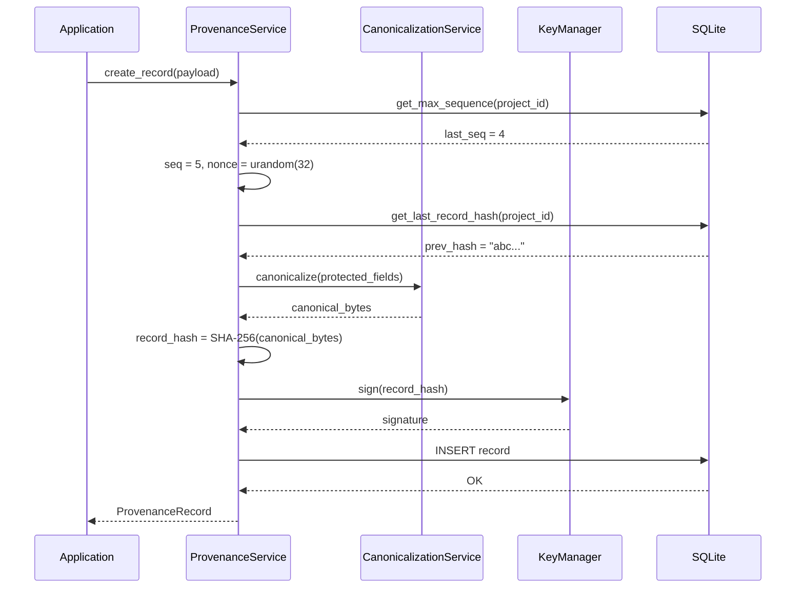
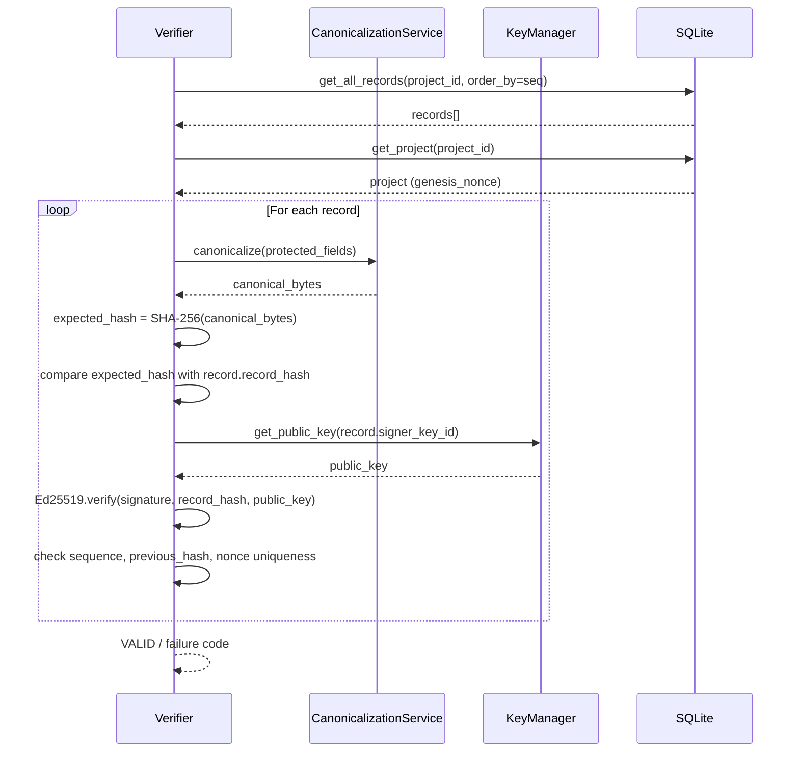
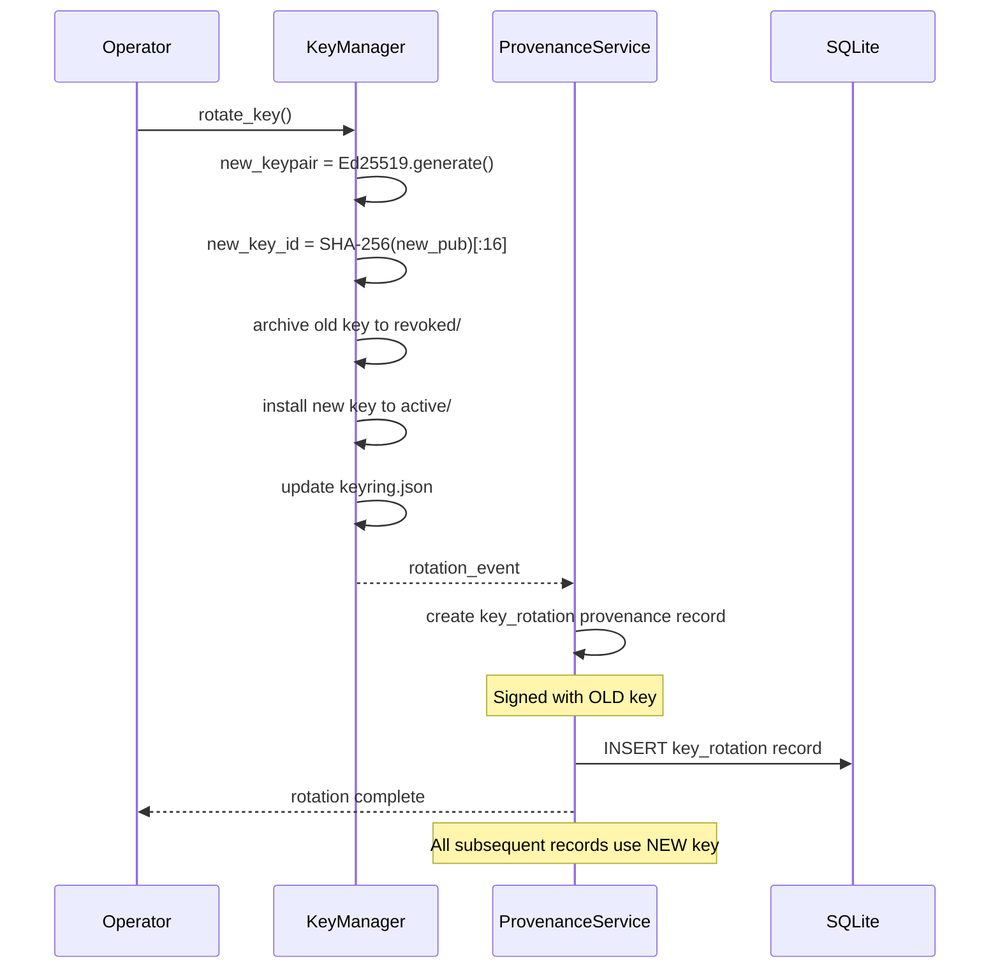

# AIVARA — Cryptographic Provenance Engine Design Specification

**Phase:** 4.10 — Cryptographic Tamper Detection Engine  
**Status:** IMPLEMENTED & VERIFIED  
**Date:** 2026-09-05  
**Authors:** AIVARA Engineering  

---

## Table of Contents

1. [Purpose](#1-purpose)
2. [Security Goals](#2-security-goals)
3. [Threat Model](#3-threat-model)
4. [Cryptographic Primitives](#4-cryptographic-primitives)
5. [Canonical Serialization](#5-canonical-serialization)
6. [Hash Construction](#6-hash-construction)
7. [Ed25519 Signature Design](#7-ed25519-signature-design)
8. [Key Management](#8-key-management)
9. [Nonce Design](#9-nonce-design)
10. [Sequence Number Design](#10-sequence-number-design)
11. [Timestamp Design](#11-timestamp-design)
12. [Provenance Record Structure](#12-provenance-record-structure)
13. [Hash-Chain Design](#13-hash-chain-design)
14. [Verification Pipeline](#14-verification-pipeline)
15. [Replay Detection](#15-replay-detection)
16. [Failure Behavior](#16-failure-behavior)
17. [Database Impact](#17-database-impact)
18. [API Design](#18-api-design)
19. [Test Strategy](#19-test-strategy)
20. [Security Limitations](#20-security-limitations)
21. [Offline / Air-Gapped Considerations](#21-offline--air-gapped-considerations)
22. [Future Blockchain Integration Considerations](#22-future-blockchain-integration-considerations)

---

## 1. Purpose

This document defines the complete cryptographic design for AIVARA's Provenance Engine (Phase 4). It specifies how every provenance record and inference record is:

- **canonically serialized** to produce deterministic bytes
- **hashed** to establish content identity
- **signed** to establish authenticity and non-repudiation
- **chained** to detect tampering, deletion, insertion, and reordering
- **protected against replay** via nonces, sequence numbers, and chain binding
- **verified** through an explicit, deterministic verification pipeline

This is a **design document only**. No code, database migrations, or dependency changes are introduced.

### 1.1 Guiding Principle: Separation of Detection and Proof

> A cryptographic hash proves that an artifact has not been modified relative to the hash. It does **NOT** prove that the artifact is benign, correct, or trustworthy. Hashing provides **identity/integrity**. Detection engines provide **anomaly analysis**. These are complementary, not substitutes (ADR-003, ADR-028).

---

## 2. Security Goals

| ID | Goal | Mechanism |
|----|------|-----------|
| SG-01 | **Content integrity** — detect accidental or malicious modification of any provenance-protected field | SHA-256 record hash |
| SG-02 | **Authenticity** — verify that a record was created by the holder of the signing key | Ed25519 digital signature |
| SG-03 | **Non-repudiation** — the signer cannot deny having signed a record | Ed25519 asymmetric signature (private key signs, public key verifies) |
| SG-04 | **Ordering integrity** — detect out-of-order, missing, or inserted records | Monotonic sequence numbers + hash chain |
| SG-05 | **Tamper evidence** — modification of any record in a chain invalidates all subsequent records | Hash-linked chain (`previous_record_hash`) |
| SG-06 | **Replay resistance** — prevent resubmission of a previously valid record | Cryptographic nonce + sequence number + chain binding |
| SG-07 | **Temporal context** — associate records with a point in time | UTC timestamps (supplementary, not sole replay protection) |
| SG-08 | **Auditability** — enable independent verification of the entire chain | Deterministic canonical serialization + public key verification |
| SG-09 | **Fail-closed** — security-critical verification failures reject the record | Explicit verification result codes, no silent pass-through |
| SG-10 | **Offline operation** — all cryptographic operations work without network access | Local key storage, Python `cryptography` library, no external services |

---

## 3. Threat Model

### 3.1 In-Scope Threats (This Design Protects Against)

| ID | Threat | Detection Mechanism |
|----|--------|---------------------|
| T-01 | **Accidental modification** — a record's payload is inadvertently altered (bit flip, partial write) | Record hash mismatch |
| T-02 | **Malicious record modification** — an attacker modifies a stored provenance record | Record hash mismatch + signature verification failure |
| T-03 | **Artifact substitution** — the `input_hash` or `output_hash` field is replaced to point to a different artifact | Record hash mismatch (hash covers these fields) |
| T-04 | **Output substitution** — inference output is swapped after sealing | Output hash mismatch within the signed record |
| T-05 | **Record substitution** — an entire record is replaced with a different valid record | Chain hash mismatch (`previous_record_hash` won't match) |
| T-06 | **Replay** — a previously valid, legitimately signed record is resubmitted | Nonce uniqueness + sequence number duplicate detection + chain binding |
| T-07 | **Record deletion** — a record is removed from the chain | Chain verification (gap in sequence, `previous_record_hash` mismatch) |
| T-08 | **Record insertion** — a spurious record is inserted into the chain | Chain verification (sequence collision, hash chain broken) |
| T-09 | **Record reordering** — records are reordered in storage | Sequence number + `previous_record_hash` verification |
| T-10 | **Unauthorized signing** — a record is signed with an unknown or revoked key | Key validity verification (unknown key ID → reject) |
| T-11 | **Cross-project/cross-chain replay** — a valid record from project A is replayed into project B | Project-scoped chain + genesis nonce anchoring |

### 3.2 Out-of-Scope Threats (Explicit Non-Coverage)

| ID | Threat | Rationale |
|----|--------|-----------|
| X-01 | **Compromised host / root access** | An attacker with root access to the workstation can modify the AIVARA binary, database, keys, and memory. No application-level cryptography can protect against this. |
| X-02 | **Stolen private signing key** | If the private key is extracted, the attacker can produce valid signatures. This design makes key compromise detectable through key rotation and revocation, but cannot prevent signing by a stolen key. |
| X-03 | **Malicious artifact legitimately signed** | A signing key holder can sign any payload. Signing proves authenticity, not benignity. Detection engines (Layer 1) address content quality. |
| X-04 | **Compromised operating system** | OS-level attacks (keyloggers, memory dumpers) are outside application scope. |
| X-05 | **Cryptographic algorithm compromise** | If SHA-256 or Ed25519 are broken, all guarantees are void. Both are currently considered secure by NIST and the wider cryptographic community. |
| X-06 | **Clock manipulation** | AIVARA trusts the local system clock. An attacker who can manipulate the system clock can forge timestamps. Replay detection does NOT rely solely on timestamps (see §15). |
| X-07 | **Side-channel attacks** | Timing attacks, power analysis, etc. are out of scope for a software-only desktop application. |

> **Non-overclaim:** This design protects against data-at-rest integrity violations and provides non-repudiation for exported records. It does NOT protect against an attacker with full access to the AIVARA data directory and signing key (see AR-017).

---

## 4. Cryptographic Primitives

### 4.1 Conceptual Distinction

Each primitive serves a distinct, non-substitutable purpose:

| Primitive | Purpose | What It Does NOT Do |
|-----------|---------|---------------------|
| **SHA-256 Hash** | Deterministic content identity / integrity checking. Same input → same hash. Any change → different hash. | Does NOT prove authenticity (anyone can compute a hash). Does NOT prove the artifact is benign. |
| **Ed25519 Signature** | Authenticity and integrity relative to a specific signing key. Proves the signer possessed the private key. | Does NOT prove the content is correct or trustworthy. Only proves who signed it. |
| **Cryptographic Nonce** | Uniqueness and replay resistance. Ensures each record is unique even if the payload is otherwise identical. | Does NOT provide ordering. Is NOT a substitute for sequence numbers. |
| **Sequence Number** | Ordering and gap detection. Detects missing, inserted, or out-of-order records. | Does NOT provide uniqueness (a replayed record could reuse a sequence number — the nonce catches this). |
| **Previous Record Hash** | Creates a tamper-evident hash-linked chain. Modification of any record invalidates all subsequent records. | Does NOT provide replay protection on its own. |
| **UTC Timestamp** | Temporal context for human review and anomaly detection. | MUST NOT be treated as sufficient replay protection by itself. Clocks can be manipulated. |

### 4.2 Library Selection

| Component | Library | Rationale |
|-----------|---------|-----------|
| SHA-256 | `hashlib` (Python stdlib) | No external dependency. FIPS 180-4 compliant. |
| Ed25519 | `cryptography` (PyCA) | Well-audited, widely used, already available in requirements. Provides `Ed25519PrivateKey` / `Ed25519PublicKey`. |
| CSPRNG | `os.urandom()` / `secrets` (Python stdlib) | OS-level cryptographically secure random number generator. No external dependency. |
| JSON canonicalization | Custom implementation following RFC 8785 principles | See §5 for justification. |

### 4.3 Algorithm Parameters

| Parameter | Value | Notes |
|-----------|-------|-------|
| Hash algorithm | SHA-256 (256-bit / 32 bytes) | Output as 64-character lowercase hex string |
| Signature algorithm | Ed25519 | 64-byte signature, 32-byte public key, 64-byte private key (seed + public) |
| Nonce size | 32 bytes (256 bits) | Stored as 64-character lowercase hex string |
| Signature encoding | Base64 (standard, with padding) | Stored as string in database TEXT column |
| Public key encoding | Base64 (standard, with padding) | For storage and transmission |
| Key ID | SHA-256 of the public key bytes, truncated to first 16 hex chars | Provides a short, unique, deterministic identifier |

---

## 5. Canonical Serialization

### 5.1 Problem Statement

The same logical provenance record MUST always produce exactly the same byte sequence regardless of:
- programming language
- JSON library implementation
- dictionary insertion order
- platform (Windows, Linux, macOS)
- Python version

Without deterministic serialization, hash(record) produces different values for logically identical records, breaking the entire integrity model.

### 5.2 Approach: RFC 8785 JSON Canonicalization Scheme (JCS) Implementation

**Decision:** Adopt RFC 8785 (JSON Canonicalization Scheme) implemented via the pure-Python `rfc8785` library (pinned to `rfc8785==0.1.4`), wrapped by AIVARA's strict type validation boundary in `backend/aivara/crypto/canonical.py`.

**Justification for `rfc8785` library:**

1. **RFC Author Reference Implementation:** Authored directly by Anders Rundgren (editor of RFC 8785).
2. **Zero Dependencies & Fully Offline:** Pure Python standard library implementation (`math`, `re`, `typing`, `io`). Requires zero external network access, cloud services, or C/Rust extensions.
3. **Spec-Compliant Number & Key Ordering:** Implements ECMA 262 §7.1.12.1 floating-point conversion and RFC 8785 §3.2.3 UTF-16 code unit key sorting (including surrogate pair astral characters like U+1F300).
4. **Auditability & Simplicity:** A concise, audited ~200-line implementation that avoids supply-chain complexity.

### 5.3 Canonical Serialization Rules and Domain Policies

| Aspect | Rule | Implementation & Example |
|--------|------|-------------------------|
| **Canonicalization Standard** | RFC 8785 (JSON Canonicalization Scheme - JCS) | `rfc8785.dumps(data)` returning UTF-8 `bytes` |
| **Object Key Ordering** | Keys sorted lexicographically by UTF-16 code units (RFC 8785 §3.2.3) | `{"a":1,"b":2}` not `{"b":2,"a":1}`; Non-BMP astral characters sort by high surrogate |
| **Whitespace** | Zero whitespace between tokens. No trailing newline. | `{"a":1,"b":2}` |
| **String Encoding** | UTF-8. Only escape characters required by RFC 8785 §3.2.2.2: `\"`, `\\`, `\b`, `\f`, `\n`, `\r`, `\t`, and control characters `\u0000`–`\u001f`. No unnecessary unicode escaping. | `"Café"` serialized as UTF-8 bytes, not `"Caf\u00e9"` |
| **Integer Representation** | Decimal notation with no leading zeros, no `+` prefix, bounded by safe integer range $[-2^{53}+1, 2^{53}-1]$. Exceeding values raise `InvalidNumberError`. | `42` not `42.0` or `+42` |
| **Floating-Point Policy** | Serialized per ECMA 262 shortest representation. `-0.0` and `0.0` serialized as `0`. Non-finite values (`NaN`, `+Inf`, `-Inf`) raise `InvalidNumberError`. **No arbitrary global rounding (e.g. `round(v, 6)`) is applied by the canonicalizer.** If model inference requires cross-hardware float quantization, it must be performed explicitly by the application layer before canonicalization. | `1.0` -> `1`; `0.5` -> `0.5`; `1e-6` -> `0.000001`; `1e-7` -> `1e-7` |
| **Datetime Policy** | Raw `datetime` objects are strictly rejected by `canonicalize()` with `UnsupportedTypeError`. All timestamps must be converted to UTC ISO 8601 strings (`YYYY-MM-DDTHH:MM:SSZ`, without fractional seconds) using `format_canonical_datetime()` prior to serialization. | `"2026-09-05T12:00:00Z"` |
| **Binary Data Policy** | Raw `bytes` or `bytearray` are strictly rejected with `UnsupportedTypeError`. Binary data must be pre-hashed to a SHA-256 hexadecimal string by higher-level cryptographic services. | `input_hash: "a3f8..."` not `image_bytes: b"..."` |
| **Boolean Representation** | JSON `true` / `false` (lowercase tokens) | `true` / `false` |
| **Null Representation** | JSON `null`. In provenance payloads, optional fields are explicitly retained as `null` rather than omitted to ensure fixed payload shape across versions. | `{"previous_record_hash":null}` |
| **Arrays / Lists** | Element order is preserved (array ordering is semantically significant). | `[1,2,3]` != `[3,2,1]` |
| **Nested Objects** | Recursive application of all canonical rules at every nesting depth. | `{"outer":{"a":1,"b":2}}` |
| **Schema Version** | Every provenance payload binds an explicit `"_schema_version":"1.0"` field. | `{"_schema_version":"1.0",...}` |
| **Duplicate Keys** | Disallowed. `parse_canonical_json()` employs an object pairs hook that detects duplicate keys and raises `DuplicateKeyError`. | `{"a":1,"a":2}` rejected |
| **Input Immutability** | Canonicalization strictly guarantees that the caller's input dictionary or list is never modified or mutated. | Caller data remains identical after call |

### 5.4 Canonicalization Error Hierarchy

All canonicalization exceptions inherit from `aivara.core.exceptions.AivaraException` and standard `ValueError`:

```
AivaraException
  └── CanonicalizationError
        ├── UnsupportedTypeError (code: UNSUPPORTED_TYPE)
        ├── InvalidNumberError (code: INVALID_NUMBER)
        ├── InvalidStringError (code: INVALID_STRING)
        ├── MalformedStructureError (code: MALFORMED_STRUCTURE)
        ├── InvalidSchemaVersionError (code: INVALID_SCHEMA_VERSION)
        └── DuplicateKeyError (code: DUPLICATE_KEY)
```

### 5.5 Canonical Serialization Flow

```
Structured Data (Python dict / list)
        │
        ▼
[1] Validate input boundary (validate_canonical_data)
    - Verify only safe JSON types (dict, list, str, int, float, bool, None)
    - Reject datetime, UUID, bytes, Path, Decimal, custom classes
    - Check finite numbers (reject NaN, Inf)
    - Check safe integer domain [-2^53 + 1, 2^53 - 1]
    - Verify valid UTF-8 string encoding
        │
        ▼
[2] RFC 8785 JCS Serialization (rfc8785.dumps)
    - Sort object keys by UTF-16 code units
    - Strip all whitespace between tokens
    - Serialize floats per ECMA 262 (-0.0 -> 0, 1.0 -> 1)
    - Apply minimal RFC 8785 string escaping
        │
        ▼
canonical_bytes: bytes (UTF-8 encoded)
```

### 5.6 Invariant

**For any two logically equivalent provenance records R₁ and R₂:**

```
canonicalize(R₁) == canonicalize(R₂)
```

**And in future Phase 4.3:**

```
SHA-256(canonicalize(R₁)) == SHA-256(canonicalize(R₂))
```

---

## 6. Hash Construction & SHA-256 Engine

### 6.1 Algorithm Specification & Implementation

**Decision:** Use the SHA-256 cryptographic hash function (FIPS 180-4) implemented via Python's standard library `hashlib`.

- **Library:** Python `hashlib` (standard library, zero third-party dependencies, 100% offline).
- **Module:** `backend/aivara/crypto/hashing.py`.
- **Digest Size:** 256 bits (32 bytes).
- **Textual Representation:** Exactly 64 lowercase hexadecimal characters (`[0-9a-f]`).
- **Input Boundary:** Low-level hashing operates strictly on exact bytes (`bytes`, `bytearray`, `memoryview`) via `sha256_bytes()`. Strings must be explicitly encoded as UTF-8 via `sha256_text()`. Structured data must be canonicalized via `hash_canonical_data()` or `hash_provenance_payload()`.

### 6.2 Record Hash Protected Fields

The record hash provides content identity for a single provenance record.

**Protected fields** (included in hash input):

```json
{
    "_schema_version": "1.0",
    "action": "<string>",
    "actor": "<string>",
    "config_hash": "<hex string | null>",
    "input_hash": "<hex string | null>",
    "metadata_json": {},
    "model_id": "<string | null>",
    "model_weight_digest": "<hex string | null>",
    "nonce": "<hex string>",
    "output_hash": "<hex string | null>",
    "previous_record_hash": "<hex string | null>",
    "project_id": "<uuid string>",
    "record_type": "<string>",
    "sequence_number": 1,
    "signer_key_id": "<hex string>",
    "target_id": "<uuid string | null>",
    "target_type": "<string | null>",
    "timestamp": "2026-09-05T12:00:00Z"
}
```

**Fields explicitly EXCLUDED from the hash input:**

| Field | Reason |
|-------|--------|
| `id` (UUID primary key) | Database-assigned internal surrogate key, not part of the logical record |
| `signature` | The digital signature signs the hash. Including signature in hash input would create a circular dependency. |
| `record_hash` | This IS the output digest. Cannot be its own input. |
| `blockchain_tx_id` | Populated asynchronously after record creation in future phases |
| `created_at` (DB column) | Database row insertion timestamp, distinct from the cryptographic `timestamp` |
| `verification_status` | Mutable verification state, not part of the signed content |

### 6.3 Hash Computation Flow & Canonicalization Integration

```
Protected Fields (dict)
        │
        ▼
canonical_bytes = canonicalize_provenance_payload(...)  # RFC 8785 JCS UTF-8 bytes
        │
        ▼
record_hash = sha256_bytes(canonical_bytes)            # 64-char lowercase hex
```

- **Separation of Concerns:** `canonicalize()` is exclusively responsible for canonical serialization. `sha256_bytes()` is exclusively responsible for hashing exact bytes. `hash_provenance_payload()` acts as the clean integration bridge without duplicating JCS logic.

### 6.4 Representation & Lowercase Policy

- **Format:** Lowercase hexadecimal string (`[0-9a-f]`).
- **Length:** Exactly 64 characters (256 bits).
- **Prohibitions:** Uppercase hex (e.g. `A1B2...`) and algorithm prefixes (e.g. `sha256:...`) are strictly prohibited in canonical storage.
- **Empty-Input Vector:** SHA-256 of `b""` is accepted and evaluates to the standard NIST empty digest:
  `e3b0c44298fc1c149afbf4c8996fb92427ae41e4649b934ca495991b7852b855`.

### 6.5 Validation & Constant-Time Comparison

- **Validation (`is_valid_sha256`):** Verifies that a digest string is exactly 64 characters and contains exclusively lowercase hex digits.
- **Secure Comparison (`secure_compare_hashes`):** Uses `hmac.compare_digest` to perform constant-time string comparison, mitigating timing side-channel attacks during record and artifact verification.

### 6.6 Security Properties vs. Limitations

**What SHA-256 Provides:**
1. **Deterministic Content Digest:** Identical canonical inputs produce bit-for-bit identical hashes across all environments.
2. **Accidental & Malicious Modification Detection:** The avalanche effect ensures that any single-bit modification produces an unpredictable and uncorrelated 256-bit digest.
3. **Collision Resistance:** Finding two distinct inputs $x \neq y$ such that $\text{SHA-256}(x) = \text{SHA-256}(y)$ requires an intractable $O(2^{128})$ operations.
4. **Preimage Resistance:** Infeasible to reverse-engineer input data from the hash digest alone ($O(2^{256})$ work).

**What SHA-256 Does NOT Provide:**
1. **Authenticity / Non-Repudiation:** A hash alone does NOT prove who authored or created the record (addressed by Ed25519 signatures in Phase 4.5).
2. **Proof of Benign Content:** Hashing an artifact or model proves only that it matches the digest; it does not prove that the model or data is safe or unbackdoored (ADR-003, ADR-028).
3. **Replay Protection by Itself:** An attacker can replay a legitimately hashed record unless bound to sequence numbers, nonces, and previous record hashes (Phase 4.4 / Phase 4.6).

### 6.7 Algorithm Agility

While SHA-256 is the standard cryptographic digest for AIVARA (Phase 4), the architecture isolates hashing into `backend/aivara/crypto/hashing.py`. If future post-quantum or enterprise requirements mandate SHA-3, BLAKE3, or SHA-512, migration can be supported cleanly by:
1. Versioning the canonical schema (`_schema_version = "2.0"`).
2. Storing algorithm identifiers alongside the chain genesis metadata.
3. Providing modular hashing adapters within `aivara.crypto`.

### 6.8 Avoiding Circular Hashing

```
                    ┌──────────────────┐
                    │ Protected Fields │
                    │  (no signature,  │
                    │   no record_hash)│
                    └────────┬─────────┘
                             │
                    ┌────────▼─────────┐
                    │  canonicalize()   │
                    └────────┬─────────┘
                             │
                    ┌────────▼─────────┐
                    │   sha256_bytes()  │──────────▶ record_hash (64 hex chars)
                    └────────┬─────────┘                │
                             │                          │ stored in DB
                    ┌────────▼─────────┐                │
                    │  Ed25519.sign()   │ (Phase 4.5)    │
                    └────────┬─────────┘                │
                             │                          │
                        signature ──────────────────────┘ both stored in DB
```

The digital signature (Phase 4.5) signs the `record_hash` bytes, avoiding recursive dependencies and eliminating re-canonicalization overhead during signature verification.

---

## 7. Ed25519 Digital Signing & Verification Engine (Phase 4.5 Implementation)

### 7.1 Architecture & Signing Flow

The cryptographic signing layer binds a deterministic content identity (`record_hash`) to an authenticated signer identity (`signer_key_id`) using Edwards-curve Digital Signatures (Ed25519 / RFC 8032):

```
Protected Provenance Payload (dict)
          │
          ▼
canonicalize_provenance_payload() (RFC 8785 JCS)
          │
          ▼
sha256_bytes() (FIPS 180-4)
          │
          ▼
record_hash (64 lowercase hex chars)
          │
          ▼
record_hash.encode("utf-8") (64 ASCII / UTF-8 bytes)
          │
          ▼
Ed25519PrivateKey.sign() (RFC 8032 deterministic signing)
          │
          ▼
raw signature (64 bytes)
          │
          ▼
encode_signature() (Standard Base64: 88 chars with padding)
```

### 7.2 Exact Signing Input Definition

- **Signing Bytes Formulation**:
  ```python
  signing_bytes = record_hash.encode("utf-8")
  ```
- **Length**: Exactly 64 bytes.
- **Enforcement**:
  1. Input must be a valid 64-character lowercase hexadecimal SHA-256 string (`^[0-9a-f]{64}$`).
  2. Uppercase hex, non-hex characters, and lengths other than 64 characters are strictly rejected with `InvalidSigningInputError`.
  3. No arbitrary dictionary or uncanonicalized JSON is ever passed directly to the signing primitive.
  4. The signing boundary is completely explicit: `canonicalize()` handles JCS serialization, `sha256_bytes()` handles hashing, and `sign_hash()` signs the UTF-8 encoded hash string.

### 7.3 Signature Format & Base64 Encoding

| Aspect | Specification | Details |
| :--- | :--- | :--- |
| **Algorithm** | Ed25519 (RFC 8032) | Deterministic Edwards-curve Digital Signature Algorithm |
| **Raw Signature Size** | 64 bytes | 32 bytes ($R$) + 32 bytes ($S$) |
| **Textual Encoding** | Standard Base64 | RFC 4648 §4 standard alphabet with `=` padding |
| **Encoded Length** | Exactly 88 characters | Always ends in `==` padding; no newlines or whitespace |
| **Strict Decoder** | `decode_signature()` | Validates exact 88-char length, strict Base64 characters, and decoded length of exactly 64 bytes; rejects malformed inputs with `MalformedSignatureError` |

### 7.4 Signer Key ID Association

- **Signer Identity Binding**: Signer identity is cryptographically tied to the 64-character lowercase hex `key_id = SHA-256(raw_32_byte_public_key)`.
- **Association**:
  - `SignatureResult` pairs the Base64 signature with `signer_key_id`.
  - Verification validates that the public key used for verification derives the expected `signer_key_id`.
  - If a mismatch occurs, verification rejects the signature with `VerificationStatus.UNKNOWN_SIGNER_KEY`.

### 7.5 Active-Key Signing Policy vs. Historical-Key Verification Policy

| Policy Domain | Rule | Enforcement & Behavior |
| :--- | :--- | :--- |
| **New Signatures** | Only `ACTIVE` keys may sign | Attempting to sign with a `ROTATED` key raises `KeyRotatedError`. Attempting to sign with a `REVOKED` key raises `KeyRevokedError`. Attempting to sign with an `EXPIRED` key raises `KeyExpiredError`. Attempting to sign without loaded private key raises `KeyManagementError`. |
| **Historical Verification** | All keys (`ACTIVE`, `ROTATED`, `REVOKED`, `EXPIRED`) may verify | Historical signatures created before key rotation or revocation remain mathematically valid and verifiable for audit and assurance pipelines. |

**Crucial Distinction:**
- **Cryptographic Validity**: Answers *"Was this signature mathematically generated by the private key corresponding to this public key over this exact payload?"*
- **Key Lifecycle Authorization**: Answers *"Is this key currently active and authorized to generate new signatures?"*

The engine decouples these two concerns: historical signatures verify as mathematically `VALID` (`is_valid=True`), while returning `key_is_active=False` and the historical `key_status`.

### 7.6 Verification Result Structure & Error Semantics

Verification operations return a structured `VerificationResult`:

```python
class VerificationResult(BaseModel):
    is_valid: bool
    status: VerificationStatus  # VALID, INVALID_SIGNATURE, MALFORMED_SIGNATURE, UNKNOWN_SIGNER_KEY, INVALID_SIGNING_INPUT
    signer_key_id: Optional[str]
    key_status: Optional[KeyStatus]
    key_is_active: bool
    error_message: Optional[str]
```

**Verification Failure Categories:**
1. `INVALID_SIGNING_INPUT`: Record hash does not match 64-character lowercase hexadecimal specification.
2. `MALFORMED_SIGNATURE`: Signature is not valid Base64 or does not decode to 64 bytes.
3. `UNKNOWN_SIGNER_KEY`: Key ID not found in storage or does not match public key.
4. `INVALID_SIGNATURE`: Cryptographic verification failed (content tampered, wrong key, or corrupted signature).

Callers requiring exception-based flow can use `assert_signature_valid()`, which raises typed exceptions (`InvalidSignatureError`, `MalformedSignatureError`, `UnknownSignerKeyError`, `InvalidSigningInputError`).

### 7.7 Security Properties

- **Constant-Time Verification**: Uses library-provided verification via OpenSSL / `cryptography`.
- **Deterministic Signatures**: Ed25519 (RFC 8032) derives nonces deterministically from the private key and message hash. No random number generator failure can leak private keys.
- **Zero Secret Exposure**: Signatures and verification results never contain private keys or passphrases. Private keys are never logged or returned.

---

## 8. Key Management Engine (Phase 4.4 Implementation)

### 8.1 Key Hierarchy & Directory Layout

To avoid write-contention and file corruption issues of a monolithic keyring file, key material and metadata are stored atomically per key ID in the dedicated keys directory (`data/keys/`):

```
data/
└── keys/
    ├── .gitkeep                         # Track directory structure
    ├── active_key_id                    # Plain text containing active key_id (64 hex chars)
    ├── <key_id>.key                     # PKCS#8 PEM private key (restricted ACL / 0600)
    ├── <key_id>.pub                     # SubjectPublicKeyInfo PEM public key
    ├── <key_id>.json                    # KeyMetadata JSON schema (RFC 8785 canonical format)
    └── ...                              # Historical (rotated / revoked) keys retained
```

### 8.2 Key Generation & Key ID Derivation

| Parameter | Value | Details |
|-----------|-------|---------|
| **Algorithm** | Ed25519 (RFC 8032) | High-speed, high-security Edwards-curve digital signature algorithm |
| **Private Key Size** | 32 bytes seed (64 bytes expanded) | PKCS#8 unencrypted or encrypted with AES-256-CBC |
| **Public Key Size** | 32 bytes raw | Stored in SubjectPublicKeyInfo PEM format + base64 in metadata |
| **Key Identifier (key_id)** | Full 64-character lowercase hex digest | Derived deterministically as `SHA-256(raw_32_byte_public_key)` |
| **Format Enforcement** | `^[0-9a-f]{64}$` regex validation | Bounded length matches SQLite `VARCHAR(64)` and eliminates directory traversal |
| **Generator** | `Ed25519PrivateKey.generate()` | Cryptographically secure random generation via `cryptography` library |

**Key ID Determinism Invariant:**
```
raw_pub = public_key.public_bytes(Encoding.Raw, PublicFormat.Raw)
key_id  = sha256_bytes(raw_pub)  # Exact 64 hex characters
```

### 8.3 Key Storage & Local Filesystem Security

**Private Key Security (`<key_id>.key`):**
- **Encoding:** Standard PKCS#8 encrypted PEM format (`BEGIN ENCRYPTED PRIVATE KEY`).
- **Mandatory Encryption at Rest:** By default and in production, newly generated persistent private keys are strictly encrypted using standard PKCS#8 `serialization.BestAvailableEncryption(passphrase.encode("utf-8"))` (AES-256-CBC / scrypt / PBKDF2).
- **Passphrase Responsibility:** The passphrase is the sole responsibility of the operator and cannot be recovered by AIVARA. If a passphrase is not supplied or is empty, key generation immediately fails with `PassphraseRequiredError`. No fallback to plaintext storage is ever permitted.
- **Credential Storage Invariants:** The passphrase is never stored in SQLite, never logged, never hardcoded, never cached in memory beyond immediate use, and never returned in API responses.
- **Filesystem Permissions:**
  - **Windows (NTFS):** Configured via `icacls` sub-process:
    ```cmd
    icacls <filepath> /inheritance:r /grant:r %USERNAME%:(R,W)
    ```
    Inheritance is severed, granting read/write exclusively to the current operating system user.
  - **POSIX:** Configured via `os.chmod(filepath, 0o600)` granting read/write only to file owner.
- **Atomic File Writes:** Key files are written to a `.tmp` file in the same directory, flushed with `os.fsync`, permissions applied, and atomically moved into place via `os.replace`.

**Public Key Storage (`<key_id>.pub`):**
- **Encoding:** SubjectPublicKeyInfo (SPKI) PEM format (`BEGIN PUBLIC KEY`).
- **Access:** Shared/readable for signature verification.

### 8.4 Key Metadata Schema (`<key_id>.json`)

Key metadata is strictly validated using Pydantic (`KeyMetadata`):

```json
{
  "key_id": "a3f8c9e2b104...",
  "algorithm": "Ed25519",
  "created_at": "2026-09-05T12:00:00Z",
  "status": "ACTIVE",
  "public_key_hex": "e3b0c44298fc...",
  "public_key_pem": "-----BEGIN PUBLIC KEY-----\nMCow...",
  "revoked_at": null,
  "revocation_reason": null
}
```

### 8.5 Key Security Invariants & Encapsulation

| Security Invariant | Enforcement Mechanism |
|--------------------|------------------------|
| **No Plaintext at Rest** | Persistent keys are strictly encrypted with PKCS#8 `BestAvailableEncryption` |
| **No Hardcoded Keys** | Keys exist exclusively in local filesystem storage or test fixtures |
| **No Version Control Leaks** | Root `.gitignore` explicitly ignores `data/keys/*` while preserving `!data/keys/.gitkeep` |
| **No In-Memory Exposure** | `Ed25519KeyHandle` wraps private keys; `__repr__` and `__str__` mask private key material (`<Ed25519KeyHandle key_id=... status=...>`) |
| **No Database Leaks** | Private keys and passphrases are never persisted in database columns |
| **No Log / API Leaks** | Sensitive sanitization filter in `core/logging.py` redacts PEM patterns and passphrases |
| **No Path Traversal** | Key IDs are strictly checked against `^[0-9a-f]{64}$` before forming file paths |

### 8.6 Key Lifecycle & Status Semantics

A key follows a formal finite state machine with statuses defined by `KeyStatus`:

```
               ┌───────────┐
               │  ACTIVE   │
               └─────┬─────┘
                     │
         ┌───────────┴───────────┐
         ▼                       ▼
   ┌───────────┐           ┌───────────┐
   │  ROTATED  │           │  REVOKED  │
   └─────┬─────┘           └───────────┘
         │                       ▲
         └───────────────────────┘
```

1. **`ACTIVE`:** Valid for signing new records and historical verification. Exactly one active key is designated in `active_key_id`. Evaluates `handle.is_active == True` and `handle.can_sign == True`.
2. **`ROTATED`:** Deprecated for new signatures, but retained for historical verification of past records. When an operation requires an active key, raises `KeyRotatedError` (code: `KEY_ROTATED`). Evaluates `handle.is_rotated == True` and `handle.can_sign == False`.
3. **`REVOKED`:** Invalided permanently due to compromise or retirement. When an operation requires an active key, raises `KeyRevokedError` (code: `KEY_REVOKED`). Evaluates `handle.is_revoked == True` and `handle.can_sign == False`.
4. **`EXPIRED`:** Beyond validity timeline. When an operation requires an active key, raises `KeyExpiredError` (code: `KEY_EXPIRED`). Evaluates `handle.is_expired == True` and `handle.can_sign == False`.

**Status Error Hierarchy:**
```
KeyManagementError
  └── KeyStatusError
        ├── KeyRevokedError (code: KEY_REVOKED)
        ├── KeyRotatedError (code: KEY_ROTATED)
        └── KeyExpiredError (code: KEY_EXPIRED)
```

**Historical Loading Policy:**
When loading keys for historical provenance verification (`require_active=False`), all key statuses (`ACTIVE`, `ROTATED`, `REVOKED`, `EXPIRED`) remain loadable and verifiable indefinitely.

### 8.7 Key Rotation & Revocation Architecture

- **`rotate_key(passphrase=...)`:**
  - Atomically marks the active key as `KeyStatus.ROTATED`.
  - Generates a new encrypted Ed25519 keypair with the provided passphrase and assigns it `KeyStatus.ACTIVE`.
  - Updates `active_key_id` pointer atomically.
  - Returns `(old_key_handle, new_key_handle)` for cryptographic handoff (Phase 4.5/4.6).
- **`revoke_key(key_id, reason=...)`:**
  - Sets key status to `KeyStatus.REVOKED`, records `revoked_at = utcnow()` and `revocation_reason`.
  - If the revoked key was active, clears `active_key_id`.
- **Historical Retention:** Historical keys are never deleted, ensuring that historical provenance chains can always be verified indefinitely.

### 8.8 Development vs. Production Key Handling

| Aspect | Development / Testing | Production |
|--------|-----------------------|------------|
| Key generation | Explicit test passphrases in temporary directories | Operator-supplied passphrase via secure prompt / CLI |
| Key encryption | Standard encrypted PKCS#8 (`BestAvailableEncryption`) | Standard encrypted PKCS#8 (`BestAvailableEncryption`) |
| Key persistence | Temporary directory (`tmp_path`) | Local `data/keys/` with restrictive ACL / 0600 |
| Plaintext fallback | Prohibited | Prohibited |
| Key rotation | Verified via test automation | Operator-triggered rotation |

---

## 9. Nonce Design

### 9.1 Generation

| Parameter | Value |
|-----------|-------|
| Source | `os.urandom(32)` — OS-level CSPRNG |
| Size | 32 bytes (256 bits) |
| Representation | Lowercase hexadecimal string (64 characters) |
| Storage | `VARCHAR(64)` column |

### 9.2 Uniqueness Scope

**Decision:** Nonce uniqueness is enforced **per-project** (project-scoped).

**Justification:**

| Scope | Pros | Cons | Decision |
|-------|------|------|----------|
| Global | Maximum protection | Requires cross-project index; overhead for large multi-project deployments | Rejected — unnecessary given chain binding |
| Per-project | Matches chain scope; practical index size; sufficient given that chains are project-scoped | A nonce could technically repeat across projects | **Selected** |
| Per-signer | Allows nonce reuse across signers within a project | Insufficient — doesn't prevent cross-signer replay within a project | Rejected |
| Per-chain | Equivalent to per-project in current design | — | Equivalent to selected |

### 9.3 Uniqueness Checking

Before a new provenance record is committed:

1. Generate nonce via `os.urandom(32).hex()`
2. Query: `SELECT 1 FROM provenance_records WHERE project_id = ? AND nonce = ?`
3. If a match is found → **regenerate** (this is astronomically unlikely with 256-bit nonces, but the check is a defense-in-depth measure)
4. If no match → proceed

### 9.4 Behavior After Restart

Nonces are stored persistently in the database. After a restart:

- The nonce uniqueness table is already populated
- New nonces are generated independently of any prior state
- `os.urandom()` does not depend on application state — it draws from the OS entropy pool

### 9.5 Nonce vs. Sequence Number

| Property | Nonce | Sequence Number |
|----------|-------|-----------------|
| Purpose | Uniqueness / replay resistance | Ordering / gap detection |
| Generation | Random (CSPRNG) | Deterministic (increment) |
| Predictable | No | Yes (by design) |
| Detects replay | Yes (duplicate nonce check) | Partially (duplicate sequence check) |
| Detects gaps | No | Yes |
| Detects reorder | No | Yes |

Both are required. Neither alone is sufficient.

---

## 10. Sequence Number Design

### 10.1 Scope

**Decision:** Sequence numbers are scoped **per-project** for provenance records.

For inference records, the existing schema scopes sequence numbers per `(project_id, model_id)` pair (as defined by the unique index `ix_inference_records_sequence`). This is retained.

| Chain Type | Sequence Scope | Rationale |
|------------|---------------|-----------|
| Provenance records | Per `project_id` | One provenance chain per project |
| Inference records | Per `(project_id, model_id)` | One inference chain per model within a project |

### 10.2 Rules

| Rule | Specification |
|------|---------------|
| Starting value | `1` (genesis record has `sequence_number = 1`) |
| Increment | Strictly `+1` per record |
| Type | Non-negative integer |
| Maximum | No artificial limit (SQLite INTEGER is 64-bit) |
| Persistence | Derived from `MAX(sequence_number) + 1` at record creation time |
| Concurrency | SQLite single-writer mode (WAL) ensures serialized writes. Sequence assignment is atomic within a transaction. |
| Restart behavior | Sequence continues from the last persisted value. No reset on restart. |

### 10.3 Gap and Duplicate Handling

| Condition | Meaning | Verification Result |
|-----------|---------|---------------------|
| Sequence `[1, 2, 3, 4, 5]` | Valid | `VALID` |
| Sequence `[1, 2, 4, 5]` | Gap — record 3 is missing (deleted or never written) | `CHAIN_BROKEN` |
| Sequence `[1, 2, 3, 3, 4]` | Duplicate — record 3 appears twice | `SEQUENCE_VIOLATION` |
| Sequence `[1, 2, 4, 3, 5]` | Out-of-order — records 3 and 4 are swapped | `CHAIN_BROKEN` (previous_hash also fails) |

### 10.4 Interaction with Other Fields

```
sequence_number: provides ordering, detects gaps
         +
nonce: provides uniqueness, detects replay
         +
previous_record_hash: provides chaining, detects tampering
         +
timestamp: provides temporal context (supplementary)
         =
Full provenance integrity
```

---

## 11. Timestamp Design

### 11.1 Format

| Parameter | Value |
|-----------|-------|
| Timezone | UTC only |
| Format | ISO 8601: `YYYY-MM-DDTHH:MM:SSZ` |
| Fractional seconds | None (truncated to whole seconds) |
| Suffix | `Z` (explicit UTC indicator, not `+00:00`) |
| Storage | `VARCHAR(20)` or `DATETIME` column (existing `DATETIME`) |

### 11.2 Clock Source

The timestamp is derived from the local system clock via `datetime.now(timezone.utc)`.

**Documented assumption:** AIVARA trusts the local system clock. In air-gapped environments, the clock may not be NTP-synchronized. This is a known limitation (see §20).

### 11.3 Timestamp as Supplementary Evidence

Timestamps are included in the canonical payload and protected by the hash. However:

> **Timestamps MUST NOT be the sole replay detection mechanism.**
> 
> Primary replay detection: nonce uniqueness + sequence number + chain binding.
> Timestamps: supplementary evidence for human review and anomaly detection.

### 11.4 Clock Anomaly Detection

During chain verification, if `record[N].timestamp < record[N-1].timestamp`, this is flagged as a warning (not an automatic rejection):

```
CLOCK_ANOMALY_WARNING: Record {N} timestamp is before record {N-1} timestamp.
This may indicate clock manipulation or clock skew. Manual review recommended.
```

This is a **warning**, not a verification failure, because clock skew can occur legitimately in some environments.

---

## 12. Provenance Record Structure

### 12.1 Complete Record Structure

```
┌─────────────────────────────────────────────────────────────────┐
│                      ProvenanceRecord                            │
├─────────────────────────────────────────────────────────────────┤
│ Database fields (not in hash):                                   │
│   id: UUID                    ← DB primary key                   │
│   created_at: datetime        ← DB insertion timestamp           │
│   verification_status: str    ← mutable verification state       │
│   blockchain_tx_id: str|null  ← future blockchain reference      │
├─────────────────────────────────────────────────────────────────┤
│ Protected fields (included in hash):                             │
│   _schema_version: "1"       ← canonical schema version         │
│   record_type: str           ← category of provenance event     │
│   project_id: UUID str       ← project scope                    │
│   actor: str                 ← who performed the action          │
│   action: str                ← what was done                     │
│   target_type: str|null      ← type of affected entity           │
│   target_id: UUID str|null   ← ID of affected entity             │
│   input_hash: hex str|null   ← SHA-256 of inputs                 │
│   output_hash: hex str|null  ← SHA-256 of outputs                │
│   metadata_json: str         ← canonicalized metadata            │
│   sequence_number: int       ← monotonic ordering                │
│   nonce: hex str             ← cryptographic nonce               │
│   timestamp: ISO 8601 str    ← UTC timestamp                     │
│   signer_key_id: hex str     ← identifies the signing key        │
│   previous_record_hash: hex str|null ← chain link                │
├─────────────────────────────────────────────────────────────────┤
│ Computed fields:                                                 │
│   record_hash: hex str       ← SHA-256(canonical(protected))     │
│   signature: base64 str      ← Ed25519.sign(record_hash_bytes)   │
└─────────────────────────────────────────────────────────────────┘
```

### 12.2 Record Creation Flow

```
                    ┌──────────────────┐
                    │  Application     │
                    │  provides:       │
                    │  - record_type   │
                    │  - actor, action │
                    │  - target info   │
                    │  - input/output  │
                    │  - metadata      │
                    └────────┬─────────┘
                             │
                    ┌────────▼─────────┐
                    │ Assign:          │
                    │ - sequence_number│ ← MAX(seq) + 1
                    │ - nonce          │ ← os.urandom(32).hex()
                    │ - timestamp      │ ← UTC now
                    │ - signer_key_id  │ ← active key ID
                    │ - previous_hash  │ ← last record's hash
                    └────────┬─────────┘
                             │
                    ┌────────▼─────────┐
                    │ canonicalize()    │
                    │ → canonical_bytes │
                    └────────┬─────────┘
                             │
                    ┌────────▼─────────┐
                    │ SHA-256()         │
                    │ → record_hash     │
                    └────────┬─────────┘
                             │
                    ┌────────▼─────────┐
                    │ Ed25519.sign()    │
                    │ → signature       │
                    └────────┬─────────┘
                             │
                    ┌────────▼─────────┐
                    │ INSERT into DB    │
                    │ (atomic txn)      │
                    └──────────────────┘
```

---

## 13. Hash-Chain Design

### 13.1 Chain Structure

```
┌────────────────────┐     ┌────────────────────┐     ┌────────────────────┐
│   Record 1         │     │   Record 2         │     │   Record 3         │
│   (Genesis)        │     │                    │     │                    │
│                    │     │                    │     │                    │
│ prev_hash: <gen>   │◄────│ prev_hash: hash_1  │◄────│ prev_hash: hash_2  │
│ seq: 1             │     │ seq: 2             │     │ seq: 3             │
│ nonce: <random>    │     │ nonce: <random>    │     │ nonce: <random>    │
│ record_hash: hash_1│     │ record_hash: hash_2│     │ record_hash: hash_3│
│ signature: sig_1   │     │ signature: sig_2   │     │ signature: sig_3   │
└────────────────────┘     └────────────────────┘     └────────────────────┘
```

### 13.2 Genesis Record

The first record in a project's provenance chain is the **genesis record**.

**Genesis `previous_record_hash` construction (per ADR-011 Amendment / AR-015):**

```
genesis_nonce = os.urandom(32).hex()    # Generated at project creation
Store genesis_nonce in Project.genesis_nonce column

previous_record_hash for genesis = SHA-256(project_id + genesis_nonce).hexdigest()
```

The genesis nonce is stored in the `Project` table (column `genesis_nonce`, already present), separate from the provenance chain. This anchors the chain to the project. Replacing the chain requires modifying both the provenance records AND the project record.

### 13.3 Chain Scope

One provenance chain per project. All provenance records for a project form a single linear chain ordered by `sequence_number`.

### 13.4 Chain Identity

The chain is identified by:
- `project_id` — which project
- `genesis_nonce` — the anchor stored in the Project table
- The genesis record's `previous_record_hash = SHA-256(project_id + genesis_nonce)`

### 13.5 Signer Changes Within a Chain

When a key rotation occurs (§8.6):
1. A `key_rotation` provenance record is signed with the **old** key
2. Subsequent records are signed with the **new** key
3. Chain verification looks up the correct public key for each record using `signer_key_id`

The chain remains valid across key rotations because:
- The hash chain is independent of the signing key (hashes don't change with key rotation)
- Each record's `signer_key_id` identifies which key to use for signature verification
- The key rotation record itself provides the cryptographic handoff

### 13.6 Chain Verification

Full chain verification algorithm:

```
function verify_chain(project_id):
    records = get_all_records(project_id, order_by=sequence_number ASC)
    
    if records is empty:
        return CHAIN_EMPTY
    
    # Verify genesis
    project = get_project(project_id)
    expected_genesis_prev = SHA-256(project_id + project.genesis_nonce)
    
    if records[0].previous_record_hash != expected_genesis_prev:
        return CHAIN_BROKEN (genesis anchor mismatch)
    
    if records[0].sequence_number != 1:
        return SEQUENCE_VIOLATION (genesis must be sequence 1)
    
    seen_nonces = set()
    
    for i, record in enumerate(records):
        # 1. Verify sequence
        if record.sequence_number != i + 1:
            return SEQUENCE_VIOLATION
        
        # 2. Verify record hash
        protected = extract_protected_fields(record)
        expected_hash = SHA-256(canonicalize(protected))
        if expected_hash != record.record_hash:
            return TAMPERED (record {i+1})
        
        # 3. Verify signature
        public_key = lookup_key(record.signer_key_id)
        if public_key is None:
            return UNKNOWN_KEY
        if not verify_signature(public_key, record.record_hash, record.signature):
            return INVALID_SIGNATURE (record {i+1})
        
        # 4. Verify chain link (for non-genesis records)
        if i > 0:
            if record.previous_record_hash != records[i-1].record_hash:
                return CHAIN_BROKEN (record {i+1})
        
        # 5. Verify nonce uniqueness
        if record.nonce in seen_nonces:
            return REPLAY_DETECTED (duplicate nonce)
        seen_nonces.add(record.nonce)
        
        # 6. Timestamp monotonicity (warning, not failure)
        if i > 0 and record.timestamp < records[i-1].timestamp:
            add_warning(CLOCK_ANOMALY)
    
    return VALID
```

### 13.7 Tamper Scenarios and Detection

| Scenario | Detection Mechanism | Result |
|----------|---------------------|--------|
| **Middle record modified** | Record hash recomputation fails; all subsequent `previous_record_hash` links break | `TAMPERED` at modified record, `CHAIN_BROKEN` at next record |
| **Record deleted** | Sequence gap (e.g., 1,2,4,5); `previous_record_hash` of the record after the gap doesn't match the record before it | `CHAIN_BROKEN` |
| **Record inserted** | Sequence collision (duplicate sequence number) OR chain links broken | `SEQUENCE_VIOLATION` or `CHAIN_BROKEN` |
| **Records reordered** | `previous_record_hash` doesn't match the preceding record's hash; sequence is non-monotonic | `CHAIN_BROKEN` |
| **Old valid record replayed** | Nonce already exists in the chain; sequence number already used | `REPLAY_DETECTED` or `SEQUENCE_VIOLATION` |
| **Record from another project substituted** | `project_id` in the record doesn't match the chain's project; genesis anchor mismatch | `CHAIN_BROKEN` (previous_hash won't match) |

---

## 14. Verification Pipeline

### 14.1 Verification Stages

The verification pipeline is an ordered sequence of deterministic checks. Each stage produces a pass/fail result. The pipeline **stops at the first failure** (fail-fast) and returns the corresponding result code.

```
┌─────────────────────────────────────────────────────┐
│              VERIFICATION PIPELINE                   │
│                                                     │
│  [1] Schema Validation                              │
│       └─ Are all required fields present and typed? │
│                     │                               │
│  [2] Key Validity                                   │
│       └─ Is signer_key_id known and not revoked?    │
│                     │                               │
│  [3] Record Hash Verification                       │
│       └─ Re-canonicalize → re-hash → compare        │
│                     │                               │
│  [4] Signature Verification                         │
│       └─ Ed25519.verify(sig, hash, pubkey)          │
│                     │                               │
│  [5] Nonce Uniqueness                               │
│       └─ Is this nonce unique within the project?   │
│                     │                               │
│  [6] Sequence Verification                          │
│       └─ Is sequence_number = expected?             │
│                     │                               │
│  [7] Previous Hash Verification                     │
│       └─ Does previous_record_hash match prior?     │
│                     │                               │
│  [8] Timestamp Plausibility (warning only)          │
│       └─ Is timestamp >= previous timestamp?        │
│                     │                               │
│  [9] Result                                         │
│       └─ VALID / failure code                       │
└─────────────────────────────────────────────────────┘
```

### 14.2 Verification Result Codes

These codes align with the existing `FindingType` enum patterns in the codebase (e.g., `CHAIN_BREAK`, `REPLAY_DETECTED`, `SEAL_INVALID`):

| Code | Meaning | Severity | Fail-Closed |
|------|---------|----------|-------------|
| `VALID` | All checks pass | — | N/A |
| `INVALID_SCHEMA` | Record is missing required fields or has invalid types | CRITICAL | Yes |
| `UNKNOWN_KEY` | `signer_key_id` not found in keyring | CRITICAL | Yes |
| `REVOKED_KEY` | Signing key has been revoked (acceptable for historical records before revocation date) | HIGH | Contextual |
| `TAMPERED` | Record hash does not match recomputed hash from protected fields | CRITICAL | Yes |
| `INVALID_SIGNATURE` | Ed25519 signature verification failed | CRITICAL | Yes |
| `REPLAY_DETECTED` | Nonce reuse or duplicate record detected | CRITICAL | Yes |
| `SEQUENCE_VIOLATION` | Sequence number gap, duplicate, or out-of-order | HIGH | Yes |
| `CHAIN_BROKEN` | `previous_record_hash` does not match prior record's `record_hash` | CRITICAL | Yes |
| `CLOCK_ANOMALY` | Timestamp is before previous record's timestamp | MEDIUM | No (warning) |

### 14.3 Single Record vs. Chain Verification

| Mode | Scope | Use Case |
|------|-------|----------|
| **Single record** | Stages 1–4 (schema, key, hash, signature) | Quick validation of one record |
| **Chain verification** | Stages 1–8 for every record in the chain | Full integrity audit of the entire provenance history |
| **Incremental verification** | Chain verification from last verified checkpoint | Efficient re-verification after new records are added |

---

## 15. Replay Detection

### 15.1 Definition of Replay

A **replay** occurs when a previously valid, legitimately signed record is resubmitted to the system. The record's signature is valid, its hash is correct — but it is being presented out of its original context.

### 15.2 Replay Vectors and Defenses

| Vector | Defense | Detection |
|--------|---------|-----------|
| **Exact record resubmission** | Nonce uniqueness check | `SELECT 1 FROM provenance_records WHERE project_id = ? AND nonce = ?` |
| **Valid old signed record** | Sequence number check (already used) + chain binding (previous_hash won't match current chain head) | `SEQUENCE_VIOLATION` or `CHAIN_BROKEN` |
| **Reused nonce** | Nonce uniqueness check | `REPLAY_DETECTED` |
| **Duplicate record hash** | Record hash uniqueness is implied by nonce uniqueness (different nonces → different hashes) | Covered by nonce check |
| **Old timestamp** | Timestamp monotonicity warning | `CLOCK_ANOMALY` (supplementary) |
| **Cross-project replay** | `project_id` is part of the hashed payload; `previous_record_hash` won't match target chain | `CHAIN_BROKEN` |
| **Cross-chain replay (different chain within same project)** | Not applicable — one chain per project | N/A |

### 15.3 Replay Detection is Multi-Layered

No single mechanism is sufficient. The defense-in-depth approach:

```
Layer 1: Nonce uniqueness      ← catches exact replays
Layer 2: Sequence number       ← catches replays with reused sequence  
Layer 3: Chain binding         ← catches replays into wrong position
Layer 4: Timestamp warning     ← flags temporal anomalies for human review
```

### 15.4 Why Timestamps Alone Are Insufficient

An attacker who can manipulate the system clock (or an environment where the clock is not synchronized) can craft records with any timestamp. Therefore:

- Timestamp checks produce **warnings**, not **rejections**
- The primary replay protection is the nonce + sequence + chain binding triad
- Timestamps provide value for human review and anomaly detection

---

## 16. Failure Behavior

### 16.1 Fail-Closed Principle

For all security-critical verification failures, the system **fails closed**: the record is rejected, the failure is logged, and a proof-layer finding is generated.

### 16.2 Failure Matrix

| Failure Condition | Result Code | Action | Creates Finding |
|-------------------|-------------|--------|-----------------|
| Corrupted record (unparseable) | `INVALID_SCHEMA` | Reject | Yes — `RECORD_MODIFICATION` |
| Wrong signature | `INVALID_SIGNATURE` | Reject | Yes — `SEAL_INVALID` |
| Wrong public key | `UNKNOWN_KEY` | Reject | Yes — `SEAL_INVALID` |
| Changed payload (any protected field) | `TAMPERED` | Reject | Yes — `RECORD_MODIFICATION` |
| Changed model hash | `TAMPERED` | Reject | Yes — `RECORD_MODIFICATION` |
| Changed input hash | `TAMPERED` | Reject | Yes — `INPUT_SUBSTITUTION` |
| Changed output | `TAMPERED` | Reject | Yes — `OUTPUT_TAMPERING` |
| Changed timestamp | `TAMPERED` | Reject | Yes — `RECORD_MODIFICATION` |
| Changed nonce | `TAMPERED` | Reject | Yes — `RECORD_MODIFICATION` |
| Changed sequence number | `TAMPERED` | Reject | Yes — `RECORD_MODIFICATION` |
| Changed previous_record_hash | `TAMPERED` | Reject | Yes — `RECORD_MODIFICATION` |
| Deleted record | `CHAIN_BROKEN` | Reject chain | Yes — `CHAIN_BREAK` |
| Inserted record | `CHAIN_BROKEN` or `SEQUENCE_VIOLATION` | Reject chain | Yes — `CHAIN_BREAK` |
| Reordered records | `CHAIN_BROKEN` | Reject chain | Yes — `CHAIN_BREAK` |
| Duplicate record | `REPLAY_DETECTED` | Reject | Yes — `REPLAY_DETECTED` |
| Reused nonce | `REPLAY_DETECTED` | Reject | Yes — `REPLAY_DETECTED` |
| Replay from another chain | `CHAIN_BROKEN` | Reject | Yes — `REPLAY_DETECTED` |
| Unknown key | `UNKNOWN_KEY` | Reject | Yes — `SEAL_INVALID` |
| Revoked key (historical) | `REVOKED_KEY` | Warning (if before revocation date) | Conditional |
| Missing signing key file | Signing error | Abort operation, log error | Yes — audit event |

### 16.3 Finding Generation

When verification fails, the system generates a **proof-layer finding** (per ADR-028):

```python
Finding(
    evidence_layer="proof",
    confidence=1.0,              # Proof-layer findings are deterministic
    severity="critical",         # Security violations are critical
    finding_type="<type>",       # e.g., RECORD_MODIFICATION, CHAIN_BREAK
    disposition="quarantine",    # Fail-closed: quarantine the affected scope
)
```

---

## 17. Database Impact

### 17.1 Existing Schema Analysis

The existing `ProvenanceRecordModel` and `InferenceRecordModel` already contain most required fields. The following analysis identifies gaps.

### 17.2 `provenance_records` Table — Required Changes

| Field | Current State | Required State | Change Needed |
|-------|---------------|----------------|---------------|
| `id` | VARCHAR(36) PK | No change | None |
| `project_id` | FK → projects.id | No change | None |
| `record_type` | VARCHAR(100) NOT NULL | No change | None |
| `actor` | VARCHAR(255) DEFAULT 'system' | No change | None |
| `action` | VARCHAR(100) NOT NULL | No change | None |
| `target_type` | VARCHAR(50) NULLABLE | No change | None |
| `target_id` | VARCHAR(36) NULLABLE | No change | None |
| `input_hash` | VARCHAR(64) NULLABLE | No change | None |
| `output_hash` | VARCHAR(64) NULLABLE | No change | None |
| `metadata_json` | JSON NOT NULL | No change | None |
| `signature` | TEXT NULLABLE | No change (will store base64 Ed25519) | None |
| `previous_record_hash` | VARCHAR(64) NULLABLE | No change | None |
| `record_hash` | VARCHAR(64) NULLABLE | No change | None |
| `sequence_number` | INTEGER NULLABLE | **Change: make NOT NULL** for signed records | **ALTER** |
| `blockchain_tx_id` | VARCHAR(128) NULLABLE | No change | None |
| `created_at` | DATETIME NOT NULL | No change | None |
| **`nonce`** | Missing | VARCHAR(64) NULLABLE | **ADD COLUMN** |
| **`timestamp`** | Missing (distinct from `created_at`) | VARCHAR(24) NOT NULL | **ADD COLUMN** |
| **`signer_key_id`** | Missing | VARCHAR(16) NULLABLE | **ADD COLUMN** |
| **`verification_status`** | Missing | VARCHAR(50) NOT NULL DEFAULT 'unverified' | **ADD COLUMN** |

### 17.3 New Columns — Detailed Specification

#### `nonce`

| Property | Value |
|----------|-------|
| Purpose | Cryptographic nonce for replay resistance |
| Type | `VARCHAR(64)` |
| Nullable | Yes (null for pre-Phase-4 records) |
| Unique | Yes, within project scope |
| Index | `ix_provenance_records_nonce` UNIQUE on `(project_id, nonce)` |

#### `timestamp`

| Property | Value |
|----------|-------|
| Purpose | Cryptographic timestamp (distinct from DB `created_at`) — included in hash |
| Type | `VARCHAR(24)` |
| Nullable | Yes (null for pre-Phase-4 records) |
| Index | None (covered by sequence_number for ordering) |

#### `signer_key_id`

| Property | Value |
|----------|-------|
| Purpose | Identifies which signing key was used |
| Type | `VARCHAR(16)` |
| Nullable | Yes (null for pre-Phase-4 records) |
| Index | `ix_provenance_records_signer_key_id` on `(signer_key_id)` |

#### `verification_status`

| Property | Value |
|----------|-------|
| Purpose | Tracks the verification state of this record |
| Type | `VARCHAR(50)` |
| Nullable | No |
| Default | `'unverified'` |
| Values | `unverified`, `valid`, `invalid`, `tampered`, `replay` |

### 17.4 `inference_records` Table — Required Changes

The inference record model already contains `nonce`, `signature`, `sequence_number`, `previous_record_hash`, `record_hash`, and `verification_status`. Required additions:

| Field | Current State | Required State | Change Needed |
|-------|---------------|----------------|---------------|
| **`timestamp`** | Missing (uses `created_at`) | VARCHAR(24) NULLABLE | **ADD COLUMN** |
| **`signer_key_id`** | Missing | VARCHAR(16) NULLABLE | **ADD COLUMN** |

### 17.5 `projects` Table — No Changes

The `genesis_nonce` column (`VARCHAR(64)`, nullable) already exists. It will be populated at project creation or via explicit initialization.

### 17.6 New Indexes

| Index Name | Table | Columns | Unique | Purpose |
|------------|-------|---------|--------|---------|
| `ix_provenance_records_nonce` | `provenance_records` | `(project_id, nonce)` | Yes | Nonce uniqueness enforcement |
| `ix_provenance_records_signer_key_id` | `provenance_records` | `(signer_key_id)` | No | Key-based record lookup |
| `ix_provenance_records_record_hash` | `provenance_records` | `(record_hash)` | No | Hash-based record lookup |

### 17.7 Migration Strategy

All schema changes will be applied via Alembic migration (ADR-018). The migration:

1. Adds new columns as NULLABLE (backward-compatible)
2. Adds new indexes
3. Does NOT modify existing data
4. Pre-Phase-4 records retain NULL values for new fields
5. Downgrade path: drops the new columns and indexes

---

## 18. API Design

### 18.1 API Conventions

All endpoints follow the existing AIVARA conventions:

- Prefix: `/api/v1/`
- Response envelope: `ApiResponse[T]` / `ApiErrorResponse`
- Versioning: URL path prefix
- Binding: `127.0.0.1` only (localhost)

### 18.2 Proposed Endpoints

#### Key Management

| Method | Endpoint | Description |
|--------|----------|-------------|
| `POST` | `/api/v1/provenance/keys/initialize` | Generate initial signing keypair (idempotent — no-op if key exists) |
| `GET` | `/api/v1/provenance/keys/active` | Get active public key info (key_id, algorithm, created_at). **Never returns private key.** |
| `POST` | `/api/v1/provenance/keys/rotate` | Rotate to a new signing key |
| `GET` | `/api/v1/provenance/keys` | List all keys (active + rotated + revoked) with status |

#### Provenance Record Operations

| Method | Endpoint | Description |
|--------|----------|-------------|
| `POST` | `/api/v1/provenance/records` | Create and sign a new provenance record |
| `GET` | `/api/v1/provenance/records/{id}` | Get a single provenance record |
| `POST` | `/api/v1/provenance/records/{id}/verify` | Verify a single record (hash + signature) |

#### Chain Operations

| Method | Endpoint | Description |
|--------|----------|-------------|
| `GET` | `/api/v1/provenance/chain/{project_id}` | Get provenance chain for a project (paginated) |
| `POST` | `/api/v1/provenance/chain/{project_id}/verify` | Verify entire chain (returns verification result) |
| `GET` | `/api/v1/provenance/chain/{project_id}/status` | Get chain verification status |

### 18.3 Request/Response Schemas (Conceptual)

**Create provenance record request:**

```json
{
    "project_id": "uuid",
    "record_type": "dataset_import",
    "action": "ingest",
    "target_type": "dataset",
    "target_id": "uuid",
    "input_hash": "sha256hex",
    "output_hash": "sha256hex",
    "metadata_json": {}
}
```

**Create provenance record response:**

```json
{
    "status": "success",
    "data": {
        "id": "uuid",
        "project_id": "uuid",
        "record_type": "dataset_import",
        "sequence_number": 5,
        "nonce": "hex64",
        "timestamp": "2026-09-05T12:00:00Z",
        "record_hash": "sha256hex",
        "signer_key_id": "a1b2c3d4e5f60718",
        "previous_record_hash": "sha256hex",
        "signature": "base64"
    },
    "meta": { "..." : "..." }
}
```

**Verification response:**

```json
{
    "status": "success",
    "data": {
        "result": "VALID",
        "records_verified": 42,
        "warnings": [
            {
                "code": "CLOCK_ANOMALY",
                "record_sequence": 17,
                "message": "Timestamp before previous record"
            }
        ],
        "verified_at": "2026-09-05T12:00:00Z"
    },
    "meta": { "..." : "..." }
}
```

---

## 19. Test Strategy

### 19.1 Test Categories

All tests must run offline, without external services, GPU, or network access.

### 19.2 Canonicalization Tests

| Test | Assertion |
|------|-----------|
| Same logical record → same bytes | `canonical(R) == canonical(R')` where R and R' have identical logical content |
| Reordered object keys → same bytes | `canonical({"b":2,"a":1}) == canonical({"a":1,"b":2})` |
| Modified value → different bytes | `canonical({"a":1}) != canonical({"a":2})` |
| Nested object sorting | `canonical({"z":{"b":2,"a":1}}) == canonical({"z":{"a":1,"b":2}})` |
| Null field handling | `canonical({"a":null}) != canonical({})` |
| Unicode stability | `canonical({"name":"hello"})` produces consistent bytes across platforms |
| Datetime normalization | `canonical({"ts":"2026-09-05T12:00:00+00:00"}) == canonical({"ts":"2026-09-05T12:00:00Z"})` |
| Empty metadata | `canonical({"metadata_json":"{}"})` is consistent |
| Schema version present | `"_schema_version"` is always first key in sorted output |

### 19.3 Hashing Tests

| Test | Assertion |
|------|-----------|
| Same record → same hash | `hash(R) == hash(R)` (idempotent) |
| One-field mutation → different hash | Changing any single protected field produces a different hash |
| Hash excludes signature | Modifying signature does not change record_hash |
| Hash excludes DB id | Modifying database UUID does not change record_hash |
| Hash format | Output is 64-character lowercase hex string |
| Known test vector | Pre-computed hash for a fixed input matches expected value |

### 19.4 Signature Tests

| Test | Assertion |
|------|-----------|
| Valid signature → verifies | `verify(sign(hash, privkey), hash, pubkey) == True` |
| Modified record → fails | `verify(sig, modified_hash, pubkey) == False` |
| Wrong public key → fails | `verify(sig, hash, wrong_pubkey) == False` |
| Corrupted signature → fails | `verify(corrupted_sig, hash, pubkey) == False` |
| Deterministic | `sign(hash, key) == sign(hash, key)` (Ed25519 is deterministic) |
| Cross-key verification | Signature from key A does not verify with key B |

### 19.5 Nonce Tests

| Test | Assertion |
|------|-----------|
| Generated nonce uniqueness | 1000 generated nonces are all distinct |
| Nonce format | 64-character lowercase hex string |
| Nonce reuse detection | Creating a record with a duplicate nonce raises error |
| Restart behavior | Nonce uniqueness is maintained across simulated restarts |

### 19.6 Sequence Number Tests

| Test | Assertion |
|------|-----------|
| Valid sequence | Records 1,2,3,4,5 pass chain verification |
| Duplicate sequence | Records 1,2,3,3,4 fail with `SEQUENCE_VIOLATION` |
| Gap detection | Records 1,2,4,5 fail with `CHAIN_BROKEN` |
| Out-of-order | Records 1,2,4,3,5 fail with `CHAIN_BROKEN` |
| Genesis starts at 1 | First record in chain has sequence_number = 1 |
| Continuation after restart | After restart, next record gets MAX(seq)+1 |

### 19.7 Chain Verification Tests

| Test | Assertion |
|------|-----------|
| Valid chain | 10-record chain passes full verification |
| Modified middle record | Changing payload of record 5 → `TAMPERED` at 5, `CHAIN_BROKEN` at 6 |
| Deleted record | Removing record 5 from a 10-record chain → `CHAIN_BROKEN` |
| Inserted record | Adding a record between 5 and 6 → `CHAIN_BROKEN` or `SEQUENCE_VIOLATION` |
| Reordered records | Swapping records 5 and 6 → `CHAIN_BROKEN` |
| Genesis anchor | Modifying project.genesis_nonce → genesis verification fails |
| Empty chain | Chain with 0 records → `CHAIN_EMPTY` (valid, no records to verify) |
| Single record chain | Chain with 1 record → verify genesis anchor + single record |

### 19.8 Replay Detection Tests

| Test | Assertion |
|------|-----------|
| Exact record replay | Submitting an identical record → `REPLAY_DETECTED` (nonce collision) |
| Valid old signed record | Old record with valid signature but wrong sequence/chain position → rejected |
| Reused nonce | New record body with copied nonce → `REPLAY_DETECTED` |
| Cross-project replay | Record from project A submitted to project B → rejected (project_id mismatch in hash) |

### 19.9 Key Management Tests

| Test | Assertion |
|------|-----------|
| Key generation | Generated keypair can sign and verify |
| Unknown key | Verification with unknown `signer_key_id` → `UNKNOWN_KEY` |
| Rotated key | Records signed before rotation verify with old key; records after verify with new key |
| Revoked key | Records signed before revocation verify; warning issued |
| Key ID derivation | `key_id == SHA-256(public_key_bytes)[:16]` |

### 19.10 Fail-Closed Tests

| Test | Assertion |
|------|-----------|
| Malformed JSON in record | → `INVALID_SCHEMA` |
| Missing required field | → `INVALID_SCHEMA` |
| Invalid signature bytes | → `INVALID_SIGNATURE` |
| Null record_hash | → `INVALID_SCHEMA` |
| Chain mismatch on genesis | → `CHAIN_BROKEN` |
| All failures generate findings | Each failure type creates a proof-layer finding |

### 19.11 Integration Tests

| Test | Description |
|------|-------------|
| End-to-end record creation | Create project → initialize keys → create 5 provenance records → verify chain |
| Key rotation flow | Create records → rotate key → create more records → verify full chain |
| Concurrent record creation | Simulate rapid sequential writes → verify sequence integrity |
| Verification API roundtrip | Create records via API → verify via API → assert VALID response |

---

## 20. Security Limitations

This section explicitly documents what the cryptographic provenance engine does NOT protect against, to prevent overclaiming.

| ID | Limitation | Explanation |
|----|------------|-------------|
| L-01 | **Full disk access attacker** | An attacker with read/write access to the entire `data/` directory can modify the database AND use the signing key. The signatures become meaningless in this scenario. This is an inherent limitation of single-machine key storage. |
| L-02 | **System clock manipulation** | Timestamps rely on the local clock. Clock tampering can forge temporal context. Replay detection does NOT depend on timestamps alone. |
| L-03 | **Memory access / process inspection** | An attacker who can read process memory can extract the private key while it is loaded. Application-level protection against memory attacks is not feasible. |
| L-04 | **Benignity assertion** | A valid signature proves that the signer created the record. It does NOT prove the artifact described by the record is safe, correct, or trustworthy. |
| L-05 | **Pre-Phase-4 records** | Records created before Phase 4 implementation lack signatures, nonces, and cryptographic timestamps. They cannot be retroactively protected. |
| L-06 | **Algorithm obsolescence** | If SHA-256 or Ed25519 are cryptographically broken in the future, all existing signatures and hashes lose their guarantees. Migration to new algorithms would require re-signing the entire chain. |
| L-07 | **Key compromise detection** | The system can detect that a key has been revoked, but cannot detect that a key has been compromised if the attacker does not reveal the compromise. |
| L-08 | **SQLite file replacement** | An attacker could replace the entire SQLite database file. This is detectable only if an external backup or hash of the database exists (e.g., exported chain hash). |
| L-09 | **Unencrypted private key** | In v1, the private key is stored unencrypted on disk. Physical access to the workstation grants access to the key. |

---

## 21. Offline / Air-Gapped Considerations

### 21.1 No Network Dependencies

The entire cryptographic provenance engine operates without:

| Dependency | Status |
|------------|--------|
| Internet | Not required |
| Cloud key management (AWS KMS, Azure Key Vault, etc.) | Not used |
| Public certificate authorities | Not used |
| Certificate transparency logs | Not used |
| Sigstore / Rekor | Not used |
| Blockchain networks | Not used (optional future adapter) |
| NTP time synchronization | Not required (clock trust is documented) |
| External authentication | Not used |
| Redis / Celery / external message queues | Not used |

### 21.2 Library Requirements

| Library | Source | Air-Gapped Availability |
|---------|--------|------------------------|
| `hashlib` | Python stdlib | Always available |
| `os` / `secrets` | Python stdlib | Always available |
| `json` | Python stdlib | Always available |
| `cryptography` | PyPI | **Must be pre-installed** in the virtual environment |

The `cryptography` library is the only additional dependency. It is already referenced in the project's dependency ecosystem (ADR-010). It must be added to `requirements.txt` when Phase 4 implementation begins.

### 21.3 Key Generation Entropy

`os.urandom()` draws from the OS entropy pool (`/dev/urandom` on Linux, `CryptGenRandom` on Windows). This works in air-gapped environments without any external entropy source.

### 21.4 Offline Verification

All verification operations use only:
- The stored provenance records (SQLite database)
- The public key(s) in `data/keys/`
- Deterministic computation (SHA-256, Ed25519 verify, canonical serialization)

No external service is consulted during verification.

---

## 22. Future Blockchain Integration Considerations

### 22.1 Current State

Per ADR-005 (amended), the blockchain adapter protocol is NOT defined in v1. The `blockchain_tx_id` column exists in `ProvenanceRecordModel` as a nullable forward-compatibility field.

### 22.2 Integration Points

When blockchain integration is implemented (Phase 2+), the design allows:

1. **Record hash as blockchain payload:** The `record_hash` of each provenance record can be submitted to a blockchain as an anchor hash. The blockchain does not need to store the full record.

2. **Write-through pattern:** Records are created in SQLite first (with full local integrity), then asynchronously anchored to the blockchain. `blockchain_tx_id` is populated upon confirmation.

3. **Verification enhancement:** Chain verification first validates the local hash chain, then optionally checks blockchain anchors for additional tamper evidence.

### 22.3 What Blockchain Adds Beyond This Design

| Capability | Local Hash Chain (This Design) | With Blockchain |
|-----------|-------------------------------|-----------------|
| Tamper detection | Yes (hash chain + signatures) | Yes (+ distributed consensus) |
| Single-point-of-failure resistance | No (single machine) | Yes (distributed) |
| Multi-party verification | No (single verifier) | Yes (any node can verify) |
| Independent audit | Requires sharing DB + public key | Only requires transaction ID |
| Offline operation | Yes | No (requires network) |

### 22.4 Design Compatibility

This design is intentionally compatible with future blockchain anchoring:

- `record_hash` provides a compact, deterministic anchor value
- `signer_key_id` enables multi-party attribution
- `sequence_number` provides ordering independent of blockchain ordering
- `blockchain_tx_id` column is pre-provisioned
- No design element assumes blockchain absence

---

## Appendix A: Diagrams

### A.1 Record Creation Data Flow



### A.2 Verification Data Flow



### A.3 Key Rotation Sequence



---

## Appendix B: Canonical Serialization Example

**Input (Python dict):**

```python
{
    "action": "ingest",
    "_schema_version": "1",
    "target_type": "dataset",
    "project_id": "550e8400-e29b-41d4-a716-446655440000",
    "record_type": "dataset_import",
    "actor": "system",
    "target_id": "6ba7b810-9dad-11d1-80b4-00c04fd430c8",
    "input_hash": "a1b2c3d4e5f6071829",
    "output_hash": None,
    "metadata_json": "{}",
    "sequence_number": 1,
    "nonce": "deadbeef" * 8,
    "timestamp": "2026-09-05T12:00:00Z",
    "signer_key_id": "a1b2c3d4e5f60718",
    "previous_record_hash": "0" * 64,
}
```

**Canonical output (JSON, no whitespace, sorted keys):**

```json
{"_schema_version":"1","action":"ingest","actor":"system","input_hash":"a1b2c3d4e5f6071829","metadata_json":"{}","nonce":"deadbeefdeadbeefdeadbeefdeadbeefdeadbeefdeadbeefdeadbeefdeadbeef","output_hash":null,"previous_record_hash":"0000000000000000000000000000000000000000000000000000000000000000","project_id":"550e8400-e29b-41d4-a716-446655440000","record_type":"dataset_import","sequence_number":1,"signer_key_id":"a1b2c3d4e5f60718","target_id":"6ba7b810-9dad-11d1-80b4-00c04fd430c8","target_type":"dataset","timestamp":"2026-09-05T12:00:00Z"}
```

**Then:** `record_hash = SHA-256(above bytes as UTF-8)`

---

## Appendix C: Phase 4.6 Implementation Specification (Nonce, Sequence & Chain)

### C.1 Nonce Generation & Validation
- **Source:** `secrets.token_hex(32).lower()` (Python standard library CSPRNG, drawing from OS entropy).
- **Size:** 32 bytes (256 bits of entropy).
- **Representation:** Lowercase hexadecimal string of exactly 64 ASCII characters (`^[0-9a-f]{64}$`).
- **Uniqueness Scope:** Project-chain level (`project_id`). Reusing a nonce within a project is strictly rejected as a replay attempt (`DuplicateNonceError`).
- **Security Invariants:**
  - Nonces are NEVER derived from `random.random()`, timestamps, counters, or UUIDs.
  - Nonces are public randomizers, not secret signing keys or passwords.
  - Nonce validation (`validate_nonce`) strictly rejects uppercase letters, non-hex characters, and lengths other than 64.

### C.2 Monotonic Sequence Numbers
- **Scope:** Scoped strictly per project chain.
- **Rule:** Genesis record is `sequence_number = 0`. Normal records begin at `sequence_number = 1` and increment strictly monotonically: `1, 2, 3, ...`.
- **Integrity Constraints:**
  - Non-negative integer (`>= 0`).
  - Strict adjacency required during chain append (`expected_sequence = len(chain)`): sequence gaps raise `SequenceGapError`, duplicate or backward sequences raise `DuplicateSequenceError` or `InvalidSequenceError`.
  - Sequence number is a protected canonical field participating in the record hash.

### C.3 Genesis Record Design
- **Sequence Number:** Strictly `0`.
- **Previous Record Hash:** Fixed 64-character zero string (`"0" * 64` / `GENESIS_PREVIOUS_RECORD_HASH`).
- **Genesis Nonce:** Deterministic project-bound anchor computed via `SHA-256(f"AIVARA_GENESIS_NONCE:{project_id}")`.
- **Genesis Action/Actor:** `action="genesis"`, `actor="system"`, `record_type="project_genesis"`.
- **Timestamp:** Deterministic epoch ISO timestamp (`1970-01-01T00:00:00Z`).
- **First Normal Record:** Sequence `1` must have `previous_record_hash = genesis.record_hash`.

### C.4 Previous-Record Hash Linking
- Every record after genesis binds the exact SHA-256 digest of its immediate predecessor: `record[N].previous_record_hash == record[N-1].record_hash`.
- Because `previous_record_hash` is part of the canonical payload, any downstream modification cascades and invalidates all subsequent record hashes and hash links.
- Uses existing `canonicalize_provenance_payload()` and `hash_provenance_payload()` modules (no duplicate hashing algorithms).

### C.5 Replay Detection Architecture
Replay detection is enforced across three distinct layers within `ProvenanceChain`:
1. **Nonce Layer:** Fast in-memory set tracking all nonces seen within the project. Attempted append with duplicate nonce raises `DuplicateNonceError`.
2. **Sequence Layer:** Fast in-memory set tracking sequence numbers. Attempted append with duplicate sequence raises `DuplicateSequenceError`.
3. **Record Hash Layer:** Fast in-memory set tracking record hashes. Attempted append with an identical record hash raises `DuplicateRecordError`.
- **Scope & Limitations:** Replay detection in Phase 4.6 is in-memory within the crypto layer. It protects against replay attacks within a project chain in a single process. Cross-process / durable replay protection across system restarts will be backed by SQLite unique constraints and transaction locks when integrated in Phase 5.

### C.6 Chain Verification & Decoupling
- `verify_chain(records, key_manager=None, expected_project_id=None)` validates:
  1. Chain non-emptiness.
  2. Project consistency (all records match chain's `project_id`).
  3. Genesis integrity (record 0 has sequence 0, `previous_record_hash == "0"*64`, action `genesis`).
  4. Sequence ordering (monotonic `0, 1, 2, ...` with zero gaps).
  5. Nonce format and project uniqueness.
  6. Previous-record hash linking (`record[N].previous_record_hash == record[N-1].record_hash`).
  7. Canonical record hash integrity (recomputed hash matches `record.record_hash`).
  8. Digital signature validity (if signature is present, verified against Phase 4.4 `KeyManager` public key; unsigned records permitted during intermediate building).
- **Chain Integrity vs. Key Lifecycle Status:** Chain integrity (`CHAIN_VALID`, `CHAIN_BROKEN`, `REPLAY_DETECTED`) evaluates hash links and payloads. Historical keys that are `ROTATED` or `REVOKED` can still verify historical signatures created when active, maintaining long-term archival validity without compromising current signing restrictions.

### C.7 Exception & Status Taxonomy
All chain-layer exceptions derive from `ChainError(AivaraException)`:
- `InvalidProjectError`
- `InvalidSequenceError`
- `SequenceGapError`
- `DuplicateSequenceError`
- `InvalidNonceError`
- `DuplicateNonceError`
- `InvalidPreviousHashError`
- `BrokenChainError`
- `RecordHashMismatchError`
- `DuplicateRecordError`
- `ReplayDetectedError`

Verification results are encapsulated in `ChainVerificationResult` with `ChainVerificationStatus` enum (`VALID`, `INVALID_PROJECT`, `GENESIS_INVALID`, `INVALID_SEQUENCE`, `SEQUENCE_GAP`, `INVALID_NONCE`, `REPLAY_DETECTED`, `CHAIN_BROKEN`, `RECORD_HASH_MISMATCH`, `INVALID_SIGNATURE`, `UNKNOWN_SIGNER_KEY`).

---

## Appendix D: Phase 4.9 Implementation Specification (Unified Verification Engine)

### D.1 Unified Verification Architecture
The Phase 4.9 Verification Engine reconciles and composes all preceding cryptographic layers into a single cohesive interface without rewriting or duplicating existing algorithms:
- **Canonical Serialization (RFC 8785 JCS):** `canonicalize_provenance_payload` from `aivara.crypto.canonical`.
- **SHA-256 Hashing:** `hash_provenance_payload`, `is_valid_sha256`, `secure_compare_hashes` from `aivara.crypto.hashing`.
- **Key Lifecycle Management:** `KeyManager`, `KeyStatus`, `validate_key_id` from `aivara.crypto.keys`.
- **Digital Signatures:** `verify_hash_signature`, `verify_provenance_signature` from `aivara.crypto.signing`.
- **Hash-Chain Linkage & Nonces:** `ChainRecord`, `ProvenanceChain`, genesis rules from `aivara.crypto.chain`.

### D.2 Four Decoupled Verification Dimensions
The verification engine explicitly decouples four independent dimensions of cryptographic evaluation:
1. **Record Integrity (`record_valid: bool`):** Does the recomputed SHA-256 digest over the canonical RFC 8785 JCS payload match the record's stored `record_hash`?
2. **Chain Integrity (`chain_valid: bool`):** Does the record correctly reference its predecessor's `record_hash` in a strictly monotonic, gapless sequence from a valid genesis anchor without nonce or hash replay?
3. **Signature Authenticity (`signature_valid: Optional[bool]`):** Was the record's hash mathematically signed by the private key corresponding to `signer_key_id`? (Returns `None` if record is unsigned).
4. **Key Lifecycle Status (`key_status: Optional[KeyStatus]`, `key_is_active: Optional[bool]`):** What is the administrative status of the signing key (`ACTIVE`, `ROTATED`, `REVOKED`, `EXPIRED`)?

### D.3 Historical Signature Verification Policy
Preserves the Phase 4.5 invariant:
- Signatures created when a key was active remain **cryptographically valid** even after key state transitions to `ROTATED`, `REVOKED`, or `EXPIRED`.
- The engine reports `signature_valid = True`, `overall_valid = True`, but accurately reflects `key_status = KeyStatus.ROTATED` / `REVOKED` / `EXPIRED` and `key_is_active = False`.
- Administrative revocation or rotation does NOT retroactively invalidate historical mathematical proofs.

### D.4 Multi-Failure Preservation
When a record violates multiple verification layers (e.g. modified payload causing `RECORD_HASH_MISMATCH` and tampered signature causing `INVALID_SIGNATURE`), the engine collects **all** failures rather than short-circuiting and masking secondary errors.

### D.5 Unsigned Record Policy
- By default (`allow_unsigned = True`), unsigned records are permitted during intermediate pipeline stages; `signature_present = False` and `signature_valid = None` without generating an error.
- When strict signing is enforced (`allow_unsigned = False`), an unsigned record produces a `MISSING_SIGNATURE` failure.

### D.6 Failure Taxonomy & Evidence
- **Structured Failures (`VerificationFailure`):** Machine-readable `code` (`FailureCode`), human-readable `message`, `layer` (`INPUT`, `RECORD`, `CHAIN`, `SIGNATURE`, `KEY`), `field`, and `sequence_number`.
- **Machine-Readable Evidence (`VerificationEvidence`):** Captures non-sensitive diagnostic parameters (`stored_record_hash`, `computed_record_hash`, `sequence_number`, `expected_sequence`, `stored_previous_record_hash`, `expected_previous_record_hash`, `signer_key_id`, `key_status`, `key_is_active`). Private keys and passphrases are strictly excluded.

---

## Appendix E: Phase 4.10 Implementation Specification (Tamper Detection Engine)

### E.1 Architecture & Separation Principle
Tamper detection resides downstream of the verification engine:
```
canonical.py ➔ hashing.py ➔ keys.py ➔ signing.py ➔ chain.py ➔ verification.py ➔ tamper_detection.py
```
It strictly operates on pre-computed `UnifiedVerificationResult` and `UnifiedChainVerificationResult` instances without repeating canonicalization, hashing, signature verification, or chain verification.

**Core Invariant:** `VERIFICATION FAILURE != AUTOMATIC PROOF OF MALICIOUS TAMPERING`
- Cryptographic failure proves mathematical divergence, not human intent or malicious motivation.
- Reports objectively state: `"Cryptographic integrity violation detected"` and never claim `"Malicious attacker detected"`.

### E.2 Four-Class Assessment Taxonomy
Every evaluation classifies the subject into one of four mutually exclusive states:
1. **`INTEGRITY_VIOLATION` (`tampering_detected = True`, `confidence = 1.0`):**
   Deterministic mathematical evidence of record modification, corrupted signature, broken hash link, sequence manipulation, or genesis alteration.
2. **`AUTHENTICITY_UNAVAILABLE` (`tampering_detected = False`, `confidence = 0.0`):**
   Signer key is unknown or signature is absent under strict policy. Authenticity cannot be established, but tampering is NOT proved.
3. **`UNVERIFIABLE_INPUT` (`tampering_detected = False`, `confidence = 0.0`):**
   Input is structurally malformed, unparseable, or schema-invalid. Because input could not be parsed, integrity could not be evaluated.
4. **`CLEAN` (`tampering_detected = False`, `confidence = 0.0`):**
   All cryptographic verification checks pass without discrepancies.

### E.3 Tamper Categories
The detector maps low-level `FailureCode`s into standardized domain categories:
- **`RECORD_PAYLOAD_TAMPERING`:** Canonical payload does not match stored `record_hash` (`RECORD_HASH_MISMATCH`).
- **`RECORD_HASH_TAMPERING`:** Record hash does not match computed canonical hash.
- **`SIGNATURE_TAMPERING`:** Ed25519 digital signature fails mathematical verification (`INVALID_SIGNATURE`).
- **`CHAIN_TAMPERING`:** Broken `previous_record_hash` link, duplicate nonces, or duplicate records (`BROKEN_CHAIN`, `DUPLICATE_NONCE`, `DUPLICATE_RECORD`).
- **`SEQUENCE_TAMPERING`:** Sequence numbering gaps, duplicates, or non-monotonic transitions (`SEQUENCE_VIOLATION`, `SEQUENCE_GAP`, `DUPLICATE_SEQUENCE`).
- **`GENESIS_TAMPERING`:** Genesis record violates defined immutable properties or `"0"*64` anchor (`GENESIS_INVALID`).
- **`PROJECT_CONTEXT_TAMPERING`:** Record from another project context substituted into chain (`PROJECT_CONTEXT_TAMPERING`).

### E.4 False-Positive Protection
The following are explicitly protected against false-positive tampering classifications:
1. Malformed input / unparseable JSON (`UNVERIFIABLE_INPUT`).
2. Invalid schema / bad types (`UNVERIFIABLE_INPUT`).
3. Unknown signer key not in local keyring (`AUTHENTICITY_UNAVAILABLE`).
4. Unsigned records under permissive policy (`CLEAN`).
5. Valid historical signatures from `ROTATED` keys (`CLEAN`).
6. Valid historical signatures from `REVOKED` keys (`CLEAN`).
7. Valid historical signatures from `EXPIRED` keys (`CLEAN`).
8. Monotonic clock warnings (`CLEAN`).

### E.5 Severity Taxonomy
- **`CRITICAL`:** Genesis integrity violations, chain-wide structural compromises.
- **`HIGH`:** Record hash mismatches, invalid signatures, broken chain links.
- **`MEDIUM`:** Sequence gaps or project-context mismatches.
- **`NONE`:** Clean records, unverifiable inputs, or unestablished authenticity.

---

## Appendix F: Phase 4.11 Implementation Specification (Persistent Replay Detection)

### F.1 Replay Threat Model
A replay attack in AIVARA occurs when an adversary or erroneous pipeline re-submits a previously accepted, authentic provenance event. Because the event was legitimate when originally produced, its cryptographic attributes (payload digest, digital signature, previous record hash) remain internally valid. 

Without persistent replay protection, an attacker could:
1. Re-introduce an obsolete model evaluation or dataset version record into an active assurance chain.
2. Re-use an existing nonce to bypass unique challenge/execution guarantees.
3. Duplicate sequence numbers to fork or desynchronize audit ledgers.
4. Exploit process restarts or horizontal worker concurrency to replay events unnoticed.

### F.2 In-Memory vs. Persistent Replay Protection
- **In-Memory Replay Detection (`ProvenanceChain` in `aivara.crypto.chain`):**
  Maintains transient sets of `_seen_nonces`, `_seen_sequences`, and `_seen_hashes` within an active process memory space. Useful for local, rapid verification of in-flight chains, but ephemeral: resets upon process shutdown or restart and cannot synchronize across concurrent workers.
- **Persistent Replay Protection (`ProvenanceService` in `aivara.services.provenance_service`):**
  Authoritatively enforced by relational database constraints in `ProvenanceRecordModel`. Persists across application restarts, system reboots, and horizontal worker processes. The database is the authoritative source of truth; in-memory caching is strictly advisory.

### F.3 Compound Uniqueness Dimensions (Project-Scoped)
In accordance with the ADR-028/029 architecture and Phase 4.1 security model, provenance chains are strictly scoped to projects:
1. **`(project_id, sequence_number)` [UNIQUE]:** Sequence numbers are strictly monotonic within a project chain (Genesis = 0, Events = 1, 2, 3...). Different projects may legitimately reuse sequence numbers (e.g., both Project A and Project B have a sequence 1), but sequence numbers cannot be duplicated within the same project.
2. **`(project_id, nonce)` [UNIQUE]:** 256-bit CSPRNG nonces (64 lowercase hex characters) are guaranteed unique within each project chain. A duplicate nonce within the same project is authoritatively rejected as `DUPLICATE_NONCE`.
3. **`(project_id, record_hash)` [UNIQUE]:** Canonical SHA-256 record hashes represent unique provenance states. Re-submitting an identical record within the same project is authoritatively rejected as `DUPLICATE_RECORD`.

### F.4 Authoritative Database Enforcement & Concurrency Safety
Application-level "check-then-insert" logic is inherently race-prone under concurrency:
```
Thread A: check_replay() ➔ clean
Thread B: check_replay() ➔ clean
Thread A: INSERT ➔ succeeds
Thread B: INSERT ➔ duplicates (if not DB-enforced)
```
To guarantee race safety:
- Uniqueness is authoritatively enforced by compound database indexes (`ix_provenance_records_sequence`, `ix_provenance_records_project_nonce`, `ix_provenance_records_project_record_hash`).
- Concurrent insertion attempts of duplicate records result in an atomic `IntegrityError` at the database engine level.
- `ProvenanceService` intercepts `IntegrityError`, executes a clean transaction `rollback()`, classifies the failure via `classify_integrity_error()`, and raises the appropriate structured exception (`DuplicateNonceError`, `DuplicateSequenceError`, `DuplicateRecordError`, or `ReplayDetectedError`).
- Unrelated database errors (e.g. foreign key constraint violations if `project_id` does not exist, or NOT NULL violations) are NOT classified as replays and are re-raised.

### F.5 Restart Safety
Persistent replay protection survives full application restarts. When a process terminates and restarts:
1. Previously accepted records remain committed in the persistent database.
2. Fresh service or repository instances query the database directly.
3. Any attempt to re-submit a previously accepted provenance record is immediately rejected by either the advisory query or the authoritative database uniqueness constraint.

### F.6 Cryptographic Distinction: Replay vs. Tampering
AIVARA enforces a strict conceptual and diagnostic distinction between tampering and replay:
- **Tampering (`aivara.crypto.tamper_detection`):**
  *"The record's cryptographic integrity is internally broken or inconsistent."*
  Examples: Record payload modified after signing (`RECORD_HASH_MISMATCH`), invalid digital signature (`INVALID_SIGNATURE`), corrupted hash chain linkage (`BROKEN_CHAIN`).
- **Replay (`aivara.crypto.replay` / `aivara.services.provenance_service`):**
  *"A previously accepted, internally valid provenance event is being submitted again."*
  Example: An attacker submits an unmodified, perfectly signed record from 3 months ago.
  Cryptographic status: Valid (`record_valid = True`, `signature_valid = True`).
  Tamper status: Clean (`tampering_detected = False`).
  Replay status: Rejected (`replay_detected = True`, `DUPLICATE_NONCE` or `DUPLICATE_RECORD`).

### F.7 SQLite Concurrency Semantics & Limitations
In SQLite environments:
- Write concurrency is serialized at the database file level (even with WAL mode enabled).
- Thread-safe concurrency tests use SQLite `WAL` mode and transaction rollbacks to prove that simultaneous worker threads attempting duplicate insertion cannot corrupt state or insert duplicates. Exactly one thread succeeds, while competing threads receive structured replay rejections.
- For production enterprise multi-node deployments with high concurrent write throughput, PostgreSQL is recommended. The compound unique indexes and `IntegrityError` classification engine are database-agnostic and fully compatible with PostgreSQL.

---

## Appendix G: Phase 4.12 Implementation Specification (REST API Integration & Thin Router Adapters)

### G.1 Architectural Boundary: Thin Adapter Pattern
Phase 4.12 exposes the completed cryptographic provenance, verification, tamper assessment, and replay protection capabilities via FastAPI REST endpoints under the `/api/v1/provenance` namespace. 

The API layer is strictly implemented as a **thin adapter**:
```
HTTP Request
     ↓
FastAPI Router (backend/aivara/api/routers/provenance.py)
     ↓
Pydantic API Schema (backend/aivara/domain/schemas.py)
     ↓
Service / Domain Layer (backend/aivara/services/provenance_service.py)
     ↓
Crypto / Provenance Engine (backend/aivara/crypto/)
     ↓
Database (backend/aivara/database/)
     ↓
Structured API Response
```

**Architectural Invariants:**
1. **Zero Cryptographic Logic in Routes:** Route handlers contain no canonicalization, no SHA-256 hashing, no Ed25519 signing, no verification algorithms, no tamper classification, and no replay caches.
2. **Authoritative Domain & Service Layer:** `ProvenanceService` coordinates persistence, database transactions, replay detection, verification delegating to `ProvenanceVerificationEngine`, and tamper detection delegating to `TamperDetector`.
3. **No Database Leaks:** Internal SQLAlchemy ORM instances are never returned directly; all endpoints return typed Pydantic response models wrapped in standard API envelopes (`ApiResponse[T]` or `ApiErrorResponse`).

### G.2 Exposed Endpoints & REST Semantics
The API surface provides 13 focused endpoints:

| Method | Path | Status Code | Purpose |
| :--- | :--- | :--- | :--- |
| `POST` | `/api/v1/provenance/records` | 201 Created | Atomically records a fully formed provenance event |
| `POST` | `/api/v1/provenance/replay-check` | 200 OK | Non-mutating advisory replay check against DB |
| `GET` | `/api/v1/provenance/records/{record_id}` | 200 OK | Retrieves single record by primary key UUID |
| `GET` | `/api/v1/provenance/records` | 200 OK | Lists records with optional project filter and pagination |
| `GET` | `/api/v1/provenance/chain/{project_id}` | 200 OK | Retrieves full chain for a project ordered by sequence ASC |
| `POST` | `/api/v1/provenance/records/verify` | 200 OK | Cryptographically verifies caller-supplied record payload |
| `GET` | `/api/v1/provenance/records/{record_id}/verify` | 200 OK | Verifies existing persisted record |
| `POST` | `/api/v1/provenance/chain/verify` | 200 OK | Cryptographically verifies caller-supplied chain array |
| `GET` | `/api/v1/provenance/chain/{project_id}/verify` | 200 OK | Verifies full persistent chain for a project |
| `POST` | `/api/v1/provenance/records/tamper-assessment`| 200 OK | Evaluates caller-supplied record for tampering |
| `GET` | `/api/v1/provenance/records/{record_id}/tamper-assessment` | 200 OK | Evaluates persisted record for tampering |
| `POST` | `/api/v1/provenance/chain/tamper-assessment` | 200 OK | Evaluates caller-supplied chain array for tampering |
| `GET` | `/api/v1/provenance/chain/{project_id}/tamper-assessment` | 200 OK | Evaluates persisted chain for tampering |

### G.3 HTTP Status Semantics & Error Mapping
HTTP status codes are applied deliberately to separate transport failures from analytical findings:

1. **Cryptographic Invalidation != Transport Failure (HTTP 200 OK):**
   When a caller requests `/records/verify` or `/chain/verify` on a record with a corrupted hash or invalid signature, the operation succeeded. The endpoint returns `200 OK` with a structured `UnifiedVerificationResult` detailing `overall_valid=False`, `signature_valid=False`, and specific `failures` (e.g. `RECORD_HASH_MISMATCH`, `INVALID_SIGNATURE`). It does NOT return a 500 server error.
2. **Tampering Detection != Transport Failure (HTTP 200 OK):**
   Similarly, tamper assessment endpoints return `200 OK` with a structured `TamperAssessment` detailing `tampering_detected=True`, `status="integrity_violation"`, confidence `1.0`, severity `HIGH`/`CRITICAL`, and specific tamper categories (e.g. `RECORD_PAYLOAD_TAMPERING`).
3. **Authenticity Unavailable (HTTP 200 OK):**
   If an unknown signer key is referenced, tamper assessment returns `200 OK` with `tampering_detected=False`, `status="authenticity_unavailable"`, and zero tamper findings.
4. **Replay Rejection (HTTP 409 Conflict):**
   State-mutating attempts to record duplicate events fail transactional uniqueness and return `HTTP 409 Conflict`. Handled via a centralized FastAPI exception handler in `backend/aivara/api/errors.py`, returning an `ApiErrorResponse` detailing `code` (`DUPLICATE_NONCE`, `DUPLICATE_SEQUENCE`, `DUPLICATE_RECORD`, `REPLAY_DETECTED`) and structured metadata (`replay_type`, `project_id`, `sequence_number`, `nonce`, `record_hash`).
5. **Entity Not Found (HTTP 404 Not Found):**
   Queries for nonexistent record IDs return `404 Not Found` with standardized `ApiErrorResponse` envelope.
6. **Validation Failure (HTTP 422 Unprocessable Entity):**
   Malformed payloads missing required fields or violating schema constraints return `422 Unprocessable Entity`.

### G.4 Security, Confidentiality & Local-First Guarantees
- **Offline / Local-Only Operation:** Zero outbound internet calls, telemetry, or remote dependencies.
- **Zero Key Leaks:** Private key material and passphrases are never accepted or emitted by the API. Public keys are resolved locally via `KeyManager`.
- **Zero Traceback Leaks:** Production exception handlers suppress Python tracebacks, file paths, and internal execution frames from HTTP responses.
- **Transactional Rollback Safety:** Database sessions roll back cleanly on any insertion or uniqueness failure, guaranteeing zero partial rows.

---

*End of Cryptographic Design Specification*


