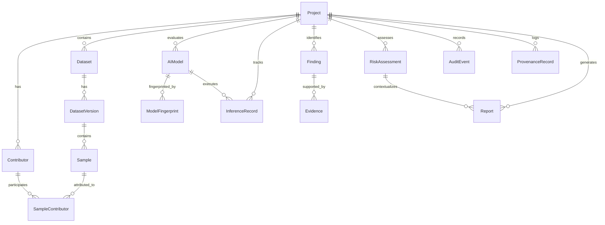

# AIVARA Relational Database & Domain Model Specification

## 1. Overview

AIVARA uses a local embedded SQLite database operating in **WAL (Write-Ahead Logging)** mode with strict foreign key constraints enabled (`PRAGMA foreign_keys=ON;`).

The database layer serves as the single persistent source of truth for:
- Assurance projects and workspace configuration
- Multi-contributor tracking and attribution
- Datasets, dataset versions, and individual image samples
- AI model registrations and structural/statistical fingerprints
- Sealed inference execution records (hash-chained)
- Findings and deterministic/probabilistic evidence items (ADR-028)
- Risk assessments and disposition decisions (`ACCEPT` / `REVIEW` / `QUARANTINE`)
- Tamper-evident provenance chains and audit trails
- Generated assurance reports

---

## 2. Architectural Design Decisions (ADRs) Incorporated

| ADR | Principle | Implementation in Schema |
|-----|-----------|--------------------------|
| **ADR-001** | Offline / Air-Gapped | SQLite embedded storage; no external database engine required |
| **ADR-005** | Hash-Linked Chains | `previous_record_hash` and `record_hash` in `InferenceRecord` & `ProvenanceRecord`. Blockchain TX ID column is optional/forward-compatible |
| **ADR-028** | Detection vs. Proof Layer Enforcement | `evidence_layer` (`detection` \| `proof`) in `Finding` and `Evidence`. Proof-layer findings enforce `confidence = 1.0` |
| **ADR-029** | Normalized Contributor Attribution | Normalized `contributors` and `sample_contributors` junction tables. Indexed by `(project_id, external_id)` |

---

## 3. Entity Relationship (ER) Diagram

---

## 4. Entity Catalog

### 4.1 `projects`
Root workspace entity grouping datasets, models, findings, risk assessments, and provenance.

| Column | Type | Constraints | Description |
|---|---|---|---|
| `id` | VARCHAR(36) | PK, UUID4 | Unique project identifier |
| `name` | VARCHAR(255) | NOT NULL | Project display name |
| `description` | TEXT | NULLABLE | Detailed project summary |
| `status` | VARCHAR(50) | NOT NULL, DEFAULT 'active' | Workspace lifecycle status |
| `genesis_nonce` | VARCHAR(64) | NULLABLE | Initial nonce for provenance chain |
| `config_json` | JSON | NOT NULL, DEFAULT '{}' | Custom assessment configuration |
| `created_at` | DATETIME | NOT NULL | UTC creation timestamp |
| `updated_at` | DATETIME | NOT NULL | UTC last modification timestamp |

---

### 4.2 `contributors` (ADR-029)
External data or model contributors registered to a project.

| Column | Type | Constraints | Description |
|---|---|---|---|
| `id` | VARCHAR(36) | PK, UUID4 | Unique contributor identifier |
| `project_id` | VARCHAR(36) | FK -> projects.id ON DELETE CASCADE | Associated project |
| `external_id` | VARCHAR(255) | NOT NULL | External contributor ID / handle |
| `name` | VARCHAR(255) | NULLABLE | Contributor display name |
| `source` | VARCHAR(255) | NULLABLE | Source platform / vendor |
| `metadata_json` | JSON | NOT NULL, DEFAULT '{}' | Semi-structured contributor attributes |
| `created_at` | DATETIME | NOT NULL | Registration timestamp |

*Indexes:*
- `ix_contributors_project_id` on `(project_id)`
- `ix_contributors_external_id` UNIQUE on `(project_id, external_id)`

---

### 4.3 `datasets`
Dataset container within a project.

| Column | Type | Constraints | Description |
|---|---|---|---|
| `id` | VARCHAR(36) | PK, UUID4 | Unique dataset identifier |
| `project_id` | VARCHAR(36) | FK -> projects.id ON DELETE CASCADE | Associated project |
| `name` | VARCHAR(255) | NOT NULL | Dataset name |
| `format` | VARCHAR(50) | NOT NULL | Format: `coco`, `yolo`, `imagefolder`, `generic` |
| `source` | TEXT | NULLABLE | Origin path or URI |
| `description` | TEXT | NULLABLE | Dataset notes |
| `status` | VARCHAR(50) | NOT NULL, DEFAULT 'imported' | Status indicator |
| `metadata_json` | JSON | NOT NULL, DEFAULT '{}' | Additional metadata |
| `created_at` | DATETIME | NOT NULL | Creation timestamp |
| `updated_at` | DATETIME | NOT NULL | Update timestamp |

---

### 4.4 `dataset_versions`
Discrete version snapshot of a dataset for reproducibility.

| Column | Type | Constraints | Description |
|---|---|---|---|
| `id` | VARCHAR(36) | PK, UUID4 | Version identifier |
| `dataset_id` | VARCHAR(36) | FK -> datasets.id ON DELETE CASCADE | Parent dataset |
| `version_label` | VARCHAR(100) | NOT NULL | Version identifier (e.g. `v1.0`) |
| `dataset_hash` | VARCHAR(64) | NULLABLE | Merkle / aggregate SHA-256 hash |
| `sample_count` | INTEGER | NOT NULL, DEFAULT 0 | Count of images in this version |
| `metadata_json` | JSON | NOT NULL, DEFAULT '{}' | Version-specific metadata |
| `created_at` | DATETIME | NOT NULL | Version snapshot timestamp |

*Indexes:*
- `ix_dataset_versions_dataset_id` on `(dataset_id)`
- `ix_dataset_versions_label` UNIQUE on `(dataset_id, version_label)`

---

### 4.5 `samples`
Individual images / samples belonging to a dataset version.

| Column | Type | Constraints | Description |
|---|---|---|---|
| `id` | VARCHAR(36) | PK, UUID4 | Unique sample identifier |
| `dataset_version_id` | VARCHAR(36) | FK -> dataset_versions.id ON DELETE CASCADE | Parent version |
| `file_path` | TEXT | NOT NULL | Relative / local file path |
| `file_hash_sha256` | VARCHAR(64) | NOT NULL | SHA-256 content hash |
| `perceptual_hash` | VARCHAR(64) | NULLABLE | Perceptual hash (e.g. pHash) |
| `width` | INTEGER | NULLABLE | Image width in pixels |
| `height` | INTEGER | NULLABLE | Image height in pixels |
| `channels` | INTEGER | NULLABLE | Color channel count |
| `batch_id` | VARCHAR(100) | NULLABLE | Ingestion batch identifier |
| `label_json` | JSON | NOT NULL, DEFAULT '{}' | Ground-truth labels |
| `annotation_json` | JSON | NOT NULL, DEFAULT '{}' | Bounding boxes / masks |
| `metadata_json` | JSON | NOT NULL, DEFAULT '{}' | EXIF and camera metadata |
| `created_at` | DATETIME | NOT NULL | Ingestion timestamp |

*Indexes:*
- `ix_samples_dataset_version_id` on `(dataset_version_id)`
- `ix_samples_file_hash` on `(file_hash_sha256)`
- `ix_samples_perceptual_hash` on `(perceptual_hash)`

---

### 4.6 `sample_contributors` (ADR-029)
Junction table linking samples to contributing actors for contributor-level risk analysis.

| Column | Type | Constraints | Description |
|---|---|---|---|
| `id` | VARCHAR(36) | PK, UUID4 | Junction ID |
| `sample_id` | VARCHAR(36) | FK -> samples.id ON DELETE CASCADE | Target sample |
| `contributor_id` | VARCHAR(36) | FK -> contributors.id ON DELETE RESTRICT | Contributing entity |
| `contribution_type` | VARCHAR(50) | NOT NULL, DEFAULT 'annotator' | Type: `annotator`, `collector`, `validator` |

*Indexes:*
- `ix_sample_contributors_sample` on `(sample_id)`
- `ix_sample_contributors_contributor` on `(contributor_id)`

---

### 4.7 `ai_models`
AI Model assets under evaluation.

| Column | Type | Constraints | Description |
|---|---|---|---|
| `id` | VARCHAR(36) | PK, UUID4 | Unique model ID |
| `project_id` | VARCHAR(36) | FK -> projects.id ON DELETE CASCADE | Associated project |
| `name` | VARCHAR(255) | NOT NULL | Model identifier |
| `format` | VARCHAR(50) | NOT NULL | Format: `onnx`, `pytorch`, `torchscript` |
| `architecture` | VARCHAR(255) | NULLABLE | Model backbone (e.g. `ResNet50`) |
| `version` | VARCHAR(100) | NULLABLE | Model release version |
| `file_path` | TEXT | NOT NULL | Local path to model weight file |
| `file_hash_sha256` | VARCHAR(64) | NOT NULL | Cryptographic SHA-256 weight hash |
| `file_size_bytes` | INTEGER | NOT NULL, DEFAULT 0 | Model file size in bytes |
| `access_level` | VARCHAR(50) | NOT NULL, DEFAULT 'white_box' | `white_box` or `black_box` |
| `metadata_json` | JSON | NOT NULL, DEFAULT '{}' | Input/output shapes and metadata |
| `created_at` | DATETIME | NOT NULL | Registration timestamp |
| `updated_at` | DATETIME | NOT NULL | Update timestamp |

*Indexes:*
- `ix_ai_models_project_id` on `(project_id)`
- `ix_ai_models_file_hash` on `(file_hash_sha256)`

---

### 4.8 `model_fingerprints`
Structural, statistical, and behavioural model fingerprints.

| Column | Type | Constraints | Description |
|---|---|---|---|
| `id` | VARCHAR(36) | PK, UUID4 | Unique fingerprint ID |
| `model_id` | VARCHAR(36) | FK -> ai_models.id ON DELETE CASCADE | Target model |
| `fingerprint_type` | VARCHAR(50) | NOT NULL | `structural`, `statistical`, `behavioural` |
| `fingerprint_version` | VARCHAR(50) | NOT NULL, DEFAULT '1' | Extraction algorithm version |
| `fingerprint_value` | TEXT | NOT NULL | Serialized fingerprint vector/data |
| `metadata_json` | JSON | NOT NULL, DEFAULT '{}' | Extraction parameters |
| `created_at` | DATETIME | NOT NULL | Computation timestamp |

---

### 4.9 `inference_records`
Sealed inference execution log for tamper-evident provenance.

| Column | Type | Constraints | Description |
|---|---|---|---|
| `id` | VARCHAR(36) | PK, UUID4 | Unique record identifier |
| `project_id` | VARCHAR(36) | FK -> projects.id ON DELETE RESTRICT | Project context |
| `model_id` | VARCHAR(36) | FK -> ai_models.id ON DELETE RESTRICT | Executed model |
| `input_hash` | VARCHAR(64) | NOT NULL | SHA-256 hash of input image |
| `input_path` | TEXT | NOT NULL | Location of input asset |
| `preprocessing_hash` | VARCHAR(64) | NULLABLE | Preprocessing config hash |
| `config_hash` | VARCHAR(64) | NULLABLE | Execution parameters hash |
| `output_json` | JSON | NOT NULL, DEFAULT '{}' | Raw/parsed model output |
| `output_hash` | VARCHAR(64) | NOT NULL | SHA-256 hash of output |
| `sequence_number` | INTEGER | NOT NULL | Monotonic sequence number |
| `nonce` | VARCHAR(64) | NULLABLE | Cryptographic nonce |
| `signature` | TEXT | NULLABLE | Ed25519 digital signature |
| `previous_record_hash` | VARCHAR(64) | NULLABLE | Hash of previous record in chain |
| `record_hash` | VARCHAR(64) | NULLABLE | Hash of current record |
| `verification_status` | VARCHAR(50) | NOT NULL, DEFAULT 'unverified' | Verification status |
| `created_at` | DATETIME | NOT NULL | Execution timestamp |

*Indexes:*
- `ix_inference_records_project_id` on `(project_id)`
- `ix_inference_records_model_id` on `(model_id)`
- `ix_inference_records_sequence` UNIQUE on `(project_id, model_id, sequence_number)`

---

### 4.10 `findings` (ADR-028)
Assurance observations generated by detection and verification engines.

| Column | Type | Constraints | Description |
|---|---|---|---|
| `id` | VARCHAR(36) | PK, UUID4 | Unique finding identifier |
| `project_id` | VARCHAR(36) | FK -> projects.id ON DELETE RESTRICT | Associated project |
| `audit_run_id` | VARCHAR(36) | NULLABLE | Associated audit run |
| `engine_id` | VARCHAR(100) | NOT NULL | Engine ID (e.g. `dataset_integrity`) |
| `engine_version` | VARCHAR(50) | NULLABLE | Engine version |
| `evidence_layer` | VARCHAR(20) | NOT NULL | `detection` (probabilistic) \| `proof` (deterministic) |
| `finding_type` | VARCHAR(100) | NOT NULL | Specific finding categorization |
| `title` | VARCHAR(500) | NOT NULL | Summary headline |
| `description` | TEXT | NULLABLE | Detailed finding description |
| `severity` | VARCHAR(20) | NOT NULL | `critical`, `high`, `medium`, `low`, `info` |
| `confidence` | FLOAT | NOT NULL | 0.0 - 1.0 (must be 1.0 for proof layer) |
| `affected_asset_type` | VARCHAR(50) | NOT NULL | `dataset`, `model`, `inference`, `contributor` |
| `affected_asset_id` | VARCHAR(36) | NOT NULL | Target asset ID |
| `disposition` | VARCHAR(20) | NOT NULL | `accept`, `review`, `quarantine` |
| `analysis_mode` | VARCHAR(20) | NOT NULL, DEFAULT 'not_applicable' | `white_box`, `black_box`, `not_applicable` |
| `recommendation` | TEXT | NULLABLE | Mitigation guidance |
| `status` | VARCHAR(50) | NOT NULL, DEFAULT 'open' | Lifecycle status |
| `metadata_json` | JSON | NOT NULL, DEFAULT '{}' | Additional engine-specific data |
| `created_at` | DATETIME | NOT NULL | Generation timestamp |

*Indexes:*
- `ix_findings_project_id` on `(project_id)`
- `ix_findings_audit_run_id` on `(audit_run_id)`
- `ix_findings_affected_asset` on `(affected_asset_type, affected_asset_id)`
- `ix_findings_severity` on `(severity)`
- `ix_findings_evidence_layer` on `(evidence_layer)`

---

### 4.11 `evidence` (ADR-028)
Supporting artifacts and technical proofs linked to findings.

| Column | Type | Constraints | Description |
|---|---|---|---|
| `id` | VARCHAR(36) | PK, UUID4 | Unique evidence identifier |
| `finding_id` | VARCHAR(36) | FK -> findings.id ON DELETE RESTRICT | Parent finding |
| `evidence_layer` | VARCHAR(20) | NOT NULL | `detection` \| `proof` |
| `evidence_type` | VARCHAR(100) | NOT NULL | Evidence categorization |
| `title` | VARCHAR(500) | NOT NULL | Evidence title |
| `description` | TEXT | NULLABLE | Technical explanation |
| `data_json` | JSON | NOT NULL, DEFAULT '{}' | Structured metric / matrix data |
| `artifact_path` | TEXT | NULLABLE | Path to generated artifact |
| `artifact_hash` | VARCHAR(64) | NULLABLE | SHA-256 hash of artifact file |
| `confidence` | FLOAT | NULLABLE | Evidence-specific confidence |
| `evidence_hash` | VARCHAR(64) | NULLABLE | Deterministic SHA-256 of evidence |
| `created_at` | DATETIME | NOT NULL | Creation timestamp |

---

### 4.12 `risk_assessments`
Aggregated assurance score and final pipeline disposition.

| Column | Type | Constraints | Description |
|---|---|---|---|
| `id` | VARCHAR(36) | PK, UUID4 | Assessment identifier |
| `project_id` | VARCHAR(36) | FK -> projects.id ON DELETE RESTRICT | Project context |
| `audit_run_id` | VARCHAR(36) | NULLABLE | Linked audit run |
| `scope` | VARCHAR(50) | NOT NULL | `dataset`, `model`, `project` |
| `target_id` | VARCHAR(36) | NOT NULL | Assessed entity ID |
| `overall_risk_score` | FLOAT | NOT NULL | Computed score (0.0 to 1.0) |
| `risk_level` | VARCHAR(20) | NOT NULL | `critical`, `high`, `medium`, `low`, `minimal` |
| `disposition` | VARCHAR(20) | NOT NULL | `accept`, `review`, `quarantine` |
| `component_scores_json` | JSON | NOT NULL, DEFAULT '{}' | Breakdown across risk dimensions |
| `rationale` | TEXT | NOT NULL | Human-readable explanation of disposition |
| `created_at` | DATETIME | NOT NULL | Assessment timestamp |

---

### 4.13 `audit_events`
Immutable system audit events.

| Column | Type | Constraints | Description |
|---|---|---|---|
| `id` | VARCHAR(36) | PK, UUID4 | Event ID |
| `project_id` | VARCHAR(36) | FK -> projects.id ON DELETE RESTRICT | Project context |
| `event_type` | VARCHAR(100) | NOT NULL | Event classification |
| `actor` | VARCHAR(255) | NOT NULL, DEFAULT 'system' | Action initiator |
| `target_type` | VARCHAR(50) | NULLABLE | Target entity type |
| `target_id` | VARCHAR(36) | NULLABLE | Target entity ID |
| `description` | TEXT | NULLABLE | Event log description |
| `metadata_json` | JSON | NOT NULL, DEFAULT '{}' | Context data |
| `event_hash` | VARCHAR(64) | NULLABLE | SHA-256 hash |
| `created_at` | DATETIME | NOT NULL | Event timestamp |

---

### 4.14 `provenance_records`
Tamper-evident hash-linked provenance trail.

| Column | Type | Constraints | Description |
|---|---|---|---|
| `id` | VARCHAR(36) | PK, UUID4 | Provenance record ID |
| `project_id` | VARCHAR(36) | FK -> projects.id ON DELETE RESTRICT | Project context |
| `record_type` | VARCHAR(100) | NOT NULL | Record category |
| `actor` | VARCHAR(255) | NOT NULL, DEFAULT 'system' | Action performer |
| `action` | VARCHAR(100) | NOT NULL | Ingestion, verification, analysis |
| `target_type` | VARCHAR(50) | NULLABLE | Target asset type |
| `target_id` | VARCHAR(36) | NULLABLE | Target asset ID |
| `input_hash` | VARCHAR(64) | NULLABLE | Hash of inputs |
| `output_hash` | VARCHAR(64) | NULLABLE | Hash of generated outputs |
| `metadata_json` | JSON | NOT NULL, DEFAULT '{}' | Extended provenance payload |
| `signature` | TEXT | NULLABLE | Digital signature |
| `previous_record_hash` | VARCHAR(64) | NULLABLE | Hash of preceding record in chain |
| `record_hash` | VARCHAR(64) | NULLABLE | Hash of this record |
| `sequence_number` | INTEGER | NULLABLE | Monotonic sequence number |
| `blockchain_tx_id` | VARCHAR(128) | NULLABLE | Optional external ledger reference |
| `created_at` | DATETIME | NOT NULL | Record timestamp |

---

### 4.15 `reports`
Generated assurance audit reports.

| Column | Type | Constraints | Description |
|---|---|---|---|
| `id` | VARCHAR(36) | PK, UUID4 | Unique report ID |
| `project_id` | VARCHAR(36) | FK -> projects.id ON DELETE RESTRICT | Associated project |
| `report_type` | VARCHAR(50) | NOT NULL | `full`, `summary`, `dataset`, `model` |
| `format` | VARCHAR(20) | NOT NULL | `pdf`, `html`, `json` |
| `file_path` | TEXT | NULLABLE | Local file path |
| `risk_assessment_id` | VARCHAR(36) | FK -> risk_assessments.id ON DELETE SET NULL | Linked assessment |
| `metadata_json` | JSON | NOT NULL, DEFAULT '{}' | Summary metrics |
| `created_at` | DATETIME | NOT NULL | Generation timestamp |

---

## 5. Security and Integrity Guarantees

1. **Strict Foreign Keys**: Foreign keys are enforced on every database connection via SQLite event listener (`PRAGMA foreign_keys=ON;`).
2. **Audit Preservation (`ON DELETE RESTRICT`)**: Findings, evidence, risk assessments, audit events, inference records, and provenance records use `RESTRICT` on delete to prevent accidental deletion of assurance evidence chains.
3. **Deterministic Proofs (ADR-028)**: Proof-layer findings require strict 1.0 confidence, verified at schema validation time.
4. **Offline Local SQLite**: Database resides locally at `data/aivara.db` without external network connections.
