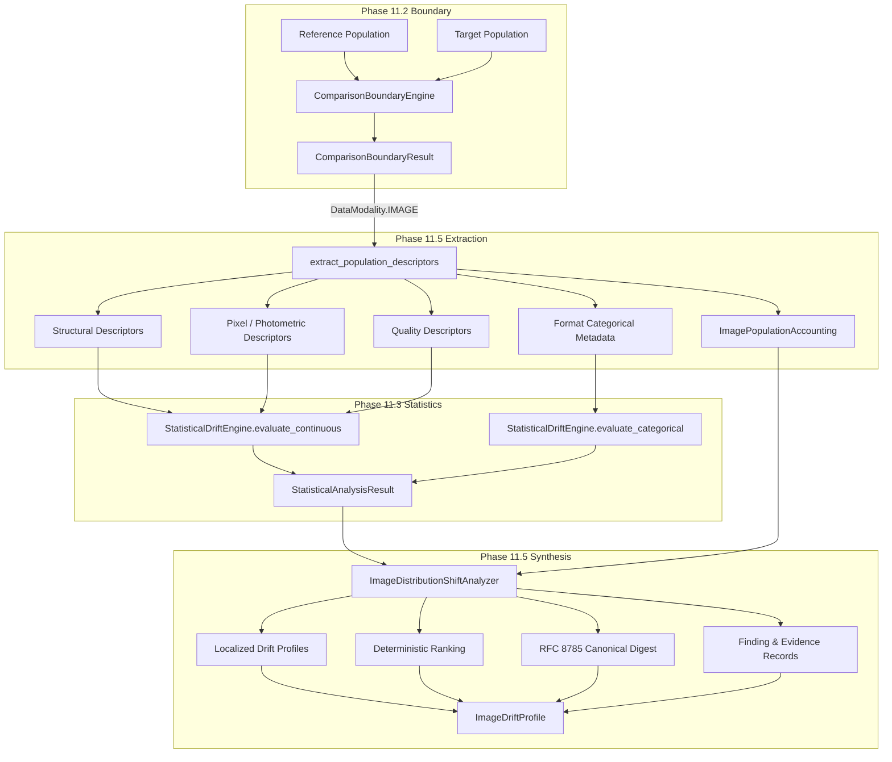

# PHASE 11.5 — IMAGE DISTRIBUTION SHIFT ANALYSIS

## 1. Objective

Phase 11.5 specializes the AIVARA Phase 11 Distribution Shift subsystem to image populations. The mission of Phase 11.5 is to answer:

> **"HOW HAS THE IMAGE DATA DISTRIBUTION CHANGED?"**

### Core Ethical and Semantic Principles
- **IMAGE DISTRIBUTION SHIFT $\neq$ MALICIOUS INTENT**
- **IMAGE DISTRIBUTION SHIFT $\neq$ DATASET COMPROMISE**
- **IMAGE DISTRIBUTION SHIFT $\neq$ MODEL FAILURE**

Distribution shift is an objective mathematical observation of divergence between two populations (reference vs. target). It identifies operational and covariate differences (e.g., changes in camera sensors, resolution, lighting, compression, aspect ratio, format distributions, focus, or brightness) without imputing maliciousness or attributing intent.

---

## 2. Scope & Boundaries

### In Scope (Phase 11.5)
1. **Image Population Validation**: Ensuring strict compliance with `DataModality == IMAGE` and immutable reference/target comparison contracts.
2. **Deterministic Descriptor Extraction**: Extracting physical structural, photometric, spatial frequency, format, and objective quality descriptors without learned deep representations.
3. **Format Distribution Analysis**: Comparing categorical image format proportions (JPEG, PNG, WEBP, BMP, TIFF, GIF).
4. **Dimension Distribution Analysis**: Analyzing width, height, aspect ratio, channel count, and file size distributions.
5. **Pixel & Photometric Distribution Analysis**: Evaluating grayscale luminance, channel means ($R, G, B$), channel variances/stds, brightness, RMS contrast, and saturation.
6. **Physical Quality Distribution Analysis**: Measuring Shannon entropy, Laplacian focus/blur variance, clipping/saturation ratios, and spatial frequency indicators.
7. **Population Accounting & Error Handling**: Explicit tracking of total, analyzable, corrupted, unsupported, and missing images.
8. **Statistical Engine Integration**: Direct consumption of Phase 11.3 two-sample non-parametric tests (KS, Wasserstein $W_1$, PSI, $\chi^2$, TVD, JSD) and Benjamini-Hochberg FDR correction ($q^* = 0.05$).
9. **Dual-Gate Decision Semantics**: Requiring both statistical significance ($q \le 0.05$) and practical effect size ($\text{PSI} \ge 0.10$ or standardized $W_1 \ge 0.10$ or $\text{TVD} \ge 0.05$) for `MATERIAL_SHIFT`.
10. **Localization & Synthesis**: Structuring localized shift buckets (`dimension_drift`, `pixel_drift`, `quality_drift`, `format_drift`) and dataset-level synthesis into `ImageDriftProfile`.
11. **Cryptographic Identity**: Deterministic SHA-256 digest over canonical RFC 8785 JCS descriptor: `image_drift_profile_hash`.
12. **Finding & Evidence Integration**: Reusing detection-layer `FindingModel` and `EvidenceModel` schemas.

### Out of Scope (Deferred to Later Phases)
- Learned embeddings & neural representations (CLIP, DINOv2, ResNet feature vectors).
- Temporal drift & time-series trajectory modeling.
- Contributor-specific attribution or drift profiling.
- Final trust decisioning & automated governance remediation.
- Dashboards, web UI, and blockchain ledgers.

---

## 3. Architecture & Data Flow

---

## 4. Deterministic Image Descriptors

Every analyzable image is converted deterministically into physical and photometric metrics:

| Category | Descriptor Name | Type | Definition / Mathematical Formula |
| :--- | :--- | :--- | :--- |
| **Structural** | `width` | Numerical | Image width in pixels ($W$) |
| | `height` | Numerical | Image height in pixels ($H$) |
| | `aspect_ratio` | Numerical | $W / H$ |
| | `channels` | Numerical | Channel count (1 for grayscale, 3 for RGB, 4 for RGBA) |
| | `file_size_bytes` | Numerical | Exact byte length of image stream or file |
| | `format` | Categorical | Canonical container format (`JPEG`, `PNG`, `WEBP`, etc.) |
| **Photometric** | `mean_intensity` | Numerical | Grayscale mean: $\mu_I = \frac{1}{HW}\sum (0.299R + 0.587G + 0.114B)$ |
| | `std_intensity` | Numerical | Grayscale standard deviation: $\sigma_I = \sqrt{\frac{1}{HW}\sum (I_{xy} - \mu_I)^2}$ |
| | `brightness` | Numerical | Evaluated as Rec.601 luminance $\mu_I \in [0, 255]$ |
| | `rms_contrast` | Numerical | Root-mean-square contrast ($\sigma_I$) |
| | `r_mean`, `g_mean`, `b_mean` | Numerical | Per-channel mean intensity |
| | `r_std`, `g_std`, `b_std` | Numerical | Per-channel standard deviation |
| | `mean_saturation` | Numerical | Mean HSV saturation: $S = \frac{\max(R,G,B) - \min(R,G,B)}{\max(R,G,B) + \epsilon} \in [0, 1]$ |
| **Quality** | `entropy` | Numerical | Shannon intensity entropy: $H = -\sum_{i=0}^{255} p_i \log_2 p_i \in [0, 8]$ |
| | `sharpness_laplacian_var` | Numerical | $\mathrm{Var}\left(\nabla^2 I\right)$ with 3x3 discrete Laplacian kernel |
| | `clipping_ratio` | Numerical | Fraction of pixels with $I_{xy} \le 0$ or $I_{xy} \ge 255$ |

---

## 5. Population Accounting & Fail-Closed Safety

Image loading and processing enforce strict resource limits to protect against decompression bombs and corrupted memory allocations:
- **Max Pixels per Image**: $25,000,000$ (25 Megapixels, e.g., $5000 \times 5000$).
- **Max Dimension**: $10,000$ pixels.
- **Max File Size**: $50 \text{ MB}$.
- **Max Population Samples**: $5,000$ images (bounded by Phase 11 budget).

### Accounting States
Each input item is classified into exactly one state:
1. `VALID`: Image successfully decoded, verified within resource limits, and descriptors extracted.
2. `CORRUPT`: Truncated, invalid headers, or decoding exception.
3. `UNSUPPORTED`: Exceeds pixel/dimension/byte bounds or unsupported dictionary structure.
4. `MISSING`: File path does not exist on disk.

Accounting invariants:
$$\text{total} = \text{analyzable} + \text{corrupt} + \text{unsupported} + \text{missing}$$

If analyzable count is below $N_{\min} = 30$, analysis returns `ShiftDecisionState.INSUFFICIENT_DATA` fail-closed.

---

## 6. Statistical Engine & Dual-Gate Integration

Phase 11.5 does **not** duplicate statistical tests. It passes numerical descriptor columns to `StatisticalDriftEngine.evaluate_boundary()`:
- **Two-Sample Kolmogorov-Smirnov (KS)**: Non-parametric shape difference test yielding raw $p$-values.
- **Wasserstein Distance ($W_1$)**: Physical transport distance normalized by reference standard deviation ($\frac{W_1}{\sigma_{\text{ref}}}$).
- **Population Stability Index (PSI)**: Binned divergence metric ($\text{PSI} \ge 0.10$ moderate, $\ge 0.25$ significant).
- **Benjamini-Hochberg FDR**: Global family-wise error rate control ($q^* = 0.05$) applied once across all evaluated descriptors (preventing double FDR correction).
- **Total Variation Distance (TVD) & $\chi^2$**: Evaluates format distribution shifts.

### Dual-Gate Rule
$$\text{MATERIAL\_SHIFT} \iff (q \le q^*) \land \left(\text{PSI} \ge 0.10 \lor \frac{W_1}{\sigma_{\text{ref}}} \ge 0.10 \lor \text{TVD} \ge 0.05\right)$$

---

## 7. Findings & Evidence Structure

Findings adhere strictly to the detection layer `FindingModel` format:
- `evidence_layer`: `"detection"`
- `finding_type`: `"image_distribution_shift"`
- `severity`: `"high"` (Material Shift), `"medium"` (Significant Shift), `"low"` (Shift Detected), `"info"` (No Shift Detected).
- `confidence`: $[0.75, 0.99]$ based purely on statistical observation confidence.
- `disposition`: `"review"` or `"accept"`.

Evidence adheres to `EvidenceModel`:
- Encapsulates comparison boundary hash, statistical analysis hash, population accounting, localized descriptors, and format drift.
- Cryptographically bound via `evidence_hash = SHA256(canonicalize(evidence_data))`.

---

## 8. Cryptographic Identity

The image drift profile computes a deterministic SHA-256 hash over its canonical descriptor:
$$\text{image\_drift\_profile\_hash} = \text{SHA256}\left(\text{RFC8785\_JCS}\left(\text{canonical\_profile\_descriptor}\right)\right)$$
This immutably binds the result to the comparison boundary, statistical engine output, population accounting, and localized shifted dimensions.
