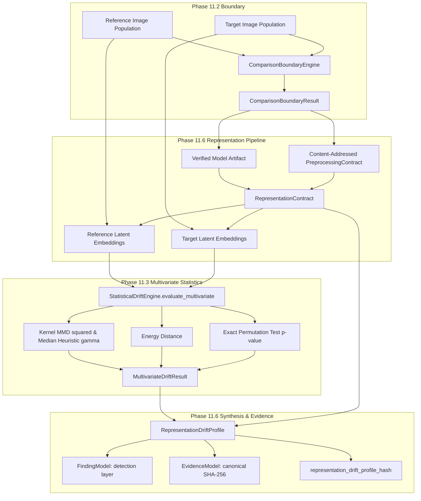

# PHASE 11.6 — REPRESENTATION & EMBEDDING DISTRIBUTION SHIFT ARCHITECTURE

**Project**: AIVARA — AI Verification & Assurance  
**Phase**: 11.6 — Representation & Embedding Distribution Shift Analysis  
**Subphase**: 11.6.1 — Architecture & Requirements Freeze  
**Document**: Architectural Specification & Theoretical Foundation  
**Status**: ARCHITECTURAL SPECIFICATION (FREEZE CANDIDATE)  

---

## 1. Objective

The objective of Phase 11.6 is to determine whether the **learned representation distribution** of image data differs between validated reference and target populations.

Phase 11.6 answers:
> **"HOW HAS THE LEARNED REPRESENTATION (EMBEDDING) DISTRIBUTION CHANGED?"**

### Core Ethical and Semantic Guardrail
```
REPRESENTATION DISTRIBUTION SHIFT ≠ MALICIOUS INTENT
REPRESENTATION DISTRIBUTION SHIFT ≠ DATASET COMPROMISE
REPRESENTATION DISTRIBUTION SHIFT ≠ MODEL FAILURE
```
Representation distribution shift is an objective mathematical observation of divergence within a verified high-dimensional latent space. It captures semantic, contextual, and structural population changes that may not be apparent from low-level pixel statistics alone (Phase 11.5). It does **not** assert malicious manipulation, data poisoning, or contributor fraud.

---

## 2. Scope & Subsystem Position



### In Scope (Phase 11.6)
1. **Representation Contract Specification**: Cryptographic binding of model identity, artifact hash, representation layer/node, embedding dimension, preprocessing contract, normalization, and runtime parameters.
2. **Offline Model Execution Policy**: Local, air-gapped ONNX/TorchScript inference without network or cloud calls.
3. **Representation Compatibility**: Strict validation ensuring reference and target embeddings inhabit the exact same latent topological manifold.
4. **Multivariate Statistical Evaluation**: Direct reuse of Phase 11.3 `StatisticalDriftEngine` (Kernel MMD, Energy Distance, Permutation Testing).
5. **Dual-Gate Multivariate Decisioning**: Requiring both statistical significance ($p \le 0.05$) and practical effect size ($\text{MMD}^2 \ge 0.02$ or $\text{Energy Distance} \ge 1.0$).
6. **Global Representation Synthesis**: Global latent space divergence profiling, rank attribution, and population accounting.
7. **Finding & Evidence Integration**: Detection-layer findings and canonical RFC 8785 evidence digests.
8. **Cryptographic Identity**: SHA-256 digest over canonical representation drift descriptor.

### Out of Scope (Deferred to Later Phases)
- Multi-modal text-image joint embedding alignment (Phase 11.7+).
- Temporal drift & trajectory modeling across continuous time windows (Phase 11.8).
- Contributor-specific embedding attribution (Phase 11.9).
- Automated remediation and final multi-evidence trust fusion (Phase 12).
- Real-time UI dashboards and blockchain ledgers.

---

## 3. Representation Contract Specification

The fundamental law of representation drift analysis:
$$\text{SAME IMAGE} + \text{DIFFERENT REPRESENTATION PIPELINE} \implies \text{INCOMPATIBLE REPRESENTATION SPACE}$$

To guarantee scientific validity, the `RepresentationContract` must be immutable, canonical, and content-addressed:

```python
class RepresentationContract(BaseModel):
    """Canonical, immutable specification of the learned representation pipeline."""
    model_config = ConfigDict(frozen=True, extra="forbid")

    schema_version: str = "1.0"
    contract_version: str = "1.0"
    representation_id: str  # Unique descriptive identifier (e.g. "dinov2_vits14_penultimate")
    modality: DataModality = DataModality.IMAGE
    
    # Model Binding
    model_id: str
    model_master_fingerprint: str  # Phase 7 Master Model Fingerprint
    model_artifact_hash: str       # SHA-256 of model weights file
    model_format: ModelFormat      # ONNX or TORCHSCRIPT
    runtime_framework: str         # "onnxruntime" or "torch"
    
    # Layer / Topological Extraction
    representation_layer: str      # Explicit output node or layer name (e.g., "norm", "pooler_output")
    embedding_dimension: int       # D (e.g. 384, 512, 768)
    
    # Preprocessing Binding
    preprocessing_contract_hash: str  # SHA-256 of Phase 10.4 PreprocessingContract
    
    # Post-Processing & Normalization
    normalization_policy: str      # "L2", "STANDARDIZED", "NONE"
    numerical_precision: str       # "float32"
    
    # Execution Environment
    execution_device_policy: str   # "CPU" (default for reproducibility)
    batch_size: int = 32
    
    # Cryptographic Identity
    representation_contract_hash: str  # SHA-256 over RFC 8785 canonical representation
```

---

## 4. Representation Model Research & Selection

### Candidate Comparison Matrix

| Criterion | Candidate A: DINOv2 (ViT-S/14) | Candidate B: CLIP (ViT-B/32) | Candidate C: ResNet-50 (ImageNet-1k) | Candidate D: EfficientNet-B0 |
| :--- | :--- | :--- | :--- | :--- |
| **Representation Quality** | **Highest** (Self-supervised vision foundation model; outstanding geometric & semantic clustering) | **High** (Multimodal contrastive features; strong zero-shot semantics) | **Moderate** (Supervised ImageNet features; biased toward classification labels) | **Moderate** (Supervised features; lightweight) |
| **Embedding Dimension ($D$)** | **384** (ViT-S/14) or **768** (ViT-B/14) | **512** | **2048** | **1280** |
| **Model Size (ONNX)** | **~88 MB** (ViT-S/14) | **~350 MB** | **~98 MB** | **~21 MB** |
| **CPU Feasibility (Inference)** | **High** (~15ms / image on CPU) | **Moderate** (~40ms / image) | **High** (~12ms / image) | **High** (~8ms / image) |
| **Offline Deployment** | **Supported** (Self-contained ONNX / TorchScript) | **Supported** (ONNX / TorchScript) | **Supported** (ONNX / TorchScript) | **Supported** (ONNX / TorchScript) |
| **Layer Accessibility** | Explicit `CLS` token or pooled output node | Explicit `visual` project head or pooled output | Explicit `avgpool` penultimate layer | Explicit `global_pool` penultimate layer |
| **Licensing** | Apache 2.0 (Commercial friendly) | MIT / OpenAI | BSD-3-Clause / PyTorch | Apache 2.0 |
| **Supply-Chain Security** | Static ONNX export verifiable by SHA-256 | Static ONNX export verifiable by SHA-256 | Static ONNX export verifiable by SHA-256 | Static ONNX export verifiable by SHA-256 |
| **Statistical Suitability ($D \le 4096$)** | **Optimal** ($D=384$ yields high sample efficiency for MMD) | **Good** ($D=512$) | **Good** ($D=2048$) | **Good** ($D=1280$) |

### V1 Representation Model Policy Recommendation:
1. **Primary Standard Model**: **DINOv2 ViT-S/14** (Small, 384-dimensional latent space, ~88MB ONNX artifact).
   - *Rationale*: DINOv2 self-supervised visual features retain both dense fine-grained spatial properties and semantic clustering without classification label bias. Its compact 384-dimensional vector prevents distance concentration in MMD.
2. **Approved Secondary Model**: **ResNet-50 (Penultimate `avgpool`, 2048-dim)** for legacy convolutional baseline comparison.
3. **Model Registry Policy**: AIVARA v1 uses a **closed, approved local model registry** where model weights are distributed as immutable ONNX artifacts with precomputed Phase 7 master fingerprints. Arbitrary unverified user models are restricted.

---

## 5. Offline Model & Supply-Chain Security Policy

- **Air-Gapped Operation**: Model weights must be present on local disk. Zero runtime network requests (no Hugging Face Hub downloads, no PyTorch Hub calls, no remote APIs).
- **Safe Format Enforcement**:
  - `ONNX` (`InspectionPolicy.SUPPORTED`): Executed via `onnxruntime` with disabled telemetry.
  - `SafeTensors` (`InspectionPolicy.SUPPORTED`): Pure tensor storage without executable headers.
  - `TorchScript` (`InspectionPolicy.RESTRICTED`): In `eval` mode only.
  - `PICKLE` / Raw `.pt` / `.pkl`: **PROHIBITED** (prevents arbitrary code execution).
- **Verification Gate**: Before loading any representation model:
  1. Compute `SHA256(model_file_bytes)`.
  2. Verify against `model_artifact_hash` declared in contract.
  3. Verify Phase 7 `model_master_fingerprint`.
  4. If mismatch, fail closed with `InvalidModelArtifactError`.

---

## 6. Preprocessing Binding & Determinism

The input tensor feeding the representation model must be deterministically produced via a content-addressed Phase 10.4 `PreprocessingContract`:
1. **Resolution & Resize**: Bilinear/Bicubic resize to exact target dimensions (e.g. $224 \times 224$).
2. **Crop Policy**: Center crop to preserve central semantic content.
3. **Channel Conversion**: Strict RGB 3-channel layout (`float32`).
4. **Normalization**: Per-channel ImageNet standardization ($\mu = [0.485, 0.456, 0.406], \sigma = [0.229, 0.224, 0.225]$).
5. **Execution Determinism**:
   - `eval()` mode strictly active (dropout/batchnorm disabled).
   - `torch.no_grad()` / inference mode.
   - Fixed deterministic PRNG seed ($42$).
   - Standard execution on **CPU** for bitwise cross-platform reproducibility.

---

## 7. Embedding Normalization & Dimensionality Policy

### Normalization Policy
- **Standard V1 Policy**: **L2 Normalization** ($\mathbf{z}_{\text{norm}} = \frac{\mathbf{z}}{\|\mathbf{z}\|_2 + \epsilon}$).
- *Rationale*: L2 normalization projects latent vectors onto the unit hypersphere $\mathbb{S}^{D-1}$. This bounds pairwise Euclidean distances within $[0, 2]$, stabilizes Gaussian RBF kernel computation ($\|\mathbf{z}_i - \mathbf{z}_j\|^2 = 2 - 2 \langle \mathbf{z}_i, \mathbf{z}_j \rangle$), and eliminates magnitude bias caused by varying activation scales.

### Dimensionality Reduction & Target Leakage Policy
- **Default Policy**: **No Dimension Reduction (Full $D$-Dimensional Space)**.
  - With $D = 384$ or $D = 512$, full-space Kernel MMD and Energy Distance are computationally efficient ($O(N^2 D)$ with $N \le 5000$).
- **Target Leakage Prohibition**: If PCA or projection is ever configured, the projection matrix $\mathbf{W}_{\text{proj}}$ must be fitted **strictly on the reference population** and applied out-of-sample to the target population. Combining reference + target to fit dimensionality reduction is strictly prohibited.

---

## 8. Statistical Methodology & Phase 11.3 Reuse

Phase 11.6 will **directly reuse Phase 11.3's multivariate statistical engine**:
1. **Kernel Maximum Mean Discrepancy ($\text{MMD}^2$)**:
   $$\text{MMD}^2(P, Q) = \mathbb{E}_{x,x'}[k(x,x')] + \mathbb{E}_{y,y'}[k(y,y')] - 2\mathbb{E}_{x,y}[k(x,y)]$$
   Uses Gaussian RBF kernel $k(x,y) = \exp(-\gamma \|x-y\|^2)$ with bandwidth $\gamma = \frac{1}{2\sigma_{\text{med}}^2}$ selected via the median heuristic over pooled sample distances.
2. **Energy Distance**:
   $$\mathcal{E}(P, Q) = 2 \mathbb{E}\|X - Y\| - \mathbb{E}\|X - X'\| - \mathbb{E}\|Y - Y'\|$$
3. **Exact Permutation Null Hypothesis Testing**:
   Computes empirical $p$-value by deterministically shuffling reference and target assignment labels across $B = 100$ permutations:
   $$p = \frac{1 + \sum_{b=1}^B \mathbb{I}(T_b \ge T_{\text{obs}})}{1 + B}$$

### Multiple Testing Strategy
- **Global Latent Hypothesis**: Representation distribution shift is evaluated as a single unified multivariate hypothesis ($H_0: P_{\mathcal{Z}} = Q_{\mathcal{Z}}$).
- Latent dimensions do not have isolated human semantic meanings; therefore, naive per-dimension 1D tests ($384$ separate KS tests) are avoided in v1 to prevent false discovery inflation and meaningless coordinate attribution.

---

## 9. Relationship with Phase 11.5 (Image Physical Drift)

Phase 11.5 and Phase 11.6 provide complementary evidence:

| Operational Scenario | Phase 11.5 (Pixel / Physical Shift) | Phase 11.6 (Representation Shift) | Analytical Interpretation |
| :--- | :--- | :--- | :--- |
| **Case 1: Global Shift** | **Material Shift** (e.g. brightness, aspect ratio) | **Material Shift** | General population shift affecting both visual acquisition and semantic content. |
| **Case 2: Sensor / Format Shift** | **Material Shift** (e.g. JPEG compression, format) | **No Shift** | Low-level acquisition change without alteration to semantic visual concepts. |
| **Case 3: Semantic Concept Shift** | **No Shift** (identical lighting, resolution, size) | **Material Shift** | Genuine semantic content drift (e.g., changes in object categories, scenery, or visual context). |
| **Case 4: Invariant Populations** | **No Shift** | **No Shift** | Populations are statistically indistinguishable across physical and latent domains. |

---

## 10. Privacy, Storage, and Data Minimization

- **In-Memory Analytical Lifecycle**: Raw embeddings are held in memory during the two-sample evaluation and released immediately after statistical profile generation.
- **Zero Database Persistence of Raw Vectors**: AIVARA does not store giant $N \times D$ embedding matrices in PostgreSQL.
- **Evidence Minimization**: Stored evidence records contain statistical metrics ($\text{MMD}^2$, Energy Distance, empirical $p$-value, kernel bandwidth, population accounting) and cryptographic hashes, preventing embedding data leakage.

---

## 11. Cryptographic Identity Specification

The canonical representation drift profile digest is defined as:
$$\text{representation\_drift\_profile\_hash} = \text{SHA256}\left(\text{RFC8785\_JCS}\left(\text{canonical\_profile\_descriptor}\right)\right)$$

Bound immutable fields:
- `comparison_boundary_hash` (from Phase 11.2)
- `representation_contract_hash`
- `model_artifact_hash`
- `preprocessing_contract_hash`
- `statistical_analysis_hash` (from Phase 11.3)
- `global_status`
- `sample_accounting`
- `schema_version` and `analysis_version`
