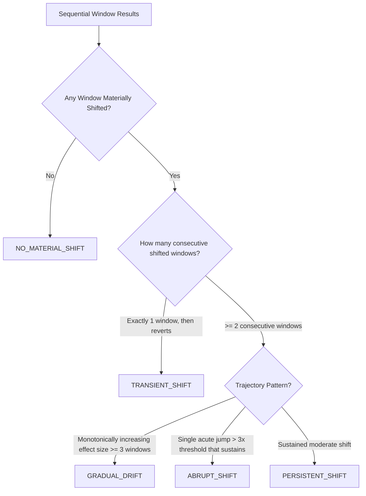

# PHASE 11.7 — TEMPORAL & WINDOWED DISTRIBUTION SHIFT: ARCHITECTURE
=============================================================================

**PROJECT**: AIVARA — AI Verification & Assurance  
**PARENT PHASE**: PHASE 11 — DISTRIBUTION SHIFT / DATA DRIFT ANALYSIS  
**SUBPHASE**: 11.7.1 — ARCHITECTURE & REQUIREMENTS FREEZE  
**STATUS**: AUTHORITATIVE FROZEN ARCHITECTURE SPECIFICATION  
**DATE**: 2026-09-13  

---

## 1. Purpose & Objectives

Phase 11.7 establishes the authoritative architecture for temporal and windowed distribution-shift evaluation across time-indexed dataset populations. By partitioning time series into deterministic chronological windows ($\mathcal{W}_0, \mathcal{W}_1, \dots, \mathcal{W}_K$) and evaluating divergence against historical baselines and adjacent windows, the system identifies the onset, magnitude, trajectory, and persistence of distribution changes in multi-modal AI pipelines (tabular features, image descriptors, and learned latent representations).

---

## 2. System Scope

The temporal distribution shift subsystem operates as a high-level orchestrator across validated population datasets, composing with:
- **Phase 11.2**: Population boundaries, selection filters, and deterministic downsampling.
- **Phase 11.3**: Authoritative statistical hypothesis tests (KS, Chi-Square, MMD, Energy Distance, Permutation Testing).
- **Phase 11.4**: Tabular continuous feature schemas and dataset profiles.
- **Phase 11.5**: Physical image characteristics and photometric descriptors.
- **Phase 11.6**: Air-gapped latent representation extraction and L2 hypersphere embeddings.

---

## 3. Frozen Dependencies

Phases 0–10, Phase 11.1, Phase 11.2, Phase 11.3, Phase 11.4, Phase 11.5, and Phase 11.6 are permanently frozen and immutable. Phase 11.7 consumes their existing public interfaces and data contracts without modifying any frozen algorithm, schema, or cryptographic invariant.

---

## 4. Temporal Data Model

An observation is characterized by:
1. **Event Time ($t_{\text{event}}$)**: The primary, real-world timestamp when the underlying sample was captured by a sensor, camera, or user.
2. **Ingestion Time ($t_{\text{ingest}}$)**: The server-attested timestamp when the record was ingested into the AIVARA data store.

> **Governing Resolution Policy**: Event time is the primary chronological key for temporal analysis. If event time is absent across a dataset, the system may explicitly configure ingestion time as the fallback chronological key, recording this selection in `TemporalAnalysisContract.timestamp_field`. Mixing event time and ingestion time within the same analysis is strictly prohibited.

---

## 5. Timestamp Policy & Normalization

1. **Format**: Strict ISO 8601 UTC string representation (`YYYY-MM-DDTHH:MM:SS.ffffffZ`).
2. **Parsing & Offset Resolution**: Explicit timezone offsets (e.g. `+05:30`, `-04:00`) are converted to UTC. Timestamps lacking timezone descriptors are treated as UTC if configured, or rejected if strict parsing is active.
3. **Sub-second Precision**: Normalized to microsecond precision (`10^{-6}\text{s}`).
4. **Deterministic Sorting**:
   $$\text{Primary Key: } t_{\text{utc}} \text{ ASC} \quad \longrightarrow \quad \text{Secondary Key: } \text{SHA-256}(\text{sample content}) \text{ ASC}$$
   Guarantees byte-identical sample ordering across arbitrary execution environments.

---

## 6. Windowing Strategy

### 6.1 V1 Primary: Fixed Non-Overlapping Windows
Partitions the sorted observation timeline into $K$ disjoint temporal windows $[\tau_k, \tau_{k+1})$ where:
$$\tau_k = t_{\text{start}} + k \cdot \Delta t, \quad k \in \{0, 1, \dots, K-1\}$$
- **Left-Closed, Right-Open**: $\tau_k \le t < \tau_{k+1}$.
- **Independence**: Disjoint sample sets ensure strict statistical independence between non-overlapping windows.

### 6.2 V2 Secondary: Calibrated Sliding Windows
When continuous fine-grained monitoring is requested:
$$\mathcal{W}_k = [t_k - W, t_k), \quad \text{step } \delta = t_k - t_{k-1} \ge \frac{W}{2}$$
Step size is bounded to $\delta \ge W/2$ to prevent excessive sample overlap ($< 50\%$ sample reuse).

---

## 7. Baseline Policy

1. **Designated Historical Baseline ($\mathcal{W}_0$)**: An immutable, verified reference dataset version ($\mathcal{D}_{\text{ref}}$) or the initial chronological window ($\mathcal{W}_0 = [t_{\text{start}}, t_{\text{start}} + \Delta t)$).
2. **Static vs Rolling Baseline**: V1 enforces a **Static Baseline** anchored by cryptographic content hash `dataset_hash` to prevent moving baselines from concealing gradual long-term drift.

---

## 8. Adjacent vs. Baseline Comparison Topology

Phase 11.7 executes a dual-topology comparison suite:

```
Baseline-to-Windows (Cumulative Drift):
   [Baseline W0] <---> [Window W1]  -> (Delta_01, p_01)
   [Baseline W0] <---> [Window W2]  -> (Delta_02, p_02)
   [Baseline W0] <---> [Window Wk]  -> (Delta_0k, p_0k)

Adjacent-Windows (Step Acceleration):
   [Window W0] <---> [Window W1]    -> (Step_01, p_01)
   [Window W1] <---> [Window W2]    -> (Step_12, p_12)
   [Window Wk-1] <---> [Window Wk]  -> (Step_k-1,k, p_k-1,k)
```

- **Baseline Comparison**: Answers *"How far has the system drifted from the certified reference state?"*
- **Adjacent Comparison**: Answers *"Did an acute transition occur between consecutive operational periods?"*

---

## 9. Statistical Methodology & Dual-Gate Decision

Phase 11.7 delegates all mathematical two-sample evaluations directly to `StatisticalDriftEngine` (Phase 11.3):
- **Tabular Continuous**: Two-Sample Kolmogorov–Smirnov (KS) + 1D Wasserstein ($W_1$) + PSI.
- **Categorical / Labels**: Chi-Square test + Total Variation Distance (TVD) + Jensen–Shannon Divergence (JSD).
- **Multivariate / Latent Embeddings**: Kernel Maximum Mean Discrepancy (MMD) with median-heuristic Gaussian RBF + Energy Distance + Exact Relabeling Permutation Test ($B=100$).

### Dual-Gate Requirement
$$\text{Window Decision} = \text{MATERIAL\_SHIFT} \iff (p_{\text{adj}} \le 0.05) \land (\text{Effect Size} \ge \text{Threshold})$$

---

## 10. Multiple Hypothesis Testing Policy

To control false discovery across sequential window tests:
1. **Feature Family (Within-Window)**: Benjamini–Hochberg FDR at $q^* = 0.05$ across all $M$ evaluated features within window $\mathcal{W}_k$.
2. **Temporal Family (Across-Windows)**: Benjamini–Hochberg FDR at $q^* = 0.05$ across the sequence of $K$ baseline comparisons $(p_1, p_2, \dots, p_K)$.

---

## 11. Change-Point Candidate Detection

A change-point candidate $\hat{\tau}_c$ is identified at window boundary $k^*$ where the adjacent discrepancy metric $D(\mathcal{W}_{k-1}, \mathcal{W}_k)$ achieves a local maximum:
$$k^* = \arg\max_k D(\mathcal{W}_{k-1}, \mathcal{W}_k) \quad \text{subject to } p_{\text{adj}}(k^*) \le 0.05 \land D(\mathcal{W}_{k-1}, \mathcal{W}_k) \ge \text{Threshold}$$
- **Semantics**: $\hat{\tau}_c$ represents the estimated onset timestamp of a distributional regime shift.
- **Non-Attribution**: $\hat{\tau}_c$ is reported as *"Distributional regime change point detected at $t \approx \tau_{k^*}$"*, NOT as an attack timestamp.

---

## 12. Persistence & Trajectory Classification



---

## 13. Seasonality Treatment

1. **Cycle Awareness**: Operators can declare expected seasonality cycles (e.g. `24h`, `7d`).
2. **Period-Aligned Baseline**: Supports comparing Monday windows against a historical Monday baseline rather than previous Sunday.
3. **Limitation Tagging**: If window duration $\Delta t < \text{declared cycle period}$, the profile explicitly adds a limitation warning regarding unadjusted cyclic non-stationarity.

---

## 14. Autocorrelation Treatment

1. **Deterministic Thinning**: When high serial correlation is indicated, the engine enforces deterministic downsampling with temporal spacing.
2. **Effect Size Shielding**: Relying on physical effect sizes ($\text{PSI}, \text{TVD}, \text{MMD}^2$) provides resilience against $p$-value deflation caused by mild autocorrelation.

---

## 15. Resource Bounds & Sampling Limits

- Maximum total temporal windows: $K \le 50$.
- Maximum sample size per window: $N_w \le 5000$.
- Minimum sample size per window: $N_{\min} \ge 30$.
- Maximum pairwise window comparisons: $2K - 1 \le 99$.
- Memory budget: $\le 200\,\text{MB}$ transient RAM.

---

## 16. Cryptographic Identity & Hashing

All temporal contracts and profiles implement canonical RFC 8785 JCS serialization and SHA-256 digests:

```
TemporalAnalysisContract
       ↓
  to_canonical_dict()
       ↓
   RFC 8785 JCS
       ↓
    SHA-256
       ↓
temporal_contract_hash
```

`TemporalAnalysisProfile` binds:
- `comparison_boundary_hash`
- `temporal_contract_hash`
- `baseline_window_hash`
- `statistical_analysis_hashes`
- `global_temporal_status`
- `sample_accounting`

---

## 17. Finding & Evidence Synthesis

- **FindingModel**: `evidence_layer="detection"`, `finding_type="temporal_distribution_shift"`, non-accusatory summary of trajectory and change points.
- **EvidenceModel**: Binds window metrics, statistical test parameters, and profile hashes without storing raw observation records.

---

## 18. Non-Attribution Governing Principle

$$\text{Temporal Distribution Shift} \ne \text{Malicious Attack} \ne \text{Dataset Poisoning} \ne \text{Contributor Fraud}$$
The temporal analyzer measures physical, statistical, and representation changes across time windows and never outputs accusations of adversarial intent.
